# SYSCO Web — Complete User Manual (single book)

**Audience:** Customs officers, secretaries, verifiers, directors, administrators — **no IT background required.**  
**Language note:** The live application interface is primarily **French**; this manual uses French **menu labels** where they appear on screen.

This document **combines** the former multi-file user manual (Parts 1–5), visual module guide, appendices, FAQ, scenario library, screen reference, print supplement, and rollout templates into **one** export-friendly book. **Figures** live in `docs/figures/` — replace **placeholder** PNGs with your own annotated screenshots for production use.

---

## How to use this manual

| You want… | Go to… |
|-----------|--------|
| Login, shell, tour | [Part 1 — Getting started](#part-1--getting-started) |
| Tickets, monitoring, Mon travail | [Part 2 — Tickets](#part-2--tickets-and-daily-operations) |
| Courrier, données, partage | [Part 3 — Courier and data](#part-3--courier-and-data) |
| Agenda, missions, planificateur | [Part 4 — Planning and missions](#part-4--planning-and-missions) |
| Chat, audits, admin, glossary | [Part 5 — Reference](#part-5--reference-chat-audits-administration) |
| Every menu module + projector script | [Module-by-module visual guide](#module-by-module-visual-guide) |
| Day-in-the-life & playbooks | [Appendix A — Procedures and training](#appendix-a--procedures-scenarios-and-training) |
| Long FAQ & compliance | [Extended FAQ and compliance](#extended-faq-incidents-and-compliance-orientation) |
| Role-play training cases | [Scenario library](#scenario-library-training-cases) |
| What to photograph per HTML screen | [Screen reference (templates)](#screen-reference-templates-to-html) |
| Monthly checklists & glossary | [Print supplement](#print-supplement-yearbook-checklists) |
| Rollout emails & posters | [Stakeholder rollout](#stakeholder-rollout-and-communication-templates) |

---

## Master figure index (images with arrows)

| Fig | File | What to show |
|-----|------|--------------|
| 1 | `figures/fig-01-application-shell.png` | Full shell: header, sidebar, content |
| 2 | `figures/fig-02-general-navigation-flow.png` | Login → dashboard → module |
| 3 | `figures/fig-03-ticket-lifecycle.png` | Ticket states and transitions |
| 4 | `figures/fig-04-courier-flow.png` | Courier handovers |
| 5 | `figures/fig-05-job-scheduler-flow.png` | Scheduled jobs / reminders |
| 6 | `figures/fig-06-login-page.png` | Username / password / Connexion |
| 7 | `figures/fig-07-password-change.png` | First-time password form |
| 8 | `figures/fig-08-guided-tour-step.png` | Tour popover + highlight |
| 9 | `figures/fig-09-ticket-monitoring.png` | Suivi: filters + table |
| 10 | `figures/fig-10-ticket-detail.png` | Ticket detail: comments, tasks |
| 11 | `figures/fig-11-create-ticket.png` | Create ticket form |
| 12 | `figures/fig-12-my-work-inbox.png` | Mon travail |
| 13 | `figures/fig-13-courier-portal.png` | Portail courrier |
| 14 | `figures/fig-14-data-entry-grid.png` | Saisie des données |
| 15 | `figures/fig-15-data-share-form.png` | Partage de données |
| 16 | `figures/fig-16-notifications-inbox.png` | Notifications |
| 17 | `figures/fig-17-chat-thread.png` | Chat |
| 18 | `figures/fig-18-user-management.png` | Gestion utilisateurs |
| 19 | `figures/fig-19-login-audit-export.png` | Audit connexions + export |

**Trainer tip:** add **numbered red arrows** on each PNG matching steps in the text.


---

# Part 1 — Getting started

**Language note:** The live application interface is primarily **French**; this manual uses French **menu labels** where they appear on screen.

---

## What this part covers

1. [What is SYSCO Web?](#1-what-is-sysco-web)  
2. [Before you start](#2-before-you-start)  
3. [Signing in and signing out](#3-signing-in-and-signing-out)  
4. [First-time password change](#4-first-time-password-change)  
5. [The main screen (shell)](#5-the-main-screen-shell)  
6. [Using the menu (sidebar)](#6-using-the-menu-sidebar)  
7. [Header: language, help, notifications, profile](#7-header-language-help-notifications-profile)  
8. [Guided tour (optional)](#8-guided-tour-optional)  
9. [Common patterns on every page](#9-common-patterns-on-every-page)  
10. [If something goes wrong](#10-if-something-goes-wrong)

---

## 1. What is SYSCO Web?

**SYSCO Web** is the **web version** of your institution’s operational workspace. You use it in a **web browser** (Chrome, Edge, Firefox, etc.) instead of installing a separate desktop program.

**You can typically:**

- Track **tickets** (dossiers) from creation to closure.  
- Work with **courier packets** (physical courrier).  
- Enter or import **data** and manage **shared files**.  
- See **your tasks**, **your activity**, and **notifications**.  
- Use **calendar / leave**, **missions**, **shifts**, and **scheduled jobs** (if your role allows).

**Important:** You only see **modules** that your **administrator** has enabled for your **role** and **organisational unit** (direction / sous-direction). If a colleague sees a menu item you do not, that is usually **normal** — not a computer fault.

---

## 2. Before you start

### 2.1 What you need

| Item | Why |
|------|-----|
| **URL** of SYSCO Web | Your IT team gives you the address (for example `https://sysco.example.gov/app`). |
| **Username** | Often your professional identifier or email prefix. |
| **Password** | Initial password may be temporary; you may be forced to change it on first login. |
| **Modern browser** | Keep the browser updated for security. |

### 2.2 Security habits (plain language)

- **Do not share** your password.  
- **Log out** when you leave a shared computer.  
- If you suspect someone used your account, **tell your administrator immediately**.

---

## 3. Signing in and signing out

### 3.1 Sign in — step by step

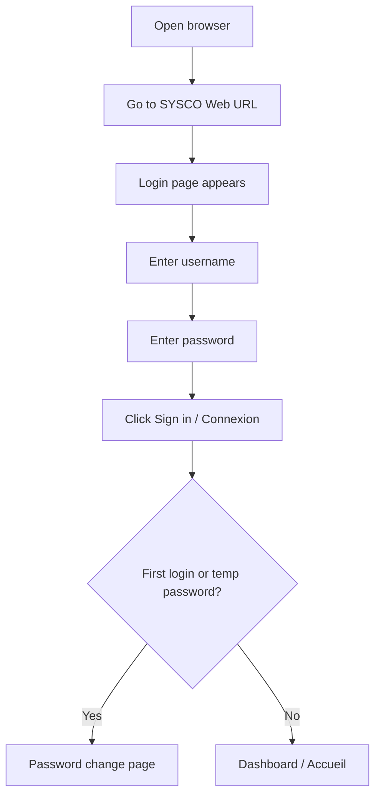

**Steps:**

1. Open your browser.  
2. Type or paste the **SYSCO Web address** exactly as provided by IT.  
3. You should see a **login** page with fields for **username** and **password**.  
4. Enter your **username** (watch for accidental spaces).  
5. Enter your **password** (password fields hide characters; this is normal).  
6. Click the button to **connect** / **sign in**.  
7. **If login fails:** read the message on screen.

### Illustrated: login page


### Illustrated: password change (first login)

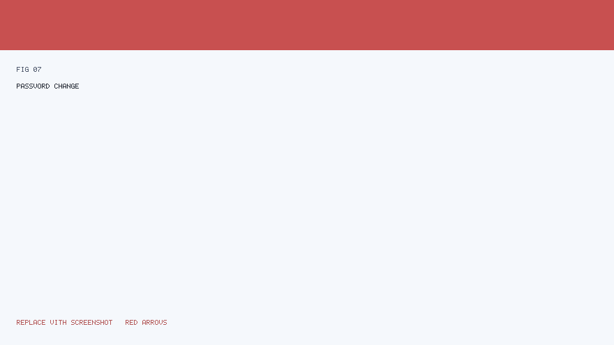

### Illustrated: guided tour popover

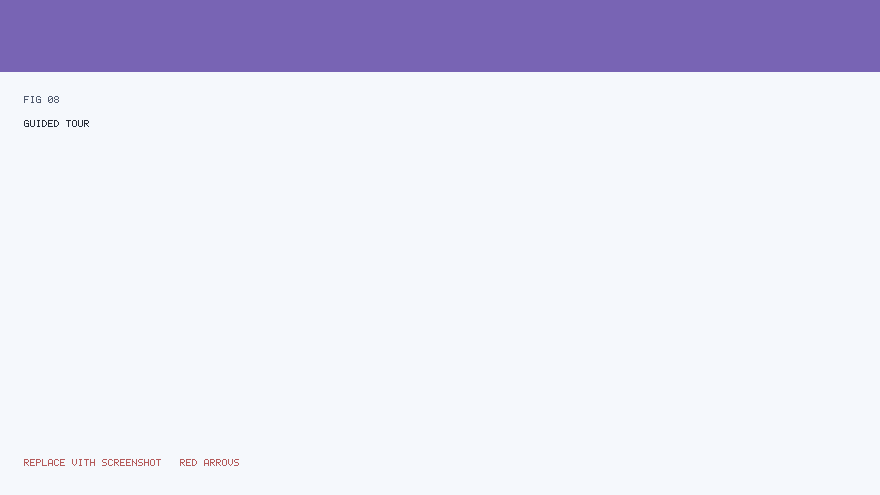

 After several failures, your account may be **temporarily locked** — wait or contact support as instructed.

### 3.2 Sign out — step by step

1. Look at the **top-right** of the screen for your **profile** or **account** menu.  
2. Choose **logout** / **déconnexion**.  
3. Close the browser tab if you are on a shared PC.

**Why sign out matters:** It prevents the next person from continuing **as you**.

---

## 4. First-time password change

If the system requires a **new password**, you will see a **dedicated page** after login (not the dashboard).

**Good password habits (non-technical):**

- Use **long** phrases you can remember but others cannot guess.  
- Mix **letters and numbers** if your policy requires it.  
- **Do not reuse** your personal email password for work systems.

After a successful change, you are usually redirected to the **main application** (`/app`).

---

## 5. The main screen (shell)

The **application shell** is the frame that stays the same while you move between modules: **header on top**, **menu on the left**, **main content** in the centre.

**Illustrated overview (annotated figure):**


*How to read the figure:* The **red arrows** in the image point to: (1) the **top bar** with notifications and profile, (2) the **left menu** listing modules, (3) the **central workspace** where forms and tables appear.

### 5.1 Regions in plain language

| Region | What you use it for |
|--------|---------------------|
| **Top bar** | Alerts, help, your name, logout. |
| **Left menu** | Jump to **Courrier**, **Tickets**, **Données**, etc. |
| **Centre** | The **page** for the module you opened — lists, buttons, filters. |

---

## 6. Using the menu (sidebar)

### 6.1 How navigation works (concept)

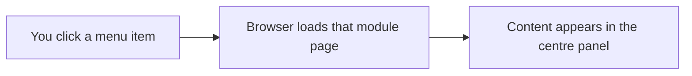

**Illustrated high-level navigation:**


### 6.2 If a menu item is missing

Ask yourself:

1. **Is it my role?** Directors see different items than couriers.  
2. **Was it disabled for my direction?** Some units use only a subset of modules.  
3. **Am I logged in as the right user?** Check the name in the header.

If still unsure, contact your **local administrator** — they manage **permissions**.

---

## 7. Header: language, help, notifications, profile

### 7.1 Notifications (bell icon)

- A **badge** (small number) may show **unread** notifications.  
- Opening the **notifications** page lists items such as ticket movements, chat, or **job reminders** (if enabled).

### 7.2 Help and guided tour

- **Help** may open documentation or start a **step-by-step tour** that highlights parts of the screen.  
- Completing the tour may be recorded so you are not prompted again (institution policy).

### 7.3 Profile

- Your **name** or **avatar** area may link to **password change** or **preferences**.

---

## 8. Guided tour (optional)

If your organisation enabled it, a **tour** may start automatically after your **first successful login**.

**What to expect:**

1. A **highlight** appears around a part of the interface.  
2. A **short explanation** appears in a small box.  
3. You click **Next** until the tour ends.  
4. You can usually **skip** the tour if you are experienced.

The tour uses **numbered steps** tied to stable element ids (for example menu entries). If your screen is very small, zoom out slightly so highlights align correctly.

---

## 9. Common patterns on every page

### 9.1 Tables (lists)

- **Column headers** may be clickable to sort (where implemented).  
- **Row actions** (open, edit) are often on the **right** or in a **⋯** menu.

### 9.2 Filters

- Many lists have **filters** at the top: status, date range, direction, assignee.  
- After changing filters, click **Apply** / **Filtrer** (wording may vary).

### 9.3 Forms

- Required fields are often marked with **\*** or a red border when empty.  
- **Save** commits your data; **Cancel** discards unsaved changes on that form.

### 9.4 Messages after an action

- **Green** messages: success.  
- **Red** messages: error — read the text; it often says *what* is wrong (missing field, permission denied).

---

## 10. If something goes wrong

| Symptom | What to try | Who helps |
|---------|-------------|-----------|
| Blank page after login | Refresh once; try another browser | IT |
| “Access denied” | You lack permission for that URL | Administrator |
| Upload fails | File too large or disallowed type | IT policy |
| Notifications never arrive | Check you are online; verify role | Administrator |

---

---

# Part 2 — Tickets and daily operations

---

## Table of contents

1. [Tickets in plain language](#1-tickets-in-plain-language)  
2. [Ticket lifecycle (overview diagram)](#2-ticket-lifecycle-overview-diagram)  
3. [Module: Suivi des tickets (monitoring)](#3-module-suivi-des-tickets-monitoring)  
4. [Module: Gestion des tickets (management)](#4-module-gestion-des-tickets-management)  
5. [Creating a new ticket](#5-creating-a-new-ticket)  
6. [Comments, tasks, and history](#6-comments-tasks-and-history)  
7. [Escalation and closure (concept)](#7-escalation-and-closure-concept)  
8. [Mon travail — personal inbox](#8-mon-travail--personal-inbox)  
9. [Mon activité — activity timeline](#9-mon-activité--activity-timeline)  
10. [Good practices for ticket hygiene](#10-good-practices-for-ticket-hygiene)

---

## 1. Tickets in plain language

A **ticket** is a **tracked case** in SYSCO Web. Think of it as a **digital folder** that:

- Has a **unique reference** (number or code).  
- Has a **status** (open, in progress, waiting for closure review, closed, etc.).  
- Can be **assigned** to people or teams.  
- Stores **comments**, **attachments**, and sometimes **tasks** or **child tickets**.

**Why tickets matter:** They give **traceability** — anyone authorised can see **what happened** and **when**.

---

## 2. Ticket lifecycle (overview diagram)

The exact **status names** on your screen are configured for your institution, but the **idea** is always: **open → work in progress → review → closed**.

**Illustrated lifecycle (reference figure with arrows):**


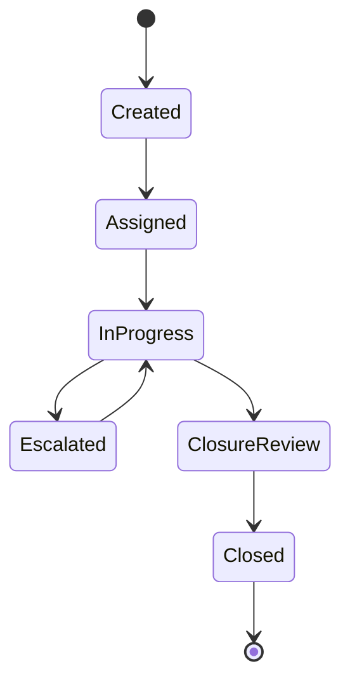

*Reading the diagram:* Arrows show **allowed movements**. Not every user can trigger every arrow — your **role** and **assignment** determine which **buttons** you see.

---

## 3. Module: Suivi des tickets (monitoring)

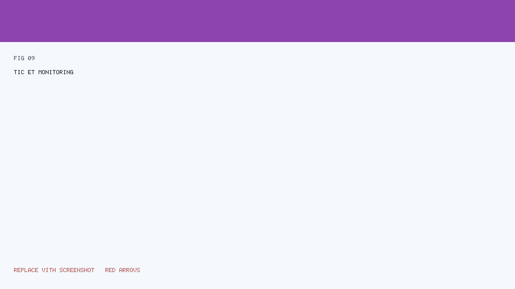

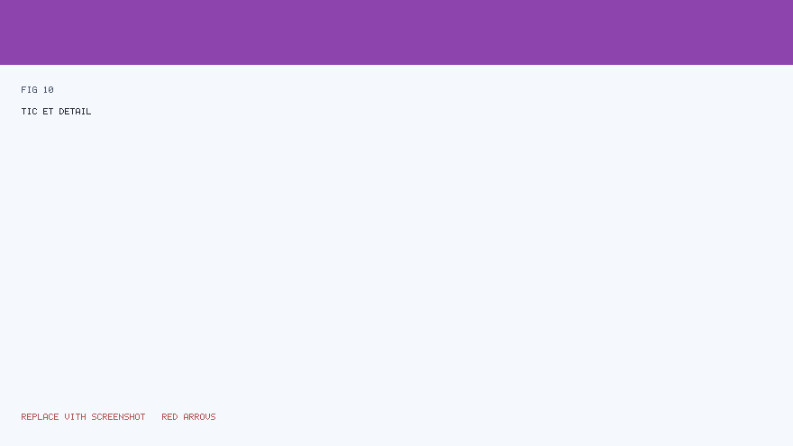

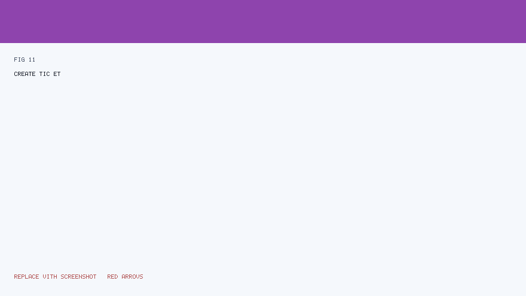

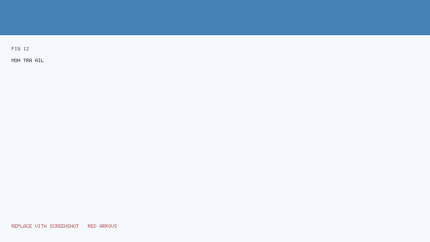


**Purpose:** **Supervise** many tickets at once — filters, bulk awareness, operational visibility.

### 3.1 How to open the module

1. In the **left menu**, click **Suivi des tickets** (or the label your admin uses).  
2. Wait for the **list** to load.

### 3.2 Typical screen layout

| Area | Use |
|------|-----|
| **Filters** | Narrow by status, date, direction, priority. |
| **Table** | One row per ticket; key columns (reference, status, assignee, dates). |
| **Row action** | Open **detail** for one ticket. |

### 3.3 Step-by-step: find tickets due soon

1. Open **Suivi des tickets**.  
2. Locate the **date** or **deadline** filter (if present).  
3. Choose **today → end of week** (example).  
4. Click **Apply** / **Filtrer**.  
5. Sort by **due date** column if available.

### 3.4 Escalation from monitoring (if your role allows)

Some deployments allow **escalation** directly from monitoring views:

1. Select the **ticket** row.  
2. Click **Escalader** / **Escalate** (wording may vary).  
3. Choose **target** (direction, user, or external escalation — as implemented).  
4. Confirm.  
5. Check **notifications** — the recipient may be alerted.

---

## 4. Module: Gestion des tickets (management)

**Purpose:** **Deep work** on one ticket at a time — edit fields, manage assignments, add evidence.

### 4.1 Open a ticket from the list

1. Go to **Gestion des tickets** or **Suivi** (depending on your workflow).  
2. Click the **ticket reference** link or **Open** / **Voir** action.  
3. The **detail** page loads.

### 4.2 Detail page sections (typical)

| Section | Plain-language meaning |
|---------|------------------------|
| **Header** | Reference, status badge, SLA indicators. |
| **Main fields** | Category, priority, description, linked courier (if any). |
| **Assignments** | Who owns the ticket now. |
| **Comments** | Chronological discussion. |
| **Tasks** | Checklist items with due dates. |
| **History / genealogy** | Parent/child tickets, merge history. |

### 4.3 Modifier (edit) dialog

If you see **Modifier** / **Edit**:

1. Click **Modifier**.  
2. A **dialog** opens — change allowed fields only (others may be read-only).  
3. Click **Enregistrer** / **Save**.  
4. Read the **confirmation message**. If red text appears, fix the indicated field.

**Tip:** If the dialog closes without saving, your changes are **lost** — the system only persists on **Save**.

---

## 5. Creating a new ticket

**Module:** **Création de ticket** / **Create ticket** (menu label varies).

### 5.1 End-to-end flow

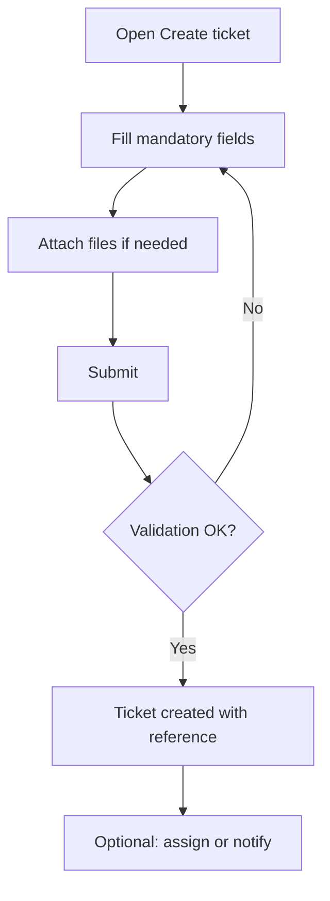

### 5.2 Step-by-step

1. Click **Création de ticket** in the menu.  
2. Enter **title / subject** and **description** clearly — future readers may not know your shorthand.  
3. Select **category**, **priority**, **direction** as required.  
4. **Attach** scans or PDFs if the process requires evidence.  
5. Click **Create** / **Créer**.  
6. **Copy** the new **reference** into your own tracker or email if needed.

### 5.3 Common mistakes

| Mistake | Result |
|---------|--------|
| Empty mandatory field | Form refuses submit; error near the field |
| Wrong category | Reporting skew; may require correction |
| Huge attachment | Upload error — ask IT for size limits |

---

## 6. Comments, tasks, and history

### 6.1 Comments

- Use comments for **decisions** and **handover** notes.  
- Avoid putting legally sensitive content in comments if policy says to use **secure attachments** only.

### 6.2 Tasks

- **Tasks** break work into steps with **owners** and **due dates**.  
- Completing tasks may be used informally as progress tracking (exact automation depends on configuration).

### 6.3 History

- **History** answers: *Who changed what?*  
- If something looks wrong, **history** is the first place supervisors check.

---

## 7. Escalation and closure (concept)

**Escalation** means: “This case needs **higher attention** or **another unit**.”

**Closure** means: “The **operational work** is done, pending final **verification** or **archival** rules.”

Your screen may show:

- **Escalader** — sends the case along a defined path.  
- **Demander clôture** / **Closure request** — starts a review period.  
- **Clôturer** — final close (often restricted).

*Always follow* your **local SOP** (standard operating procedure) — the software **enforces permissions**, not **legal authority**.

---

## 8. Mon travail — personal inbox

**Purpose:** See **what is assigned to you** without noise from the whole institution.

### Step-by-step

1. Open **Mon travail**.  
2. Review **sections** (if any): e.g. *assigned to me*, *awaiting my action*.  
3. Click a **ticket** to open detail.  
4. Perform the required action (comment, status change, attachment).  
5. Return to **Mon travail** to refresh the list.

---

## 9. Mon activité — activity timeline

**Purpose:** A **personal log** of actions you performed or that concern you (implementation-specific).

Use it when you need to **prove** you treated a dossier on a given day.

---

## 10. Good practices for ticket hygiene

1. **One ticket = one coherent case** — do not mix unrelated subjects.  
2. **Update status** honestly — dashboards depend on it.  
3. **Assign** explicitly when handing over — do not rely on verbal-only handover.  
4. **Close** only when work truly meets your **local closure checklist**.

---

---

# Part 3 — Courier and data

---

## Table of contents

1. [Courrier — what it is](#1-courrier--what-it-is)  
2. [Courier flow (illustrated)](#2-courier-flow-illustrated)  
3. [Portail courrier — daily steps](#3-portail-courrier--daily-steps)  
4. [Gestion courrier — supervision](#4-gestion-courrier--supervision)  
5. [Saisie des données](#5-saisie-des-données)  
6. [Gestion des données](#6-gestion-des-données)  
7. [Partage de données (secure share)](#7-partage-de-données-secure-share)  
8. [Files and uploads — practical rules](#8-files-and-uploads--practical-rules)

---

## 1. Courrier — what it is

**Courrier** in SYSCO Web tracks **physical movements** of **packets** or **sealed consignments** between units, desks, or external partners.

**Plain-language analogy:** Imagine a **registered parcel** in a postal system: it has a **barcode**, **origin**, **destination**, **scan events**, and **signatures**.

---

## 2. Courier flow (illustrated)

**Reference figure (arrows show handover points):**


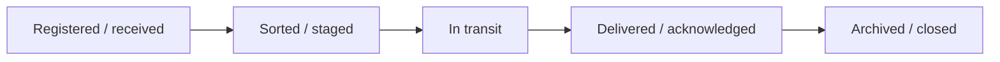

*Note:* Your institution may use **different labels**; follow **on-screen** wording.

---

## 3. Portail courrier — daily steps

**Who uses it:** **Couriers**, **desk officers**, **receiving clerks** (role-dependent).

### 3.1 Register an incoming packet

1. Open **Portail courrier** from the menu.  
2. Click **Nouveau** / **Enregistrer** (wording varies).  
3. Fill **origin**, **destination**, **reference numbers** from the physical label.  
4. **Scan** or **photograph** the label if the UI allows attachment.  
5. **Save**.  
6. **Print** or **note** the system reference if your SOP requires sticking a sticker on the packet.

### 3.2 Hand over to another person

1. Locate the packet in **active** list (search by reference).  
2. Open **detail**.  
3. Choose **transfer** / **assign** / **handover** action.  
4. Select **recipient** (user or location).  
5. Confirm.  
6. Physically **give** the packet — the digital record is not enough.

### 3.3 Confirm delivery

1. Open the packet record.  
2. Use **delivered** / **received** action.  
3. Add **comment** if there is damage or discrepancy.  
4. Save.

### 3.4 If the packet is lost

1. **Do not** delete the record silently.  
2. Flag **incident** per local procedure (comment + supervisor).  
3. Your organisation may require a **parallel paper form** — follow that.

---

## 4. Gestion courrier — supervision

**Who uses it:** **Supervisors**, **heads of unit** — broader visibility than the portal.

### Typical tasks

| Task | Steps (high level) |
|------|---------------------|
| **Find stuck packets** | Filter by status *in transit* beyond N days |
| **Reassign** | Open detail → change assignee → notify |
| **Audit trail** | Export or print history for investigation |

---

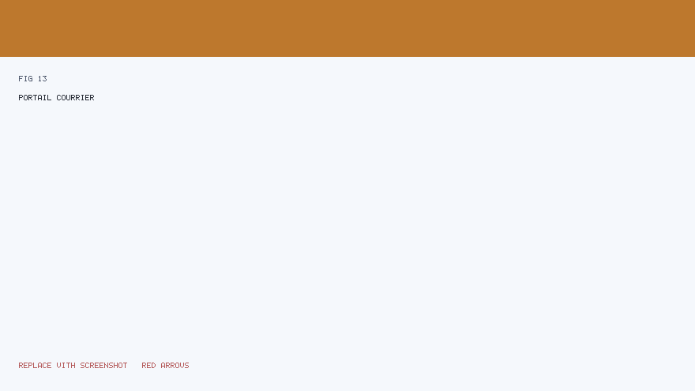

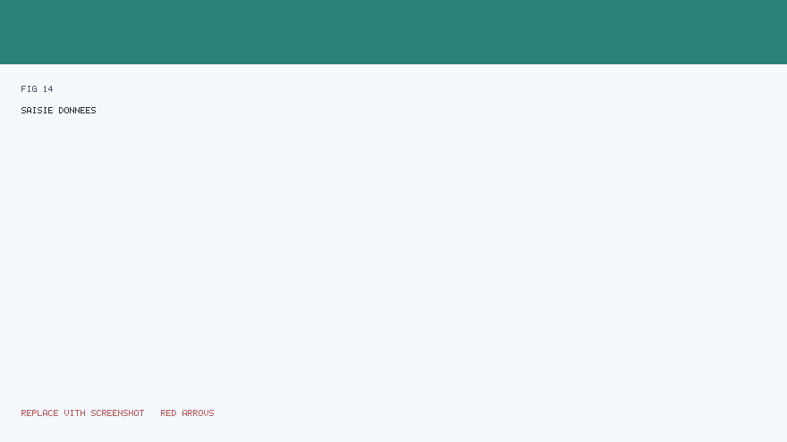


## 5. Saisie des données

**Purpose:** Enter structured information that becomes part of operational datasets (often **table-like** screens).

### 5.1 Before you type

- Confirm you are in the **correct** **dataset** or **campaign** (if your UI shows one).  
- Verify **period** or **version** — wrong period corrupts statistics.

### 5.2 Step-by-step row entry

1. Open **Saisie des données**.  
2. Click **Add row** / **Nouvelle ligne** (if available).  
3. Fill cells — use **Tab** to move quickly.  
4. **Save** the row.  
5. Repeat.

### 5.3 Copy/paste from Excel

If the module supports **paste**:

1. Prepare a **clean** sheet: **no** merged cells in data area.  
2. **Headers** must match column order expected by the app (ask your admin for a **template**).  
3. Paste **small chunks** first to validate.  
4. Review **error messages** row by row.

### 5.4 Validation errors

| Message type | Meaning |
|--------------|---------|
| **Required field** | Empty cell where mandatory |
| **Invalid format** | Date not DD/MM/YYYY, number not numeric |
| **Duplicate** | Key already exists |

---

## 6. Gestion des données

**Purpose:** **Administrative** operations on datasets — imports, corrections, reconciliations (exact buttons depend on your build).

### 6.1 Safe workflow

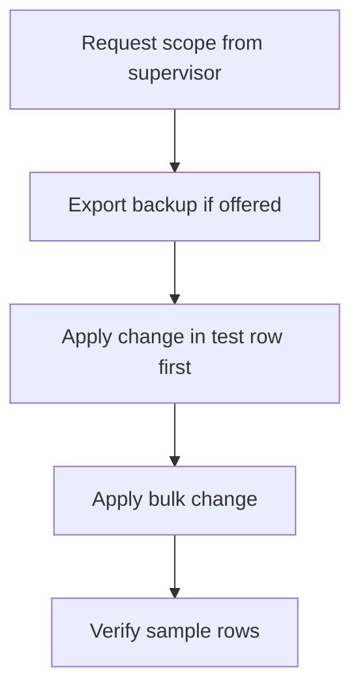

### 6.2 Import workflow (typical)

1. Download **template** (CSV/XLSX) if provided.  
2. Fill **without** altering column names.  
3. **Upload** file.  
4. Read **preview** / **validation** screen.  
5. **Commit** import only if zero blocking errors.

### 6.3 If import partially fails

1. **Save** the error report (CSV/log) if offered.  
2. Fix **only** failing rows.  
3. Re-import **only** the corrected rows (if supported) or full file per admin guidance.

---

## 7. Partage de données (secure share)

**Purpose:** Share a file or dossier **outside** your usual folder structure with **access controls** — sometimes **OTP** (one-time password) or **time-limited** links.

### 7.1 Request a share (user)

1. Open **Partage de données**.  
2. Click **Nouveau partage** / similar.  
3. Choose **file** or **dataset** scope.  
4. Enter **recipient email** or **identifier** as required.  
5. Set **expiry** if the UI offers it — **shorter is safer**.  
6. Submit.  
7. **Communicate OTP** through an approved channel (not in the same email as the link, if policy says so).

### 7.2 Revoke access

If you shared by mistake:

1. Open **active shares** list.  
2. Select the row.  
3. **Revoke** / **Désactiver**.  
4. Inform your **security officer** if sensitive data left your control.

---

## 8. Files and uploads — practical rules

| Rule | Reason |
|------|--------|
| Prefer **PDF** for final documents | Preserves layout |
| Avoid **password-protected** archives unless IT approves | Automated scanning may block |
| Name files clearly `2026-05-02_Dossier123_facture.pdf` | Audit readability |
| Never upload **personal** photos unrelated to work | Data minimisation |

---

---

# Part 4 — Planning and missions

---

## Table of contents

1. [Agenda et congés](#1-agenda-et-congés)  
2. [Missions](#2-missions)  
3. [Mon poste / équipes](#3-mon-poste--équipes)  
4. [Planificateur de tâches (scheduled jobs)](#4-planificateur-de-tâches-scheduled-jobs)  
5. [Job reminders and notifications](#5-job-reminders-and-notifications)  
6. [Gestion du partage de fichiers (administrative)](#6-gestion-du-partage-de-fichiers-administrative)  
7. [Operational reports (PDF)](#7-operational-reports-pdf)

---

## 1. Agenda et congés

**Purpose:** View **leave requests**, **team calendar** context, or **your own** absences — exact features depend on configuration.

### 1.1 View the calendar

1. Open **Agenda** / **Congés** from the menu.  
2. Use **month** / **week** controls if shown.  
3. Click a **day** to see details (if interactive).

### 1.2 Request leave (if enabled)

1. Click **Nouvelle demande** / **Request leave**.  
2. Choose **start** and **end** dates (use the date picker — typing wrong formats fails).  
3. Select **leave type** (annual, sick, mission-related, etc.).  
4. Add **comment** for your supervisor.  
5. Submit.  
6. Watch **notifications** for approval/denial.

### 1.3 Supervisor approval (if enabled)

1. Open **pending requests** list.  
2. Open one request.  
3. **Approve** or **Reject** with a **reason** (professional courtesy).  
4. Confirm.

---

## 2. Missions

**Purpose:** Plan **field missions** — participants, logistics, and sometimes **official documents** (generated files).

### 2.1 Create a mission

1. Open **Missions**.  
2. Click **Create** / **Nouvelle mission**.  
3. Fill **objective**, **location**, **dates**, **participants**.  
4. Attach **orders** or **maps** if required.  
5. Save.

### 2.2 Generate mission order document

If your build offers **document generation**:

1. Open mission **detail**.  
2. Click **Generate order** / **Générer l’ordre de mission**.  
3. Wait for **download** link.  
4. **Review** the PDF before signing — software does not replace **legal review**.

### 2.3 Close or cancel

1. Open mission.  
2. Use **Complete** / **Cancel** with reason.  
3. Archive attachments per **records policy**.

---

## 3. Mon poste / équipes

**Purpose:** **Shift** or **roster** awareness — who is on duty, attendance markers (implementation-specific).

### Daily use

1. Open **Mon poste** / **Mon équipe** (label varies).  
2. Confirm **your** shift for today.  
3. If you **swap** with a colleague, follow **local HR rules** — the software may only record the outcome after approval.

---

## 4. Planificateur de tâches (scheduled jobs)

**Purpose:** Create **time-based reminders** tied to operational work — distinct from ticket **SLA** clocks in concept, but similar in user value.

**Illustrated scheduler / reminder flow:**


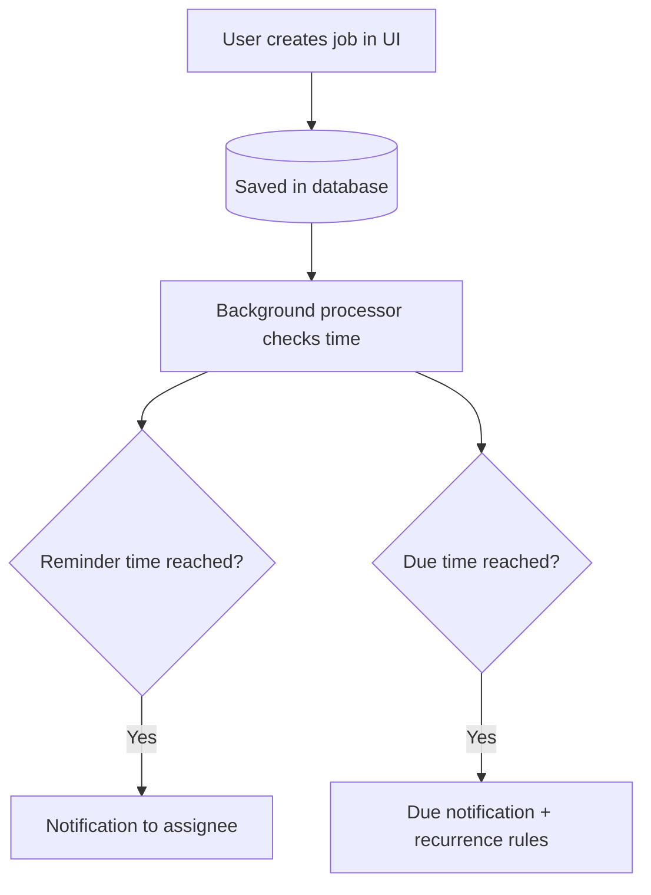

### 4.1 Open the scheduler

1. Click **Planificateur de tâches** / **Job scheduler** in the menu.  
2. You see a **list** of jobs you may access (scoped by role/direction).

### 4.2 Create a job

1. Click **New job** / **Nouvelle tâche planifiée**.  
2. Enter **title** — be explicit: *“Relance direction X — dossier 123”* beats *“relance”*.  
3. Set **due date and time** using the picker.  
4. Set **reminder offset** if the form offers it (e.g. remind **1 day before**).  
5. Assign **owner** (yourself or colleague) if applicable.  
6. **Save**.

### 4.3 Edit or cancel

1. Locate the job in the list.  
2. Open **detail** or click **Edit** / **Modifier**.  
3. Adjust fields.  
4. Save — or use **Delete** / **Cancel job** if the work is obsolete.

### 4.4 Toggle active / inactive

Some UIs allow **pausing** a job without deleting history:

1. Open job.  
2. Switch **Active** off.  
3. Save.  
4. **Re-enable** later if the task returns.

### 4.5 PDF period report (if present)

If your screen offers **export** for a **period**:

1. Choose **start** and **end** dates covering the reporting window.  
2. Click **Generate PDF** / **Exporter**.  
3. Store the file in the **official** document repository — not only on your laptop.

---

## 5. Job reminders and notifications

**What you feel as a user:**

- A **badge** on the **bell** icon.  
- A row in **Notifications** saying a job is **due** or **reminder**.

**What you should do:**

1. Open **Notifications**.  
2. Click through to the **job** or **related ticket** if linked.  
3. **Mark as read** when handled (if available).  
4. **Update** the underlying ticket status if the job was about a dossier.

---

## 6. Gestion du partage de fichiers (administrative)

**Who uses it:** **Trusted administrators** — not every officer.

### Typical tasks

| Task | Steps |
|------|-------|
| **Review pending share requests** | Open module → filter *pending* → open row → approve/deny |
| **Audit active shares** | Export or list → identify stale shares → revoke |
| **Investigate incident** | Correlate user, timestamp, file name with **file share audit** module |

**Safety:** Treat this module like a **master key** — actions here affect **confidentiality**.

---

## 7. Operational reports (PDF)

If your deployment exposes **monthly** or **period** operational reports:

1. Open the **reporting** entry (may live under dashboard or a dedicated menu).  
2. Select **period**.  
3. Generate **PDF**.  
4. Verify **page count** and **totals** before circulating.

---

---

# Part 5 — Reference (chat, audits, administration)

---

## Table of contents

1. [Chat (messagerie)](#1-chat-messagerie)  
2. [Notifications — full workflow](#2-notifications--full-workflow)  
3. [Audits: connexions et partage de fichiers](#3-audits-connexions-et-partage-de-fichiers)  
4. [Administration des utilisateurs](#4-administration-des-utilisateurs)  
5. [Accessibility and ergonomics](#5-accessibility-and-ergonomics)  
6. [FAQ — frequent questions (non-IT)](#6-faq--frequent-questions-non-it)  
7. [Glossary — user-facing terms](#7-glossary--user-facing-terms)  
8. [Where to get help](#8-where-to-get-help)

---

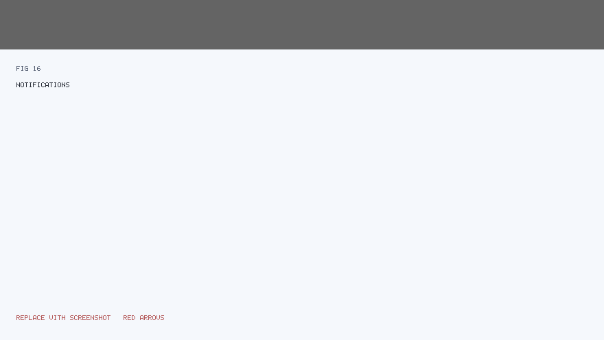

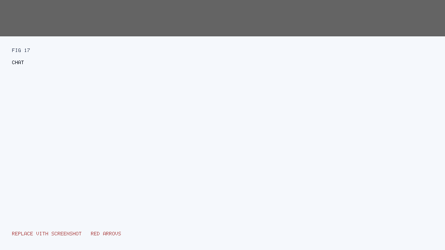


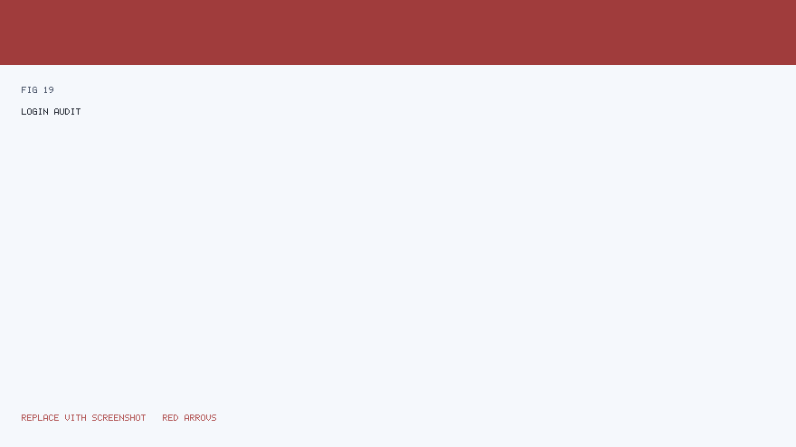

## 1. Chat (messagerie)

**Purpose:** **Direct** or **group** messaging between colleagues **inside** SYSCO Web — useful for quick coordination **without** external email.

### 1.1 Open chat

1. Click **Chat** / **Messagerie** in the menu or header shortcut (if present).  
2. Wait for conversation list to load.

### 1.2 Start a conversation

1. Click **New** / **Nouvelle conversation**.  
2. Select **recipient(s)**.  
3. Type a **short** first message with **context** (*which dossier?*).  
4. Send.

### 1.3 Unread badges

- The **header** may show an **unread count**.  
- Opening the conversation usually **marks messages as seen** (depending on build).

### 1.4 Professional use guidelines

| Do | Don’t |
|----|-------|
| Use chat for **coordination** | Paste **classified** content if policy forbids |
| **Link** ticket references | Rely on chat as the **only** audit record |
| **Archive** decisions in the **ticket** comment | Argue **personally** in shared threads |

---

## 2. Notifications — full workflow

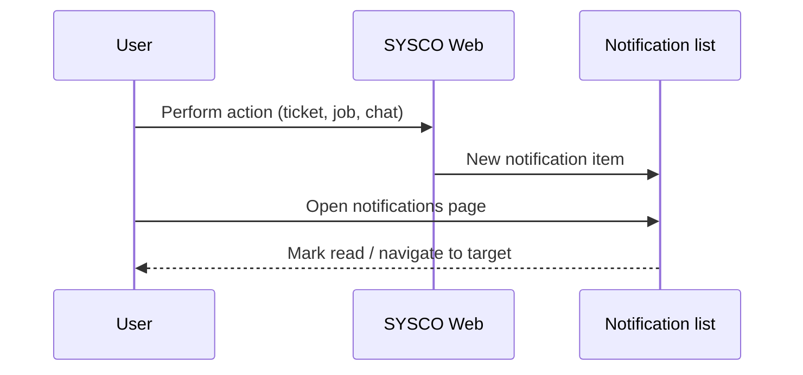

### 2.1 Types you might see

| Type | Plain meaning |
|------|----------------|
| **Ticket** | Assignment, escalation, closure request |
| **Chat** | New message |
| **Job** | Reminder or due task |
| **System** | Password change, policy broadcast (if used) |

### 2.2 Clearing noise

1. Open **Notifications**.  
2. Use **filters** (if any): unread only.  
3. Open each **high priority** item first.  
4. **Delete** or **archive** per UI (if available) only when sure.

---

## 3. Audits: connexions et partage de fichiers

**Who sees audits:** **Supervisors**, **security**, **IT auditors** — not all staff.

### 3.1 Audit des connexions (login audit)

**Purpose:** Prove **who** accessed the system **when** — often exported as **CSV** for spreadsheets.

**Typical steps:**

1. Open **Audit des connexions**.  
2. Set **date range** (narrow exports for performance).  
3. **Filter** by username if investigating one account.  
4. **Export** if allowed.  
5. Store export in **secure** drive only.

### 3.2 Audit du partage de fichiers

**Purpose:** Track **share creation**, **downloads**, **revocations**.

**Investigation pattern:**

1. Obtain **reference** of incident (user + approximate time).  
2. Open audit module.  
3. Search **time window**.  
4. Correlate **IP** / **user agent** if columns exist (ask IT meaning).  
5. **Do not** share raw audit logs with unrelated staff.

---

## 4. Administration des utilisateurs


### 4.1 Create a user

1. Open **Gestion des utilisateurs**.  
2. Click **Create user** / **Nouvel utilisateur**.  
3. Fill **username**, **email**, **full name**, **matricule** if used.  
4. Assign **role** from the **controlled list** (director, inspector, …).  
5. Assign **direction** / **sous-direction** scope.  
6. Set **permissions** (module read/write) per **least privilege** principle.  
7. **Save**.  
8. Communicate **initial password** through **secure channel** per policy.

### 4.2 Reset a password

1. Locate user in list.  
2. **Reset password** / **temporary password** action.  
3. Inform user they must **change** on login.  
4. **Log** the reset in your service desk ticket.

### 4.3 Deactivate vs delete

| Action | When |
|--------|------|
| **Deactivate** | Employee on leave, investigation, role suspension |
| **Delete** | Rare — may break historical references; prefer deactivate |

### 4.4 Role modal / permissions UI

If your build uses a **modal** to pick permissions:

1. Open user **edit**.  
2. Click **Permissions** / **Rôles détaillés**.  
3. Toggle **READ** before **WRITE** where modules are split.  
4. Save — ask the user to **log out and in** if menu does not refresh.

---

## 5. Accessibility and ergonomics

- **Zoom:** Use browser zoom (Ctrl + mouse wheel) if text feels small — institutional UIs may default to dense tables.  
- **Keyboard:** Tab through forms; **Enter** may submit — be careful near destructive buttons.  
- **Colour:** Do not rely only on **colour** of status badges — read the **text label**.

---

## 6. FAQ — frequent questions (non-IT)

**Q: Why did my menu change overnight?**  
**A:** An administrator updated your **permissions** or **role**. Ask them for the change record.

**Q: I saved but my file is not there.**  
**A:** Check you clicked **Save** on the correct form; some pages have **multiple** sections with separate saves.

**Q: The system is slow.**  
**A:** Try **one** heavy export at a time; close unused **tabs**; if persistent, report to IT with **time** and **screen name**.

**Q: Can I use my phone?**  
**A:** Only if **IT** certifies the browser and **security** controls (VPN, MDM). Do not assume.

**Q: What if I see data that is not mine?**  
**A:** **Stop** using that screen; **report** immediately — possible misconfiguration or serious bug.

---

## 7. Glossary — user-facing terms

| French (typical UI) | English meaning |
|---------------------|-----------------|
| Tableau de bord | Dashboard |
| Billet / dossier | Ticket / case |
| Courrier | Courier / physical packet |
| Clôture | Closure |
| Escalade | Escalation |
| Notification | Alert / inbox item |
| Direction | Organisational unit (top level) |
| Sous-direction | Sub-unit |

---

## 8. Where to get help

1. **Local supervisor** — process questions.  
2. **User administrator** — access and roles.  
3. **IT service desk** — browser, VPN, slowness, errors.  
4. **Security** — suspected data leak or account compromise.

---

---

# Appendix A — Procedures, scenarios, and training

**Audience:** Trainers, supervisors, help-desks, and **end users** who want cookbook-style **playbooks**.  
**Use together with:** Parts 1–5 of the user manual.

This appendix adds **length**, **repetition in different words** (useful for non-IT readers), and **day-in-the-life scenarios**. It does **not** replace your institution’s **official SOPs** — align wording with your legal and HR policies.

---

## Part A — Day-in-the-life scenarios

### Scenario A1: Verifier starts the morning

**Persona:** `VERIFICATEUR` with ticket and data-entry access.

1. **Sign in** (Part 1).  
2. Open **Tableau de bord** — scan counts / alerts (Part 1).  
3. Open **Mon travail** — treat **oldest** assigned ticket first (Part 2).  
4. For each ticket: read **description**, check **attachments**, add **comment** with your decision (Part 2).  
5. If blocked: **escalate** per SOP (Part 2).  
6. Before lunch: clear **notifications** bell or mark as read (Part 5).

**Success criteria:** No assigned ticket sits **without comment** beyond your local SLA.

---

### Scenario A2: Secretary registers incoming courier packets

**Persona:** `SECRETAIRE` with courier access.

1. Receive physical packet at desk.  
2. Open **Portail courrier** (Part 3).  
3. **Register** packet with label references (Part 3).  
4. **Assign** to internal route (Part 3).  
5. Hand physically to **next** person only after digital handover shows correct assignee (Part 3).

**Success criteria:** 100% of packets received before noon are **in the system** before routing.

---

### Scenario A3: Director reviews escalations

**Persona:** `DIRECTEUR`.

1. Open **Suivi des tickets** with filter **escalated** (Part 2).  
2. Sort by **age** (if column exists).  
3. Open top **three** dossiers.  
4. For each: decide **reassign**, **close request**, or **further escalation** (Part 2).  
5. Document decision in **comment** (non-legal summary) and official channel if required.

**Success criteria:** No escalation older than **N days** without director decision (set N locally).

---

### Scenario A4: Planner officer uses scheduled jobs

**Persona:** officer with **JOB_SCHEDULER** permission.

1. Open **Planificateur de tâches** (Part 4).  
2. Create jobs for **known deadlines** (court dates, treaty deadlines, partner SLAs) (Part 4).  
3. Confirm **reminder** is **one working day before** due (example).  
4. When notification fires: open linked **ticket** and advance status (Parts 2 & 4).

**Success criteria:** Zero “surprise” missed deadlines attributable to lack of reminder.

---

## Part B — Playbooks (step-by-step, verbose)

### Playbook B1: “I cannot see the menu my colleague sees”

1. Confirm you are logged in as **yourself** (check name in header).  
2. Ask colleague for their **role name** (exact spelling).  
3. If roles differ: **expected** difference — request access via **administrator**.  
4. If roles **match**: administrator should verify **permission rows** and **direction scope**.  
5. **Do not** share accounts to bypass this — **forbidden** in most institutions.

---

### Playbook B2: “Upload keeps failing”

1. Note **exact error text** (screenshot).  
2. Check **file size** — compress PDF if allowed.  
3. Try **another browser** once.  
4. If still failing: IT checks **server disk** and **`sysco.uploads.directory`** permissions.

---

### Playbook B3: “Ticket status wrong after my action”

1. Open ticket **history** / **timeline** (Part 2).  
2. Identify **last** status change and **who** performed it.  
3. If mistake: use **permitted** transition to correct (may require supervisor).  
4. If system bug: capture **reference**, **time**, **user** → IT ticket.

---

### Playbook B4: “Sensitive document shared by mistake”

1. **Revoke** share in **Partage de données** if you own the share (Part 3).  
2. Notify **security** immediately with **what**, **whom**, **when**.  
3. Do **not** delete audit logs — investigators need them (Part 5).

---

## Part C — Training agenda (one day, non-IT audience)

| Time | Topic | Hands-on exercise |
|------|-------|-------------------|
| 09:00 | What is SYSCO Web | Login on training laptops |
| 09:30 | Shell tour | Locate header, menu, logout |
| 10:30 | Tickets | Open sample ticket, add comment |
| 12:00 | Lunch | — |
| 13:00 | Courier | Register dummy packet |
| 14:00 | Data share | Request share with trainer as recipient |
| 15:00 | Notifications & chat | Send test message |
| 16:00 | Q&A | Playbooks B1–B4 |

**Trainer checklist:** test accounts, sample data, projector showing **Figure 1** (`fig-01-application-shell.png`) from `docs/figures/`.

---

## Part D — Glossary expansion (French ↔ plain French)

| Term | Explain like I’m new |
|------|------------------------|
| **Session** | Your logged-in period; ends on logout or timeout |
| **Fil d’Ariane** | Breadcrumb trail showing where you are (if shown) |
| **OTP** | One-time password, often numeric, valid briefly |
| **Scope direction** | Data limited to your organisational branch |

---

## Part E — Accessibility drills

1. **Keyboard only:** navigate login → dashboard → logout using Tab/Enter.  
2. **200% zoom:** ensure tables still readable; if not, report to IT (template issue).  
3. **Colour-blind:** read **text** on status badges, not only colour.

---

## Part F — Figures index (for trainers inserting slides)

| Figure file | Use in training |
|-------------|-----------------|
| `figures/fig-01-application-shell.png` | First hour — anatomy of screen |
| `figures/fig-02-general-navigation-flow.png` | Explain login → module |
| `figures/fig-03-ticket-lifecycle.png` | Ticket module week |
| `figures/fig-04-courier-flow.png` | Courier module week |
| `figures/fig-05-job-scheduler-flow.png` | Planning module |

If figures are missing from your checkout, regenerate or copy from the documentation maintainer; the manual **references** these paths so PDF export includes them when Pandoc/ImageMagick pipelines are configured.

---

## Part G — Handover checklist (shift change)

- [ ] All **assigned** tickets have **status** reflecting reality  
- [ ] **Courier** packets in desk match **digital** assignee  
- [ ] **Notifications** triaged or noted in **shift log**  
- [ ] **Logged out** on shared PC  

---

*End of user manual appendix.*


---

# Module-by-module visual guide

**How to use this document:** Each section matches **one main menu entry** from `NavigationRegistry` (same order as the sidebar). For every module you get: **purpose in plain language**, **who typically has access**, **what to click**, **what success looks like**, and **which figure** to show on a projector (if available).

**Figures:** When this guide says “show **Figure 1**”, use `docs/figures/fig-01-application-shell.png`. Add **your own** screenshots with arrows for any sub-screen not covered by the five baseline figures.

---

## Module 1 — Tableau de bord (`/app`)

**Plain purpose:** A **starting page** after login with **summary indicators** (counts, quick links, possibly charts depending on configuration).

**Typical roles:** Most operational roles see the dashboard link; exact **widgets** depend on services backing `AppController` / dashboard templates.

**Step-by-step (first visit):**

1. Sign in (User Manual Part 1).  
2. Confirm you landed on **`/app`** — URL may show `/app` or redirect from `/`.  
3. Read each **card** or **panel** slowly — do not rush; dashboards encode **management attention points**.  
4. If a number looks wrong, **drill down** via the linked module (tickets, courier, etc.) before calling IT.

**Visual aid:** Use **Figure 1** to point at the **centre panel** where dashboard tiles appear.

**Success:** You can **name three** KPIs you are responsible for acting on this week.

**Common confusion:** “Empty dashboard” — may mean **no permission** for underlying data or **no data** in your scope; administrator distinguishes.

---

## Module 2 — Saisie des données (`/app/data-entry`)

**Plain purpose:** **Structured typing** of operational data — often row/column grids resembling spreadsheets.

**Permission:** `DATA_ENTRY_READ` / `DATA_ENTRY_WRITE` (or bare `DATA_ENTRY`).

**Steps:**

1. Open **Saisie des données** from the menu.  
2. Identify the **dataset name** or **campaign** in the page title.  
3. If importing: follow **template** discipline (Part 3).  
4. If typing: add row → fill → **save** row before navigating away.  
5. Use **search** if the table is long.

**Visual:** Capture a **local screenshot** with arrows: (a) add row, (b) save, (c) validation message area.

**Success:** Random **sample of 10 rows** matches source documents.

---

## Module 3 — Portail courrier (`/app/courier`)

**Plain purpose:** **Operational** courier work — register and move **physical packets**.

**Permission:** `PHYSICAL_COURIER_*` **or** role-based visibility (see technical reference §3.3).

**Steps (receive):**

1. Open **Portail courrier**.  
2. **New** registration.  
3. Transcribe **label identifiers** carefully (double-check zeros vs letter O).  
4. Attach **photo** of label if policy allows.  
5. Save → note **system ID**.

**Steps (handover):**

1. Search packet.  
2. Open detail.  
3. **Transfer** to next person.  
4. **Physical** handover.

**Figure:** **Figure 4** (courier flow).

---

## Module 4 — Gestion courrier (`/app/courier-management`)

**Plain purpose:** **Supervisory** courier view — broader than portal.

**Role gate:** Director-level roles and similar (see `WebSyscoPermissions`).

**Steps:**

1. Open module.  
2. Filter **in transit** beyond threshold (e.g. 48h).  
3. Open **oldest** three.  
4. **Reassign** or **escalate** per SOP.

**Visual:** Screenshot **filter bar** with arrow; screenshot **row actions**.

---

## Module 5 — Gestion des données (`/app/data-management`)

**Plain purpose:** **Administrative** dataset operations — imports, corrections, governance.

**Permission:** `DATA_MANAGEMENT_READ/WRITE`.

**Steps:**

1. Confirm you have **written approval** for bulk changes.  
2. Export **backup** if UI offers it.  
3. Perform change **in small batch**.  
4. Validate **spot checks**.

**Figure:** Optional — **data pipeline** diagram from Part 3 (Mermaid) printed on slide.

---

## Module 6 — Partage de données (`/app/data-share`)

**Plain purpose:** **Controlled** sharing with **recipients** outside normal folders.

**Permission:** `DATASHARE_READ/WRITE`.

**Steps:** See User Manual Part 3 §7 (request, OTP, revoke).

**Visual:** Two screenshots: **create share form** and **active shares list** with arrow to **revoke**.

---

## Module 7 — Mon activité (`/app/my-activity`)

**Plain purpose:** **Personal** activity history — what you touched recently.

**Permission:** `MY_ACTIVITY_READ`.

**Steps:**

1. Open module.  
2. Set **date range** to this week.  
3. Click **entries** to jump back to artefacts if links exist.

**Success:** You can **reconstruct** your Tuesday afternoon from the log.

---

## Module 8 — Mon travail (`/app/my-work`)

**Plain purpose:** **Inbox** of assignments.

**Permission:** `MY_WORK_READ` **or** `MY_ACTIVITY_READ` (either grants nav access).

**Steps:** Part 2 §8.

**Figure:** **Figure 3** when explaining that work items often **are** tickets.

---

## Module 9 — Suivi des tickets (`/app/ticket-monitoring`)

**Plain purpose:** **Supervision** of many tickets — filters, operational oversight.

**Permission:** `TICKET_MONITORING_READ`.

**Steps:** Part 2 §3.

**Figure:** **Figure 3**.

---

## Module 10 — Gestion des tickets (`/app/ticket-management`)

**Plain purpose:** **Deep** ticket operations — editing, tasks, closure workflow.

**Permission:** `TICKET_MANAGEMENT_READ`.

**Steps:** Part 2 §4–§7.

**Visual:** Screenshot **Modifier** dialog with arrows: **Save** vs **Cancel**.

---

## Module 11 — Gestion du partage de fichiers (`/app/file-share-management`)

**Plain purpose:** **Admin** oversight of file-share requests.

**Visibility:** `ADMIN` / `SUPER_ADMIN` **only** in navigation gate.

**Steps:** Part 4 §6.

**Security reminder:** Treat every action as **legally sensitive**.

---

## Module 12 — Gestion des utilisateurs (`/app/user-management`)

**Plain purpose:** **Accounts**, **roles**, **permissions**.

**Permission:** `USER_MANAGEMENT_READ`.

**Steps:** Part 5 §4.

**Visual:** **Role/permissions modal** screenshot with arrow to **Save**.

---

## Module 13 — Agenda (`/app/agenda`)

**Plain purpose:** **Calendar** / **leave** (exact screens depend on `AgendaController` templates).

**Permission:** `LEAVE_MANAGEMENT_READ` **or** `USER_MANAGEMENT_READ`.

**Steps:** Part 4 §1.

---

## Module 14 — Audit des connexions (`/app/login-audit`)

**Plain purpose:** **Who logged in when**.

**Permission:** `LOGIN_AUDIT_READ`.

**Steps:** Part 5 §3.1.

**Visual:** Screenshot **export CSV** button.

---

## Module 15 — Audit du partage de fichiers (`/app/file-share-audit`)

**Plain purpose:** **Forensics** on share events.

**Permission:** `FILE_SHARE_AUDIT_READ`.

**Steps:** Part 5 §3.2.

---

## Module 16 — Création de ticket (`/app/create-ticket`)

**Plain purpose:** **Wizard** for new dossiers.

**Permission:** `CREATE_TICKET_READ`.

**Steps:** Part 2 §5.

---

## Module 17 — Planificateur de tâches (`/app/job-scheduler`)

**Plain purpose:** **Scheduled jobs** — reminders and due notifications.

**Permission:** `JOB_SCHEDULER_READ`.

**Steps:** Part 4 §4.

**Figure:** **Figure 5**.

---

## Module 18 — Missions (`/app/missions`)

**Plain purpose:** **Field missions** logistics and documentation.

**Permission:** `MISSIONS_READ`.

**Steps:** Part 4 §2.

---

## Module 19 — Mon poste / équipe (`/app/my-shift`)

**Plain purpose:** **Shift** visibility.

**Permission:** `MY_SHIFT_READ` **or** director-class roles (see technical reference).

**Steps:** Part 4 §3.

---

## Modules not in the main registry (header / shortcuts)

### Chat (`/app/chat`)

**Always** available post-login in permission gate — confirm with your UI (may be header icon).

**Steps:** Part 5 §1.

### Notifications (`/app/notifications`)

**Steps:** Part 5 §2.

---

## Trainer script (60 minutes, module rotation)

1. **0–10 min:** Figure 1 — shell.  
2. **10–20 min:** Dashboard + Mon travail.  
3. **20–35 min:** Tickets (Figure 3).  
4. **35–45 min:** Courrier (Figure 4).  
5. **45–55 min:** Planificateur (Figure 5).  
6. **55–60 min:** Q&A + logout drill.

---

## Accessibility notes per module

- **Tables:** If horizontal scroll appears, use **full screen** or ask IT for **column priority** tuning.  
- **Dialogs:** If **Modifier** traps focus, use **Esc** only if your browser allows — prefer explicit **Cancel**.

---

*End of module-by-module visual guide.*


---

# Extended FAQ, incidents, and compliance orientation

**Audience:** Non-IT readers who need **long-form answers** and **institutional framing**. Pair with Parts 1–5.

---

## Section 1 — Extended FAQ (security & access)

### Q1: Why does the application “log me out”?

**Plain answer:** The server **ends your session** after a period of **inactivity** or when an administrator **forces** logout. This protects **unattended** computers.

**What to do:** Save work frequently; keep a **draft comment** in Notepad only if policy allows (some sites forbid local copies of sensitive text).

---

### Q2: Is SYSCO Web the “legal record”?

**Plain answer:** The application is a **working system**. Whether a given export or printout is **legally authoritative** depends on **your organisation’s records policy**. Ask **legal affairs**, not IT.

**Practical habit:** When in doubt, **attach** the official signed PDF to the **ticket** and reference its **archive number**.

---

### Q3: Can my manager read my chat?

**Plain answer:** **Assume yes** for **work systems**. Institutions may **audit** messaging for **misconduct** or **security** investigations.

**Professional conduct:** Write as if **published**.

---

### Q4: What is the difference between “read” and “write” permission?

**Plain answer:** **Read** lets you **see**. **Write** lets you **change** or **create**. Some modules split these; others use only one flag.

**Symptom:** You open a page but **buttons are missing** — likely **read-only**.

---

## Section 2 — Incident playbooks (non-technical)

### Incident I1 — Suspected unauthorised access

1. **Change password** if still possible; if not, call **admin**.  
2. Note **approximate time** you noticed anomaly.  
3. **Do not** delete local evidence (screenshots) if security requests them.  
4. Supervisor opens **login audit** export for window (Part 5).

---

### Incident I2 — Wrong ticket merged or closed

1. **Stop** further edits.  
2. Capture **ticket reference** and **timestamp**.  
3. Supervisor reviews **history**.  
4. Correction path depends on **permissions** — may require **admin back-office** outside self-service.

---

### Incident I3 — Courier packet shows delivered but physically missing

1. **Flag** in system comment **immediately**.  
2. **Physical search** standard locations.  
3. **Security** notified if sensitive contents.  
4. Do **not** “fix” status silently.

---

## Section 3 — Compliance orientation (plain language)

**This section is educational, not legal advice.**

### Data minimisation

Collect **only** fields your SOP requires. Extra fields increase **breach impact**.

### Retention

If policy says “keep 5 years”, ensure **exports** and **attachments** follow the same rule — not only database rows.

### Subject access requests

If a citizen asks what you hold about them, **do not** improvise; route to **DPO / legal**.

---

## Section 4 — Usability under stress

### During peak season

- Work **one ticket to completion** before opening five tabs.  
- Use **Mon travail** not **monitoring** for personal queue.  
- **Escalate early** if SLA impossible.

### During network instability

- If **spinning** icon > 2 minutes, **note time** and **stop clicking** submit repeatedly — duplicate creates may occur depending on module.

---

## Section 5 — Glossary of “scary” error messages (simplified)

| Message flavour | Likely meaning | First action |
|-----------------|----------------|--------------|
| 403 / Forbidden | No permission | Admin |
| 404 | Wrong URL bookmark | Use menu |
| 500 | Server fault | IT |
| Validation error | Wrong field format | Fix field |
| CSRF | Session expired | Reload, login |

*Exact wording varies by deployment.*

---

## Section 6 — Training evaluation (printable)

**Name:** _______________ **Date:** _______________

1. Demonstrate **logout** path: ☐  
2. Open **Mon travail** and explain one row: ☐  
3. Add **comment** to training ticket: ☐  
4. Register **dummy courier** packet: ☐  
5. Create **scheduled job** with reminder: ☐  

**Trainer signature:** _______________

---

## Section 7 — Parental / public computer warning

**Do not** use **family PCs** without **IT approval**. Shared malware risk → **credential theft** → **institutional breach**.

---

*End of extended FAQ & compliance orientation.*


---

# Scenario library (training cases)

**Purpose:** Provide **many short stories** you can use in **role-playing**, **acceptance testing**, or **help-desk scripts**. Each scenario states **starting state**, **steps**, and **expected outcome**. Adapt names and references to your training database.

**Conventions:** “User” means the trainee. “System” means SYSCO Web. “SOP” means your local written procedure.

---

## A. Verifier / contrôleur scenarios (1–15)

### Scenario A1 — Morning triage

**Starting state:** User has five tickets in **Mon travail**, all “assigned”.  
**Steps:** Open oldest; read description; if complete, add comment “Contrôle OK — pièces conformes”; if incomplete, request missing document via comment and set status per SOP.  
**Expected:** Each ticket has **dated** comment; statuses reflect truth.

### Scenario A2 — Priority inversion

**Starting state:** Two tickets: one **normal**, one **urgent** but newer.  
**Steps:** User explains aloud why **urgent** is treated first; processes urgent within session.  
**Expected:** Supervisor agrees with ordering rationale in debrief.

### Scenario A3 — Ambiguous attachment

**Starting state:** Ticket has PDF titled `scan.pdf`.  
**Steps:** User opens PDF; if content unclear, asks author via **comment** referencing page.  
**Expected:** No silent approval.

### Scenario A4 — Escalation threshold

**Starting state:** Ticket blocked > 48h per local rule.  
**Steps:** User escalates with **summary** of attempts.  
**Expected:** Escalation record shows **continuity**.

### Scenario A5 — Duplicate suspicion

**Starting state:** Two tickets with similar subject.  
**Steps:** User checks **genealogy** / references; if duplicate, follows **merge** SOP (if permitted).  
**Expected:** Single source of truth.

### Scenario A6 — Language barrier in description

**Starting state:** Description in non-official language.  
**Steps:** User requests translation via comment; does not guess legal meaning.  
**Expected:** Supervisor provides translation channel.

### Scenario A7 — After lunch continuity

**Starting state:** User half-finished comment before break.  
**Steps:** User reopens ticket; completes or deletes draft comment; saves.  
**Expected:** No half-sentence published.

### Scenario A8 — Phone call instruction

**Starting state:** Supervisor phones: “Pause ticket 123”.  
**Steps:** User adds comment “Pause demandée par [nom] — [heure]”; adjusts status if allowed.  
**Expected:** Audit trail shows **phone order** captured.

### Scenario A9 — Wrong assignee visible

**Starting state:** Ticket shows colleague assignee but work landed on user’s desk physically.  
**Steps:** User does not silently reassign; notifies supervisor.  
**Expected:** Correct assignment after admin fix.

### Scenario A10 — Sensitive mention in comment

**Starting state:** User about to paste national ID in comment.  
**Steps:** User stops; attaches redacted PDF per policy instead.  
**Expected:** Comment contains **no** excessive PII.

### Scenario A11 — SLA colour coding

**Starting state:** Dashboard shows red badge.  
**Steps:** User opens underlying list; treats red rows first.  
**Expected:** Red count decreases by end of day or documented escalation.

### Scenario A12 — Batch of similar tickets

**Starting state:** Ten tickets same category.  
**Steps:** User uses **template comment** fragments (externally approved) sparingly; personalises each.  
**Expected:** No identical comments if policy forbids.

### Scenario A13 — Return from leave

**Starting state:** User back after one week.  
**Steps:** User filters **Mon travail** by date; processes backlog in order.  
**Expected:** No ticket untouched > N days post-return.

### Scenario A14 — Printer failure

**Starting state:** User needs paper printout for signature.  
**Steps:** User exports/prints alternate route; notes in ticket “signature papier suivra”.  
**Expected:** Traceability maintained.

### Scenario A15 — End of day

**Starting state:** Two tickets mid-edit.  
**Steps:** User saves or cancels consciously; logs out.  
**Expected:** No orphan dialogs next morning.

---

## B. Secretary scenarios (16–28)

### Scenario B1 — Front desk rush

**Starting state:** Three couriers arrive together.  
**Steps:** Register **in arrival order**; handover sequentially.  
**Expected:** Digital order matches physical order.

### Scenario B2 — Missing label

**Starting state:** Packet has damaged label.  
**Steps:** Create record with **best-effort** reference + photo + supervisor flag.  
**Expected:** Packet quarantined until identified.

### Scenario B3 — VIP packet

**Starting state:** Verbal “urgent” without written mark.  
**Steps:** Secretary follows SOP for VIP; does not invent priority codes.  
**Expected:** Documented authorisation.

### Scenario B4 — Wrong recipient signature

**Starting state:** Signer not in system.  
**Steps:** Do not force match; record actual name in comment; supervisor decides.  
**Expected:** Integrity preserved.

### Scenario B5 — End-of-day inventory

**Starting state:** Desk must be clear.  
**Steps:** Compare physical pile to **in-transit** digital list.  
**Expected:** Zero unexplained deltas.

### Scenario B6 — Duplicate registration fear

**Starting state:** User thinks packet already registered.  
**Steps:** Search by reference; if found, update; if not, register.  
**Expected:** No double barcode.

### Scenario B7 — Inter-unit feud

**Starting state:** Unit A refuses receipt.  
**Steps:** Secretary logs dispute comment; does not delete record.  
**Expected:** Escalation path triggered.

### Scenario B8 — Training observer

**Starting state:** Trainee watches.  
**Steps:** Secretary narrates each click; trainee repeats on dummy packet.  
**Expected:** Trainee performs solo next day.

### Scenario B9 — Power cut mid-save

**Starting state:** Browser closed abruptly.  
**Steps:** Reopen; verify if row saved; redo if needed.  
**Expected:** Consistency restored.

### Scenario B10 — Holiday cover

**Starting state:** Substitute secretary unfamiliar.  
**Steps:** Use **checklist** from User Manual Appendix Part G.  
**Expected:** Handover note signed.

### Scenario B11 — Bulk delivery manifest

**Starting state:** Paper manifest with 20 lines.  
**Steps:** Register **each** or batch import if tool exists — follow trainer.  
**Expected:** Manifest matches system.

### Scenario B12 — Refused dangerous goods

**Starting state:** Suspicious content.  
**Steps:** **Stop**; security protocol; no heroics.  
**Expected:** Incident number filed.

### Scenario B13 — Archive request

**Starting state:** Old packets to archive.  
**Steps:** Follow records SOP; may require status **closed** digitally first.  
**Expected:** Legal retention satisfied.

---

## C. Courier / courrier scenarios (29–38)

### Scenario C1 — First solo route

**Starting state:** New courier account.  
**Steps:** Login; open portal; accept assigned route list.  
**Expected:** All pickups acknowledged.

### Scenario C2 — Broken vehicle

**Starting state:** Cannot complete route.  
**Steps:** Notify supervisor from phone; update statuses **honestly**.  
**Expected:** No silent “delivered”.

### Scenario C3 — Recipient absent

**Starting state:** No signature possible.  
**Steps:** Record attempted delivery per SOP; return packet trace.  
**Expected:** Chain intact.

### Scenario C4 — Badge forgotten

**Starting state:** Cannot login at facility gate.  
**Steps:** Physical security first; IT second.  
**Expected:** No borrowed credentials.

### Scenario C5 — Lost device

**Starting state:** Phone with app bookmarks lost.  
**Steps:** Report loss; passwords rotated if policy says.  
**Expected:** Risk logged.

### Scenario C6 — Weather delay

**Starting state:** Storm delays.  
**Steps:** Update ETAs in comments if feature exists; else comment on ticket.  
**Expected:** Stakeholders informed.

### Scenario C7 — Friendly recipient offers coffee

**Starting state:** Social pause risks delay.  
**Steps:** Politely defer; complete scan first.  
**Expected:** Professional boundary.

### Scenario C8 — Package swap suspicion

**Starting state:** Two similar boxes.  
**Steps:** Re-scan barcodes; do not assume.  
**Expected:** Correct mapping.

### Scenario C9 — Night shift handover

**Starting state:** Digital shows pending; physical shows empty.  
**Steps:** **Stop**; reconcile before driving.  
**Expected:** Investigation note.

### Scenario C10 — Celebratory day high volume

**Starting state:** Double packets.  
**Steps:** Prioritise **time-critical** per manifest tags.  
**Expected:** SLA hits maintained.

---

## D. Director / sous-directeur scenarios (39–48)

### Scenario D1 — Monday council prep

**Starting state:** Need ticket backlog summary.  
**Steps:** Export or screenshot dashboard; redact personal data for council pack.  
**Expected:** Pack approved by comms.

### Scenario D2 — Media inquiry

**Starting state:** Journalist asks for case status.  
**Steps:** **No** ad-hoc export; route to **communications**.  
**Expected:** Legal reply only.

### Scenario D3 — HR disciplinary needing logs

**Starting state:** HR requests user activity.  
**Steps:** Formal request letter; run audits under supervision.  
**Expected:** GDPR trail.

### Scenario D4 — Strategic pivot

**Starting state:** New priority programme announced.  
**Steps:** Director adjusts **filters** and **assignments** with leads.  
**Expected:** Team understands why.

### Scenario D5 — Cross-direction dispute

**Starting state:** Two directions claim same ticket.  
**Steps:** Director uses **escalation** tools; documents decision.  
**Expected:** Single owner.

### Scenario D6 — Budget question

**Starting state:** Finance asks “how many closures this quarter?”.  
**Steps:** Use reporting module if present; else define query with IT.  
**Expected:** Repeatable metric.

### Scenario D7 — whistleblower hint

**Starting state:** Anonymous note on desk.  
**Steps:** **Do not** enter PII casually; follow whistleblower protocol.  
**Expected:** Protected channel.

### Scenario D8 — IT migration weekend

**Starting state:** System down.  
**Steps:** Use **paper fallback** SOP; back-enter later if commanded.  
**Expected:** No data loss by negligence.

### Scenario D9 — Excellence visit

**Starting state:** External auditors arriving.  
**Steps:** Demo **login audit** and **ticket history** on dummy data.  
**Expected:** Confidence gained.

### Scenario D10 — Emotional case

**Starting state:** Staff upset by graphic attachment.  
**Steps:** Wellness support; blur policy for previews if available.  
**Expected:** Duty of care.

---

## E. IT / admin scenarios (49–55)

### Scenario E1 — New hire onboarding

**Starting state:** HR sends ticket with start date.  
**Steps:** Create user; least privilege; test login on staging.  
**Expected:** Day-one access works.

### Scenario E2 — Leaver offboarding

**Starting state:** Last day.  
**Steps:** Deactivate; preserve historical references; rotate shared aliases.  
**Expected:** No orphan admin.

### Scenario E3 — Permission mistake

**Starting state:** User sees admin module wrongly.  
**Steps:** Revoke; document root cause; patch process.  
**Expected:** Incident closed with lesson.

### Scenario E4 — DB backup drill

**Starting state:** Scheduled test.  
**Steps:** Restore copy; smoke login; discard copy securely.  
**Expected:** RTO/RPO recorded.

### Scenario E5 — Log flood

**Starting state:** Disk alert.  
**Steps:** Rotate logs; tune noisy logger; schedule fix.  
**Expected:** Service stable.

### Scenario E6 — Certificate expiry

**Starting state:** HTTPS warning.  
**Steps:** Renew cert at reverse proxy; verify chain.  
**Expected:** Users stop bypass warnings.

### Scenario E7 — Migration Flyway fail

**Starting state:** Deploy aborts.  
**Steps:** Stop traffic; repair script; never edit shipped migration.  
**Expected:** Clean `flyway_schema_history`.

---

## F. Mixed / edge scenarios (56–60)

### Scenario F1 — Joint task force

**Starting state:** External officers need read-only.  
**Steps:** Issue accounts with narrow scope; time-bound.  
**Expected:** Auto expiry calendar entry.

### Scenario F2 — Litigation hold

**Starting state:** Legal says “do not delete X”.  
**Steps:** Flag records; block destructive ops.  
**Expected:** Compliance sign-off.

### Scenario F3 — Pandemic remote

**Starting state:** All remote.  
**Steps:** VPN discipline; no local downloads of bulk PII.  
**Expected:** DLP logs clean.

### Scenario F4 — Fire drill

**Starting state:** Building evacuated mid-ticket.  
**Steps:** Safety first; reconcile digital state after return.  
**Expected:** Honest timestamps.

### Scenario F5 — National holiday partial crew

**Starting state:** Skeleton staff.  
**Steps:** Prioritise **safety-critical** queues only.  
**Expected:** Public communication aligned.

---

## Annex — How trainers pick scenarios

| If training… | Use block… | Duration |
|--------------|------------|----------|
| New verifiers | A | 2 h |
| Secretaries + couriers | B + C | 3 h |
| Leadership | D | 1 h |
| IT | E | 2 h |

---

*End of scenario library.*


---

# Screen reference (templates to HTML)

**Purpose:** Give trainers a **checklist of screens** that exist in the codebase (`templates/app/*.html`). For each screen: **what it is for**, **what to photograph** for your institution’s PDF manual, and **what can go wrong** in plain language.

**How to illustrate:** Capture a screenshot from **staging**, draw **numbered arrows** in an image editor, save as `figures/screen-{name}.png`, and insert into your Word/PDF export beside the matching section below.

---

## `dashboard.html` — Tableau de bord

**For:** Landing summary after login.  
**Photograph:** Full page with **header + sidebar + first row of cards**.  
**Arrows:** (1) welcome metrics, (2) quick link to tickets, (3) notifications badge in header.  
**Typical problems:** Empty widgets → permissions or no data in scope.

---

## `data-entry.html` — Saisie des données

**For:** Grid data capture.  
**Photograph:** Table with **one highlighted row** and **Save** control.  
**Arrows:** Add row, validation message area, filter bar.  
**Typical problems:** Paste from Excel with wrong columns.

---

## `courier.html` — Portail courrier

**For:** Courier portal operations.  
**Photograph:** List view + **New** button.  
**Arrows:** Search box, status column, open detail.  
**Typical problems:** Duplicate barcode entries.

---

## `courier-management.html` — Gestion courrier

**For:** Supervisory courier overview.  
**Photograph:** Filtered “in transit” list.  
**Arrows:** Bulk filter, row action menu.  
**Typical problems:** Role confusion — verifier expects screen but lacks role.

---

## `data-management.html` — Gestion des données

**For:** Dataset administration.  
**Photograph:** Import section + table preview.  
**Arrows:** Choose file, validate, commit.  
**Typical problems:** Large import timeout — split file.

---

## `data-share.html` — Partage de données

**For:** Secure sharing workflow.  
**Photograph:** Create share form + OTP hint text.  
**Arrows:** Recipient field, expiry, submit.  
**Typical problems:** Email typo → wrong recipient.

---

## `my-activity.html` — Mon activité

**For:** Personal activity timeline.  
**Photograph:** Week range filter + first three events.  
**Arrows:** Date picker, event link, export if present.  
**Typical problems:** User expects other people’s activity — wrong module.

---

## `my-work.html` — Mon travail

**For:** Personal assigned work queue.  
**Photograph:** Inbox table with assignment column.  
**Arrows:** Open ticket, bulk nothing (usually single-action).  
**Typical problems:** Stale assignments — supervisor fix.

---

## `my-work-merge-ticket.html` — Fusion (Mon travail)

**For:** Merge flow from **Mon travail** context.  
**Photograph:** Two ticket references visible + confirm.  
**Arrows:** Source, target, confirm.  
**Typical problems:** Irreversible merge — training stress test on dummy data.

---

## `my-activity-merge-ticket.html` — Fusion (Mon activité)

**For:** Merge initiated from activity view.  
**Photograph:** Similar to above but breadcrumb differs.  
**Arrows:** Back link, confirm.  
**Typical problems:** Users lost navigation — teach breadcrumb.

---

## `ticket-monitoring.html` — Suivi des tickets

**For:** Supervision list.  
**Photograph:** Wide table with filters expanded.  
**Arrows:** Status filter, escalate button if visible, sort column.  
**Typical problems:** Wrong filter saved in bookmark.

---

## `ticket-management.html` — Gestion des tickets (list)

**For:** Ticket management entry list.  
**Photograph:** Row with SLA badge.  
**Arrows:** Open detail, filter, export.  
**Typical problems:** Performance on huge lists — narrow filters.

---

## `ticket-management-detail.html` — Détail billet

**For:** Deep ticket work.  
**Photograph:** Header + comments + tasks panels.  
**Arrows:** Modifier, add comment, add attachment, change status.  
**Typical problems:** Long pages — teach collapse sections if UI has them.

---

## `create-ticket.html` — Création de ticket

**For:** Creation wizard/form.  
**Photograph:** First and last step side-by-side in two images if multi-step.  
**Arrows:** Required fields star, submit.  
**Typical problems:** Attachment size limits.

---

## `file-share-management-access.html` / `file-share-management.html`

**For:** Administrative file share tooling (split templates).  
**Photograph:** Pending approvals queue.  
**Arrows:** Approve, deny, audit link.  
**Typical problems:** Highly sensitive — restrict training recordings.

---

## `file-share-audit.html` — Audit partage fichiers

**For:** Forensic audit view.  
**Photograph:** Redacted example rows.  
**Arrows:** Date filter, export.  
**Typical problems:** Huge exports — narrow window.

---

## `user-management.html` — Gestion utilisateurs

**For:** Accounts and permissions.  
**Photograph:** User list + edit drawer/modal.  
**Arrows:** Create user, permissions toggle, save.  
**Typical problems:** Accidental admin grant — double-check role.

---

## `agenda.html` — Agenda / congés

**For:** Calendar / leave.  
**Photograph:** Month grid + side panel.  
**Arrows:** New request, day cell, legend.  
**Typical problems:** Time zone misinterpretation for deadlines.

---

## `login-audit.html` — Audit connexions

**For:** Login history reporting.  
**Photograph:** Table + export button.  
**Arrows:** Start date, end date, download CSV.  
**Typical problems:** CSV opened in Excel garbles dates — use import wizard.

---

## `missions.html` — Missions (list)

**For:** Mission list.  
**Photograph:** Filters + mission rows.  
**Arrows:** Create mission, open detail.  
**Typical problems:** Confusion between mission and ticket — clarify SOP.

---

## `mission-detail.html` — Détail mission

**For:** Single mission logistics.  
**Photograph:** Participants section + documents.  
**Arrows:** Add participant, generate document.  
**Typical problems:** Missing mandatory logistics fields.

---

## `my-shift.html` — Mon poste / équipe

**For:** Shift/roster views.  
**Photograph:** Today strip + team list.  
**Arrows:** Mark attendance if present, request swap if present.  
**Typical problems:** HR policy not aligned with UI fields.

---

## `job-scheduler.html` — Planificateur

**For:** Scheduled jobs UI.  
**Photograph:** List + modal for new job.  
**Arrows:** Due datetime picker, reminder offset, active toggle.  
**Typical problems:** Time confusion AM/PM — use 24h display if possible.

---

## `notifications.html` — Notifications

**For:** Notification inbox page.  
**Photograph:** Unread vs read rows.  
**Arrows:** Mark read, click through.  
**Typical problems:** Users ignore bell — teach triage cadence.

---

## `chat.html` — Chat

**For:** Messaging UI.  
**Photograph:** Conversation list + message thread.  
**Arrows:** New chat, send, attach if present.  
**Typical problems:** Sensitive content — policy reminder.

---

## `task-detail.html` — Détail tâche

**For:** Task drill-down associated with planner/ticket contexts.  
**Photograph:** Task fields + linkage to parent ticket if shown.  
**Arrows:** Complete task, reassign.  
**Typical problems:** Orphan tasks when parent ticket reassigned.

---

## `module-placeholder.html` — Écran placeholder

**For:** Reserved / upcoming module shell.  
**Photograph:** Usually simple message page.  
**Arrows:** N/A — explain “under deployment” to users.  
**Typical problems:** Users think system broken — comms required.

---

## Suggested figure numbering for your institution

| Your PNG filename | Suggested caption |
|-------------------|-------------------|
| `screen-dashboard.png` | “Figure D1 — Dashboard” |
| `screen-ticket-detail.png` | “Figure T1 — Ticket detail” |
| … | … |

---

*End of template screen reference.*


---

# Print supplement: yearbook checklists

**Purpose:** Increase **printed page volume** with **operational checklists** and a **wide glossary** for mixed audiences. Suitable for appendices in the **user manual PDF** or as a **trainer handout**.

---

## Part I — Monthly operations calendar (generic institution template)

*Replace bracketed items with local names. Each month block is designed to fill roughly one printed page when combined with your letterhead and screenshots.*

### January — planning and inventory

**Goals:** Align priorities; verify user accounts for returning staff.  
**Checklist:**

- [ ] Directors confirm **priority programmes** in writing.  
- [ ] Administrators **review** dormant accounts (>90 days no login).  
- [ ] Helpdesk updates **FAQ** from December incidents.  
- [ ] IT verifies **backup** restoration test ticket closed.  
- [ ] Training team schedules **refresher** for courier module.

**Talking points for staff meeting:** “Tickets are not email — history matters.”

---

### February — data quality

**Goals:** Reduce validation errors in data entry campaigns.  
**Checklist:**

- [ ] Publish **Excel template** with example rows.  
- [ ] Run **duplicate key** report if available.  
- [ ] Secretaries reconcile **courier** desk inventory.  
- [ ] Auditors sample **10 tickets** for comment quality.

**KPI idea:** % rows accepted on first import.

---

### March — security awareness

**Goals:** Phishing resistance; password hygiene.  
**Checklist:**

- [ ] Simulated **phish** exercise (if policy allows).  
- [ ] Remind **no password sharing**.  
- [ ] Verify **HTTPS** certificate expiry date on calendar.  
- [ ] Review **file-share** active list for stale entries.

**Plain-language script for supervisors:** “If someone asks for your password, it is an attack.”

---

### April — mid-year reporting

**Goals:** Management information accuracy.  
**Checklist:**

- [ ] Validate **dashboard** metrics against sample manual count.  
- [ ] Archive **Q1** PDF reports to records.  
- [ ] Review **mission** documents naming convention.

---

### May — workload balancing

**Goals:** Fair distribution; burnout prevention.  
**Checklist:**

- [ ] Export **assignment** report by user (if exists).  
- [ ] Adjust **roles** only via formal HR request.  
- [ ] Confirm **escalation** paths still valid after org chart change.

---

### June — summer continuity

**Goals:** Holiday coverage.  
**Checklist:**

- [ ] **Handover** checklist signed per desk (see User Manual Appendix Part G).  
- [ ] Limit **bulk imports** during skeleton crew weeks.  
- [ ] Test **on-call** reachability for IT.

---

### July — infrastructure mid-year

**Goals:** Non-functional health.  
**Checklist:**

- [ ] Patch **OS** on servers.  
- [ ] Review **disk** growth projections for uploads.  
- [ ] Load test **staging** optional.

---

### August — training intake

**Goals:** Onboard interns/temps.  
**Checklist:**

- [ ] Create **training** accounts in staging.  
- [ ] Run **scenario library** block A for verifiers.  
- [ ] Collect **feedback** form.

---

### September — peak preparedness

**Goals:** Operational surge readiness.  
**Checklist:**

- [ ] Increase **monitoring** frequency temporarily.  
- [ ] Pre-stage **courier** supplies (labels, scanners).  
- [ ] Communicate **expected delays** template for citizens if relevant.

---

### October — audit preparation

**Goals:** Evidence packs.  
**Checklist:**

- [ ] Login audit sample export **redacted**.  
- [ ] File-share audit sample **redacted**.  
- [ ] Document **who** can run exports.

---

### November — year-end hygiene

**Goals:** Close stale tickets ethically.  
**Checklist:**

- [ ] Report tickets **open > 1 year** without comment.  
- [ ] Directors decide **mass reassignment** vs closure campaign.  
- [ ] Archive **missions** completed.

---

### December — freeze window

**Goals:** Stability over holidays.  
**Checklist:**

- [ ] Change freeze except **critical** security.  
- [ ] Verify **on-call** roster.  
- [ ] Remind staff **logout** on shared PCs at parties.

---

## Part II — Weekly micro-checklist (print 52 copies if desired)

| Day | Action |
|-----|--------|
| Monday | Clear **Mon travail** backlog plan |
| Tuesday | Triage **notifications** to zero |
| Wednesday | **Courier** reconciliation snapshot |
| Thursday | **Data** import sanity check |
| Friday | **Logout** drill on shared desks |

---

## Part III — Extended glossary (A–Z selection)

**A — Assignation:** The user responsible for acting next on a ticket.  
**A — Audit:** Immutable or semi-immutable record of actions for investigations.  
**B — Badge:** Small numeric indicator on an icon (e.g., unread count).  
**C — Chaîne de custody:** Courier concept — sequential responsibility.  
**C — Clôture:** Closure phase of a ticket.  
**D — Dashboard:** Summary home page.  
**D — Direction:** Organisational branch.  
**E — Escalade:** Raising priority or hierarchy involvement.  
**E — Export:** Downloading data to CSV/PDF.  
**F — Filtre:** Narrowing a list by criteria.  
**G — Genealogy:** Parent/child relationships between tickets.  
**H — Historique:** Chronological change log.  
**I — ID billet:** Ticket reference number.  
**J — Job planifié:** Scheduled reminder task.  
**L — Liste:** Table view of many rows.  
**M — Merge:** Combining duplicate tickets (dangerous — follow SOP).  
**M — Mission:** Field operation record.  
**N — Notification:** System message to a user.  
**O — OTP:** One-time password.  
**P — Permission:** Technical allowance to see or edit a module.  
**P — Profil:** Your account identity in header.  
**Q — Quota:** Limits on storage or import size (institution-specific).  
**R — Rôle:** Job category driving defaults.  
**S — Session:** Period logged in.  
**S — Sous-direction:** Sub-branch.  
**T — Tableau:** Grid of rows and columns.  
**T — Ticket:** Case record.  
**U — Upload:** Sending file to server.  
**V — Vérificateur:** Officer role archetype.  
**W — WebSocket:** Technical channel for live updates (users: “live notifications”).  
**Z — Zone sensible:** Sensitive compartment (policy term).

---

## Part IV — “Explain to my parent” paragraphs (accessibility of tone)

**Paragraph P1 — Why tickets exist.**  
Tickets exist so that many people can work on complex cases without losing the thread. Instead of relying on memory or private email, the team writes short, dated notes everyone authorised can see. This slows down gossip but speeds up justice and logistics.

**Paragraph P2 — Why courier is digital.**  
Paper can be lost; digital records can be wrong too — but together, scanning barcodes and writing who handed what to whom makes investigations fairer. The goal is not “computer says no”, the goal is **shared truth**.

**Paragraph P3 — Why permissions differ.**  
Not everyone should see everything. Permissions mimic **need-to-know** rules you already use verbally. If your screen differs from your colleague’s, that may protect **victims**, **whistleblowers**, or **national security**.

**Paragraph P4 — Why scheduled jobs matter.**  
Humans forget deadlines when busy. A reminder is a **kind robot** that nudges you the day before. It does not replace thinking — it supports it.

**Paragraph P5 — Why audits frighten people.**  
Audits are not about catching you typing too slowly; they catch **impersonation**, **fraud**, and **mistakes** early. When properly governed, audits protect **honest** workers too.

---

## Part V — Picture-taking guide for communicators

1. Use **staging** data only.  
2. **Redact** names — replace with “Alice / Bob”.  
3. **Resolution:** 1280px width minimum for clarity.  
4. **Arrows:** 3–5 per image max; use consistent colour.  
5. **Captions:** Repeat the **menu path** in French.

---

## Part VI — Index of figures (merge with your PNGs)

| ID | File | Topic |
|----|------|-------|
| F1 | `fig-01-application-shell.png` | Shell |
| F2 | `fig-02-general-navigation-flow.png` | Navigation |
| F3 | `fig-03-ticket-lifecycle.png` | Tickets |
| F4 | `fig-04-courier-flow.png` | Courier |
| F5 | `fig-05-job-scheduler-flow.png` | Jobs |
| S+ | `screen-*.png` (your captures) | Template reference |

---

## Part VII — “Read this first” one-pager for non-IT managers

SYSCO Web is a **coordination** tool. It does not replace **law**, **policy**, or **professional judgment**. When staff use it consistently — short dated comments, honest statuses, careful courier scans — leadership gains **situational awareness** without micromanagement. When staff circumvent it — shadow spreadsheets, personal phones for case details — risk rises for everyone: citizens wait longer, audits hurt more, and good employees face unfair suspicion. Investing **one hour a month** in **data hygiene** pays back in **fewer emergencies**. Show **Figure 1** (application shell) in every onboarding: people fear what they cannot map; a labelled picture calms rooms faster than a hundred bullet points.

---

*End of print supplement.*


---

# Stakeholder rollout and communication templates

**Purpose:** Ready-to-adapt **emails**, **posters**, and **talking points** for launching or refreshing SYSCO Web. Written for **non-IT** readers; IT can append technical annex separately.

---

## 1. Executive briefing (one page)

**Subject:** Operational workplace SYSCO Web — what changes for staff

**Summary:** SYSCO Web is the browser-based workspace for tickets, courier, data, missions, and planning. Access depends on role. Training is mandatory for data stewards.

**Risks if ignored:** Duplicate data entry, lost chain-of-custody, audit findings.  
**Mitigations:** Weekly super-user clinics, staged rollout by direction.

**Ask:** Directors nominate **two super-users** per site by [date].

---

## 2. All-staff email (announcement)

Dear colleagues,

From **[date]**, our team will use **SYSCO Web** for **[modules list tailored]**. You will log in with your professional account. Please:

1. Complete the **guided tour** on first login if offered.  
2. Use **Mon travail** for your assignments.  
3. **Log out** on shared computers.

Support: **[helpdesk email/phone]**  
Training calendar: **[link]**

Thank you,  
**[Name, title]**

---

## 3. Poster text (A3)

**Big title:** SYSCO Web — votre espace de travail  
**Bullets:**

- Vos **tâches** → **Mon travail**  
- Vos **alertes** → **cloche**  
- Vos **dossiers** → **Tickets**  
- **Déconnexion** obligatoire sur PC partagés

**QR:** Link to quick-start PDF.

---

## 4. Union / staff representative FAQ

**Q:** Will the system track keystrokes?  
**A:** Standard application logs exist; keystroke spyware is **not** part of this product — confirm with IT for endpoint monitoring separately.

**Q:** Can we refuse overtime caused by the system?  
**A:** Workforce rules are **HR/legal**; this project provides training to reduce overtime from rework.

**Q:** Disciplinary use of logs?  
**A:** Only under **lawful** investigation procedures.

---

## 5. Change champion script (5 minutes)

“Colleagues, SYSCO Web does not replace your judgment — it **remembers** your actions so we can **coordinate**. The three habits today: **comment**, **assign**, **logout**.”

---

## 6. Desk drop card (print & cut)

**Front:** “3 actions: Comment • Assign • Logout”  
**Back:** Helpdesk **[number]** — Reference this card in tickets.

---

## 7. Director weekly email template

Team,

**Wins:** [examples]  
**Friction:** [honest list]  
**Decisions needed:** [escalations]  
**Data hygiene:** [imports/courier anomalies]

— [Director]

---

## 8. Press / citizen comms guardrail

Do **not** promise features not deployed.  
Do **not** cite live statistics without comms approval.  
Route inquiries to **[official spokesperson]**.

---

## 9. Vendor dependency statement (internal)

We rely on **[hosting]**, **[database]**, **[identity provider if any]**. Contract owners: **[names]**.

---

## 10. Training attendance sheet fields

Name | Role | Site | Date | Trainer signature | Score (/5 confidence)

---

## 11. Hypercare week schedule (example)

| Day | Focus | Staffing |
|-----|-------|----------|
| Mon | Login issues | IT double |
| Tue | Courier | Domain expert |
| Wed | Tickets | Domain expert |
| Thu | Imports | DBA shadow |
| Fri | Retrospective | All leads |

---

## 12. Retro questions

What should we **stop** doing?  
What should we **start**?  
What should we **continue**?

---

## 13. Plain-language risk register (public sector style)

| Risk | Likelihood | Impact | Mitigation |
|------|------------|--------|------------|
| Low adoption | Med | High | Executive sponsorship |
| Wrong permissions | Low | High | Quarterly access review |
| Data quality | Med | Med | Templates + validation |

---

## 14. Accessibility comms

“We designed training for **zoomed screens** and **keyboard** use. Tell us if you need **adjustments**.”

---

## 15. Multilingual note

If your institution is bilingual, translate **poster** and **email**; keep **screenshots** in the **UI language** users actually see.

---

## 16. After go-live survey (5 questions)

1. I can log in reliably (1–5).  
2. I know where my tasks are (1–5).  
3. Notifications help me (1–5).  
4. I trust the data I see (1–5).  
5. One improvement: [free text]

---

## 17. Celebrate wins (important)

Publicly thank teams with **low error rates** or **fast courier scans** — behaviour follows recognition.

---

## 18. Ethical use reminder

Use data **only** for authorised purposes. Personal curiosity breaches trust and may breach law.

---

## 19. Glossary snippet for intranet

Link to User Manual **Part 5 glossary** + this package **Part III extended glossary**.

---

## 20. Closing paragraph for board paper

SYSCO Web operationalises existing mandates with **traceability**. Success depends on **training**, **governance**, and **patient correction** of early friction — not on software alone.

---

## 21. Six-month health message

Half-year checkpoint: permissions reviewed? training refreshed? disk space ok? If yes, green; if no, schedule fixes before year-end surge.

---

## 22. One-year narrative

Year one is **habit formation**; year two is **optimisation**; year three is **analytics maturity** — adjust timeline to institutional reality.

---

## 23. Micro-story for citizens (if public-facing)

“Behind the counter, officers coordinate securely so your case moves without losing papers.”

---

## 24. Anti-story (what not to say)

“We track everything about you personally for performance theatre.” — **Never**.

---

## 25. Super-user charter (bullet)

- Answer peers kindly  
- Escalate bugs with reproducible steps  
- Never bypass security “just this once”

---

## 26. Merge to communications calendar

| Week | Channel | Message |
|------|---------|---------|
| -4 | Email | Save-the-date training |
| -2 | Poster | 3 habits |
| 0 | Town hall | Demo |
| +2 | Survey | Pulse |
| +8 | Newsletter | Wins |

---

## 27. Plain apology template (outage)

We experienced an outage from **[time]** to **[time]**. Impacted **[areas]**. Cause **[high level]**. Preventive **[action]**. We regret the disruption.

---

## 28. Accessibility of PDF manuals

Offer **Word** source upon request for screen-reader users if PDF is imperfect.

---

## 29. Photo consent

If filming training, obtain **written** consent; blur badges.

---

## 30. Final reassurance

Systems change; **purpose** does not — serve the public **faithfully** and **document** your service.

---

## 31. Plain-language summary for legal reviewers

This software records **operational actions** to support **accountability** and **coordination**. It is not a covert surveillance system: it does not replace lawful authority for investigations, and it should be operated with **written policies** on retention and access. Training materials emphasise **minimum necessary** exposure of personal data and encourage staff to write **professional**, **factual** comments. If a feature’s behaviour is unclear, **staging** should be used to reproduce flows before any production promise is made to external parties.

---

*End of stakeholder communication templates.*

---

# End of complete user manual

**Maintained sources:** split files `02-…` through `17-…` remain the chapter originals; re-run `python docs/build-complete-user-manual.py` after editing them to refresh this book.

**Export PDF (Pandoc example, from `sysco-web`):**

```text
pandoc docs/00-User-Manual-Complete-Book.md -o SYSCO-Web-User-Manual-Complete.pdf --pdf-engine=xelatex -V geometry:margin=2.5cm
```

