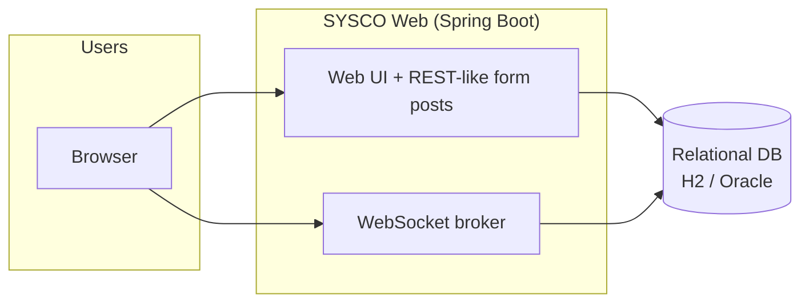
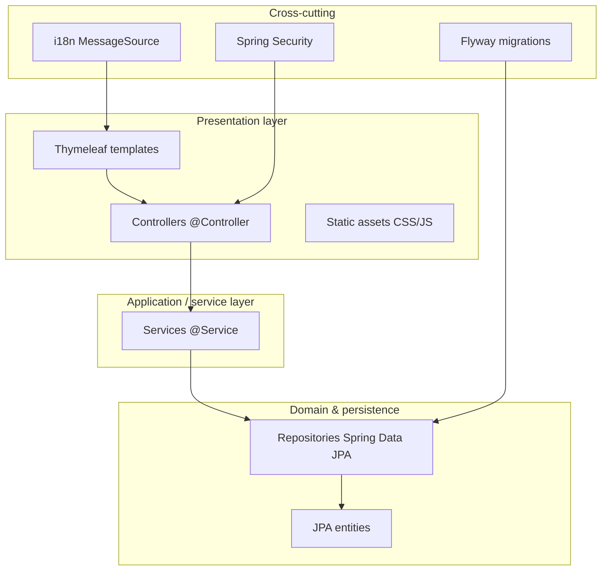
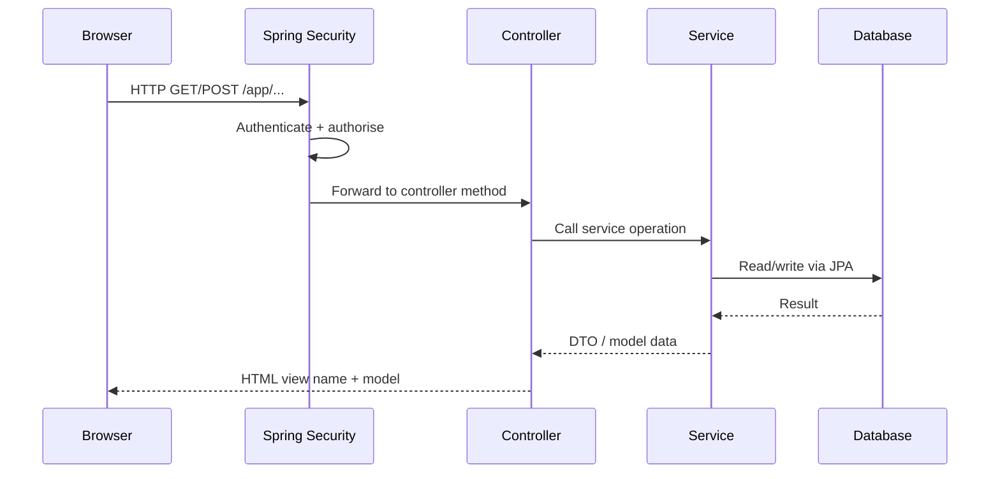
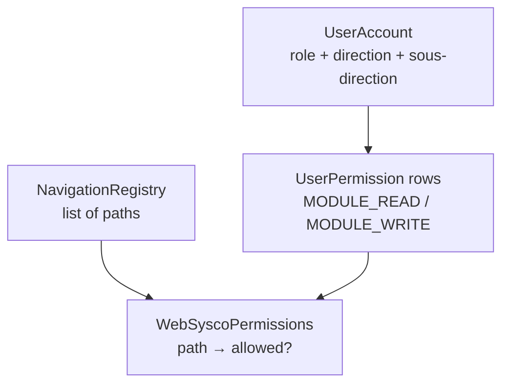
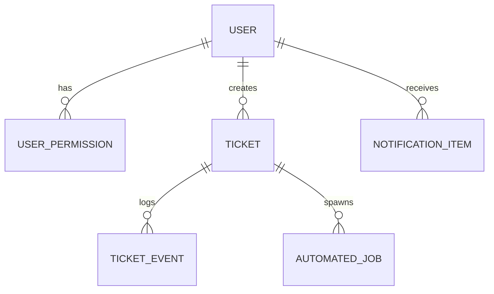

# SYSCO Web — Application & Technical Documentation

**Product:** SYSCO Web (Spring Boot shell, institutional theme parity with the JavaFX SYSCO client)  
**Primary artifact:** `sysco-web` (Maven module)  
**Document purpose:** Explain *what the system does*, *how it is structured in software*, and *how security and data flow work* — in language that a **non-programmer stakeholder** can follow, with **technical depth** for IT staff.

---

## Table of contents

1. [Executive summary (plain language)](#1-executive-summary-plain-language)  
2. [Glossary](#2-glossary)  
3. [System context](#3-system-context)  
4. [High-level architecture](#4-high-level-architecture)  
5. [Technology stack](#5-technology-stack)  
6. [Application layering](#6-application-layering)  
7. [Web layer (controllers & pages)](#7-web-layer-controllers--pages)  
8. [Security architecture](#8-security-architecture)  
9. [Navigation & authorisation matrix](#9-navigation--authorisation-matrix)  
10. [Persistence & schema evolution](#10-persistence--schema-evolution)  
11. [Real-time & notifications](#11-real-time--notifications)  
12. [Internationalisation & guided tour](#12-internationalisation--guided-tour)  
13. [Key business domains (mapping)](#13-key-business-domains-mapping)  
14. [Deployment & configuration](#14-deployment--configuration)  
15. [Operational concerns](#15-operational-concerns)  
16. [Extensibility & maintenance](#16-extensibility--maintenance)  
17. [Appendix: diagram index](#appendix-diagram-index)

---

## 1. Executive summary (plain language)

**SYSCO Web** is a **browser-based workplace** used by customs / institutional teams to manage **tickets**, **physical courier packets**, **data entry**, **file sharing**, **missions**, **leave/agenda**, **shifts**, and **scheduled jobs**, among other functions. It is designed to mirror capabilities that historically existed in a **desktop JavaFX** application, so that users can work from the office or remote locations using a standard web browser.

From a business perspective:

- Each **user** has an **account** with a **role** (for example: director, inspector, verifier, secretary, administrator).
- The **menu** only shows **modules** that the organisation allows for that user.
- **Tickets** represent operational cases; they can move through statuses (open, assigned, in progress, escalated, closure review, closed).
- **Notifications** inform users of important events (movements on tickets, chat, scheduled job reminders, etc.).
- **Auditing** features exist for login events and file-share management, depending on permissions.

From a technical perspective:

- The application is a **Spring Boot** server that renders **HTML pages** with **Thymeleaf** templates, serves **static CSS/JS**, and exposes **WebSocket/STOMP** endpoints for real-time features.
- Data is stored in a **relational database** (default developer database: **H2** file; production profile can use **Oracle**).
- **Flyway** applies **versioned SQL migrations** so the database schema stays aligned with the code.

---

## 2. Glossary

| Term | Plain-language meaning | Technical meaning |
|------|------------------------|-------------------|
| **Module** | A major area of the application (e.g. “Courrier”, “Tickets”) | A navigable feature area, often mapped to permission keys (`*_READ` / `*_WRITE`) |
| **Ticket** | A tracked dossier / case | Entity `Ticket` with workflow status, assignments, SLA fields, optional linked courier |
| **Permission** | What a user is allowed to do | Row in `user_permissions` (e.g. `TICKET_MANAGEMENT_WRITE`) |
| **Role** | A job category (director, inspector, …) | String on `users.role`, normalised in `RoleKeys` / `WebSyscoPermissions` |
| **Escalation** | Sending work upward or sideways in the hierarchy | Ticket operations + notifications; external escalation to another direction |
| **Flyway** | “Database update scripts in order” | Migration files `V1__....sql`, `V2__....sql`, … |
| **Thymeleaf** | Server builds the final HTML | Template engine under `src/main/resources/templates/` |
| **CSRF** | Protection against cross-site form abuse | Spring Security CSRF token on forms and AJAX |
| **WebSocket / STOMP** | Live channel to push updates to the browser | Spring messaging + SockJS client |

---

## 3. System context

*Plain language:* Users sit in front of a **web browser**. The browser talks to **one central application server** (SYSCO Web). That server talks to a **database** and optionally to **other institutional systems** only indirectly (this module is primarily a self-contained web app with JDBC).

**Figure A — Context:** End users interact with SYSCO Web through HTTP and WebSockets; persistence is relational.

---

## 4. High-level architecture

The application follows a **layered architecture** typical of Spring applications:

**Reading the diagram for non-IT readers:**

- **Templates** are the “pages” and fragments users see.
- **Controllers** receive the browser request, call the right **service**, and choose the next page.
- **Services** hold the real **business rules** (who may escalate, how to save a ticket, how to compute dashboard metrics).
- **Entities & repositories** represent **tables** and **database access**.

---

## 5. Technology stack

| Layer | Technology | Notes |
|-------|------------|------|
| Language | Java 17 | LTS |
| Framework | Spring Boot 3.2.x | Web, Security, Thymeleaf, Data JPA, WebSocket |
| Templates | Thymeleaf 3 + Spring Security extras | Layout `layout/base.html`, fragments |
| Database | H2 (dev file), Oracle optional | `application.yml`, profile `oracle` |
| Migrations | Flyway | `src/main/resources/db/migration` |
| Build | Maven | `pom.xml` |
| Front-end libs | Flatpickr, Driver.js (guided tour CDN), SockJS/STOMP | See `base.html` |
| PDF / reporting | iText / doc generation services | Operational reports, mission docs (see services) |

---

## 6. Application layering

### 6.1 Package layout (conceptual)

Typical packages under `com.sysco.web`:

| Package | Responsibility |
|---------|----------------|
| `web` | HTTP controllers, page orchestration |
| `service` | Business logic, transactions |
| `domain` | JPA entities |
| `repo` | Spring Data repositories |
| `security` | Authentication handlers, permission checks, interceptors |
| `config` | Spring `@Configuration` (locale, MVC, etc.) |
| `navigation` | Central list of main menu items |
| `bootstrap` | Optional data seeding (`SyscoDataInitializer`) |

### 6.2 Request lifecycle (simplified)

---

## 7. Web layer (controllers & pages)

Controllers live in `com.sysco.web.web`. The following table maps **URL prefixes** (simplified) to **business capability**. Exact paths are defined on each `@RequestMapping`.

| Area | Example path prefix | Representative controller |
|------|---------------------|---------------------------|
| Dashboard | `/app` | `AppController` |
| Data entry | `/app/data-entry` | `DataEntryController` |
| Courier portal | `/app/courier` | `CourierPortalController` |
| Courier management | `/app/courier-management` | `CourierManagementController` |
| Data management | `/app/data-management` | `DataManagementController` |
| Data share | `/app/data-share` | `DataShareController` |
| My activity | `/app/my-activity` | `MyActivityController` |
| My work | `/app/my-work` | `MyWorkController` |
| Ticket monitoring | `/app/ticket-monitoring` | `TicketMonitoringController` |
| Ticket management | `/app/ticket-management` | `TicketManagementController` |
| File share management | `/app/file-share-management` | `FileShareManagementController` |
| User management | `/app/user-management` | `UserManagementController` |
| Agenda / leave | `/app/agenda` | `AgendaController` |
| Login audit | `/app/login-audit` | `LoginAuditController` |
| File share audit | `/app/file-share-audit` | `FileShareAuditController` |
| Create ticket | `/app/create-ticket` | `CreateTicketController` |
| Job scheduler | `/app/job-scheduler` | `JobSchedulerController` |
| Missions | `/app/missions` | `MissionsController` |
| My shift | `/app/my-shift` | `MyShiftController` |
| Notifications | `/app/notifications` | `NotificationsController` |
| Chat | `/app/chat` | `ChatController` |
| Auth / password | `/login`, `/change-password` | `LoginController` |
| Help / tour | `/app/help/tutorial-completed` | `HelpController` |

**Templates** mirror these areas under `src/main/resources/templates/app/`.

---

## 8. Security architecture

### 8.1 Authentication

- **Form login** at `/login` with Spring Security’s `SecurityFilterChain`.
- **Success handler** (`SyscoAuthenticationSuccessHandler`) decides redirect to **password change** or **`/app`**, and may set a **session flag** for the **guided tour**.
- **Failure / lockout** handled via `SyscoAuthenticationFailureHandler` and `AuthAccountService` (failed attempts, temporary lock).

### 8.2 Authorisation

- Method security enabled (`@EnableMethodSecurity`).
- HTTP chain: most resources require **authenticated** user; static assets and login endpoints are **permitAll**.
- Fine-grained **module access** uses `WebSyscoPermissions.canAccessNavPath(authentication, path)` when building the sidebar.
- Additional **filters** exist for specialised areas (e.g. file share management access filter).

### 8.3 Permission model (conceptual)

---

## 9. Navigation & authorisation matrix

The **sidebar** is data-driven:

1. `NavigationRegistry.mainNav()` returns an ordered list of `NavItem(path, messageKey)`.
2. `NavigationAdvice` exposes `navItems` filtered by `WebSyscoPermissions`.
3. `sidebar.html` renders anchors; guided tour assigns stable ids `tour-nav-{index}`.

This means **authorisation changes** in one Java class affect both **security** and **visible navigation**.

---

## 10. Persistence & schema evolution

### 10.1 JPA & transactions

- Services use `@Transactional` where multiple writes must succeed or fail together.
- Some processing uses `REQUIRES_NEW` for isolated transactions (e.g. automated job notification processing).

### 10.2 Flyway migrations

- Located in `src/main/resources/db/migration`.
- Naming: `V{n}__description.sql`.
- **Baseline** (`V1__sysco_baseline.sql`) establishes core tables; later versions add chat, tasks, missions, guided tour flag on users, etc.

### 10.3 Conceptual ER (selected entities)

*(Simplified: real schema has many more tables and foreign keys.)*

---

## 11. Real-time & notifications

### 11.1 Notification pipeline

1. **Domain event** occurs (ticket movement, job due, etc.).
2. `NotificationService` persists `NotificationItem` and pushes to the user’s STOMP destination (e.g. `/user/{username}/queue/notifications`).
3. Browser `realtime-hub.js` consumes messages and updates badges / UI where implemented.

### 11.2 Chat

- Messages stored in `chat_messages` (see migrations).
- Unread counts power header badges; visiting chat may mark messages seen (`ChatService`).

---

## 12. Internationalisation & guided tour

- **Message bundles:** `messages.properties` (default English keys) and `messages_fr.properties` (French).
- **Locale:** `FixedLocaleResolver(Locale.FRENCH)` may be configured so the UI defaults to French institution-wide.
- **Guided tour:** `GuidedTourService` builds JSON steps; **Driver.js** highlights UI regions; completion POSTs to `/app/help/tutorial-completed` to set `users.onboarding_tutorial_completed`.

---

## 13. Key business domains (mapping)

| Domain | Primary services (examples) | User-visible outcome |
|--------|----------------------------|----------------------|
| Tickets | `TicketManagementService`, `TicketMonitoringService`, `CreateTicketService` | Create, assign, escalate, close, merge, SLA display |
| Tasks / planner jobs | `JobSchedulerService`, `AutomatedJobProcessingService` | Scheduled tasks, reminders, due notifications |
| Courier | `CourierPortalService`, `CourierManagementService` | Packet lifecycle, assignments |
| Data share | `DataShareService` | Secure share, OTP flows |
| Missions | `MissionService`, `MissionOrderDocxGenerator` | Mission orders, logistics fields |
| HR / agenda | `AgendaService`, related controllers | Leave, calendar |
| Reporting | `OperationalReportPdfService`, `MonthlyReport` | PDF exploitation reports |

---

## 14. Deployment & configuration

### 14.1 Ports & packaging

- Default **HTTP port** `8080` (`application.yml`).
- Runnable JAR produced by `spring-boot-maven-plugin`.

### 14.2 Configuration keys (examples)

- `spring.datasource.*` — JDBC URL, credentials.
- `sysco.uploads.directory` — file upload root.
- `sysco.scheduler.jobs-poll-ms` — how often scheduled jobs are evaluated for reminders/due notifications.

### 14.3 Profiles

- **`oracle` profile** example in `application.yml` for Oracle JDBC driver and validation mode.

---

## 15. Operational concerns

| Topic | Guidance |
|-------|----------|
| **Backups** | Database + uploaded files directory must be backed up together for consistency |
| **Logs** | Spring Boot logging; tune levels for WebSocket noise in production |
| **Security** | Enforce HTTPS at reverse proxy; rotate credentials; review `USER_MANAGEMENT` access |
| **Migrations** | Test Flyway upgrades on a copy of production before rollout |

---

## 16. Extensibility & maintenance

- **Add a module:** introduce permission keys, add `NavItem`, implement controller + templates + service, update `WebSyscoPermissions`.
- **Add DB column:** new Flyway script `V{next}__....sql`, update entity, service, UI.
- **Keep desktop parity:** when changing business rules, align with JavaFX client expectations where applicable.

---

## Appendix: diagram index

| ID | Name | Location |
|----|------|----------|
| Figure A | System context | Section 3 |
| Figure B | Layered architecture | Section 4 |
| Figure C | Request lifecycle | Section 6.2 |
| Figure D | Permission gate | Section 8.3 |
| Figure E | Simplified ER | Section 10.3 |

---

---

## 17. Expanded service catalogue (for IT integrators)

The following list names **representative** service classes. It is **not** exhaustive of every helper or utility, but it helps integrators find where behaviour lives.

| Service | Typical responsibility |
|---------|------------------------|
| `AuthAccountService` | Login outcomes, password change, forgot-password temp password |
| `UserManagementService` | CRUD users, roles, permissions, direction binding |
| `DashboardMetricsService` | Dashboard KPI snapshot for `/app` |
| `TicketManagementService` | Ticket detail, comments, tasks, closure workflow, genealogy |
| `TicketMonitoringService` | Monitoring lists, bulk operations, escalations from monitoring |
| `CreateTicketService` | Wizard to create new tickets |
| `MyWorkService` | Personal inbox, merges, escalations from “Mon travail” |
| `MyActivityService` | Consolidated activity timeline for a user |
| `CourierPortalService` | Courier packet registration, routing, assignments |
| `CourierManagementService` | Oversight screens for courier operations |
| `DataEntryService` | Excel-style data entry tickets |
| `DataManagementService` | Imports / management of structured data sets |
| `DataShareService` | Sharing files with OTP / access workflow |
| `FileShareManagementService` | Administrative handling of file-share requests |
| `FileShareManagementAccessService` | Access control logic for file-share management |
| `JobSchedulerService` | Planner UI: create jobs, toggle, delete, PDF period reports |
| `AutomatedJobProcessingService` | Poll-driven: reminders & due notifications for `AutomatedJob` |
| `AutomatedJobPlannerProcessor` | `@Scheduled` driver invoking processing |
| `MissionService` | Mission lifecycle, participants, logistics fields |
| `MissionOrderDocxGenerator` | Official mission order document generation |
| `AgendaService` | Leave/agenda calendar aggregates |
| `MyShiftService` | Attendance / shift views |
| `NotificationService` | Persist + push notifications |
| `ChatService` | Conversations and unread counts |
| `LoginAuditService` | Login audit CSV / queries |
| `TicketTimelineService` | Append-only style ticket events; optional notification side-effect |
| `GuidedTourService` | Builds guided tour JSON payload |
| `OperationalReportPdfService` | Period PDF operational report |
| `DirectionScopeService` | Direction / sous-direction scoping for users |
| `TicketSlaCalculator` | SLA evaluation helpers |

---

## 18. Batch and asynchronous processing

### 18.1 Scheduled jobs (application level)

**Automated jobs** (`AutomatedJob` entity) are distinct from **Spring `@Scheduled` beans**:

- **Planner jobs** are rows users create in the UI.
- A **processor** (`AutomatedJobPlannerProcessor`) runs on a configurable interval (`sysco.scheduler.jobs-poll-ms`) and invokes `AutomatedJobProcessingService.handleOne(jobId)` for active rows.

### 18.2 Notification semantics (planner)

Reminder and due notifications are **time-based**:

- A **reminder** is sent in the window before the due instant, subject to “not already reminded for this due key” and “reminder instant not entirely in the past relative to job creation” (anti-spam for short deadlines).
- A **due** notification fires when `now >= dueAt`, with recurrence rules advancing or deactivating the row.

---

## 19. Threat model (high level)

| Threat | Mitigation (as implemented in typical deployment) |
|--------|-----------------------------------------------------|
| Credential stuffing | Lockout after repeated failures; password hashing (bcrypt) |
| CSRF on state-changing POST | Spring Security CSRF tokens embedded in forms / meta for fetch |
| Session fixation | Spring Security session management defaults + HTTPS in production |
| Horizontal privilege escalation | Permission checks on navigation + service-level checks for sensitive operations |
| Data exfiltration via uploads | Configurable upload directory; OS-level permissions; validation in services |

*This is not a formal certification document; perform institution-specific penetration testing.*

---

## 20. Data residency & PII

Fields such as **email**, **matricule**, **attendance signature**, chat content, and uploaded attachments are **personal or operational data**. Policies for retention, anonymisation, and lawful basis of processing are **organisational** decisions; the software provides technical hooks (audit tables, delete operations where implemented).

---

## 21. Disaster recovery checklist (plain language)

1. **Stop** application instances cleanly.  
2. **Backup** database (native DB tools).  
3. **Backup** upload directory (`sysco.uploads.directory`).  
4. **Restore** DB + files to a consistent point in time.  
5. **Replay** Flyway migrations on upgraded environments (never skip versions).  
6. **Verify** login, one ticket operation, one upload, one notification.

---

## 22. Interface stability

- **Server-rendered HTML** contracts change with template edits; there is **no public REST API guarantee** documented here for third parties.
- **WebSocket destinations** are internal; clients are bundled with the app.

---

*End of technical documentation. For exhaustive API-level detail, generate Javadoc and OpenAPI if REST endpoints are exposed in future versions; this module is primarily server-rendered HTML.*

