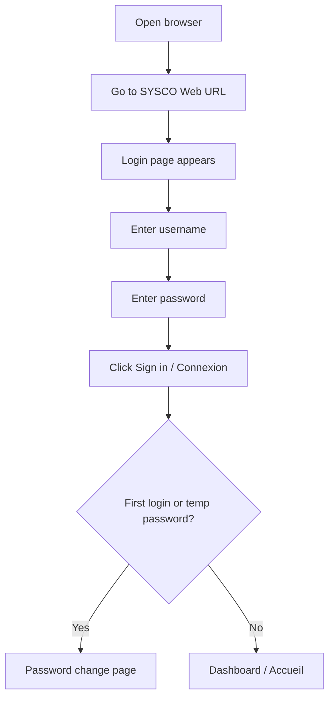
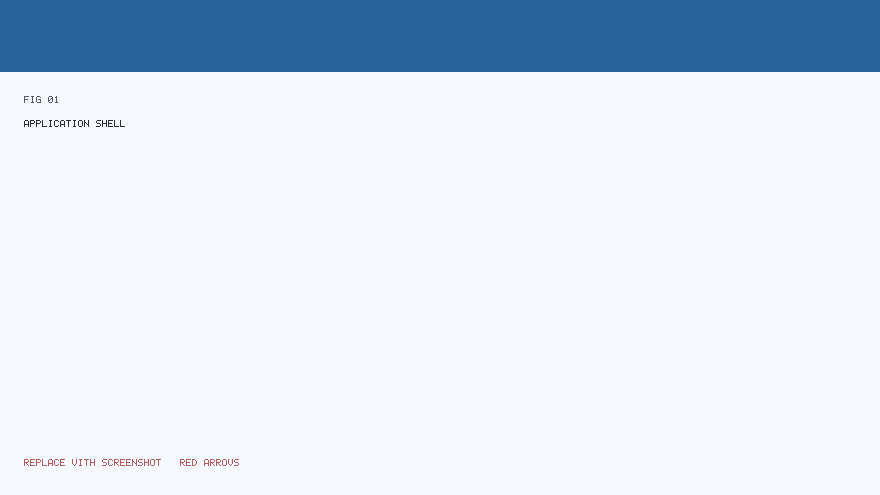
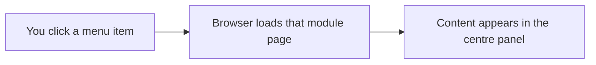
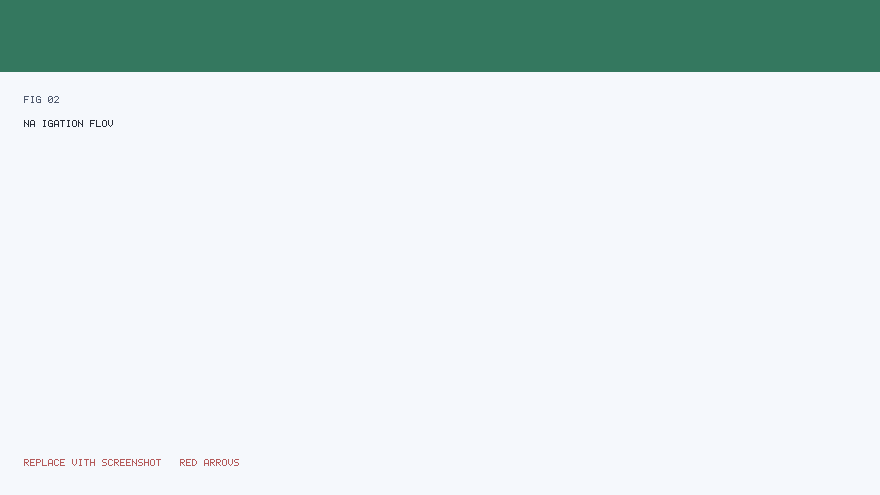

# SYSCO Web — User Manual (Part 1 of 5)

**Audience:** Customs officers, secretaries, verifiers, directors, and administrators — **no IT background required.**  
**Language note:** The live application interface is primarily **French**; this manual uses French **menu labels** where they appear on screen.

---

## What this part covers

1. [What is SYSCO Web?](#1-what-is-sysco-web)  
2. [Before you start](#2-before-you-start)  
3. [Signing in and signing out](#3-signing-in-and-signing-out)  
4. [First-time password change](#4-first-time-password-change)  
5. [The main screen (shell)](#5-the-main-screen-shell)  
6. [Using the menu (sidebar)](#6-using-the-menu-sidebar)  
7. [Header: language, help, notifications, profile](#7-header-language-help-notifications-profile)  
8. [Guided tour (optional)](#8-guided-tour-optional)  
9. [Common patterns on every page](#9-common-patterns-on-every-page)  
10. [If something goes wrong](#10-if-something-goes-wrong)

---

## 1. What is SYSCO Web?

**SYSCO Web** is the **web version** of your institution’s operational workspace. You use it in a **web browser** (Chrome, Edge, Firefox, etc.) instead of installing a separate desktop program.

**You can typically:**

- Track **tickets** (dossiers) from creation to closure.  
- Work with **courier packets** (physical courrier).  
- Enter or import **data** and manage **shared files**.  
- See **your tasks**, **your activity**, and **notifications**.  
- Use **calendar / leave**, **missions**, **shifts**, and **scheduled jobs** (if your role allows).

**Important:** You only see **modules** that your **administrator** has enabled for your **role** and **organisational unit** (direction / sous-direction). If a colleague sees a menu item you do not, that is usually **normal** — not a computer fault.

---

## 2. Before you start

### 2.1 What you need

| Item | Why |
|------|-----|
| **URL** of SYSCO Web | Your IT team gives you the address (for example `https://sysco.example.gov/app`). |
| **Username** | Often your professional identifier or email prefix. |
| **Password** | Initial password may be temporary; you may be forced to change it on first login. |
| **Modern browser** | Keep the browser updated for security. |

### 2.2 Security habits (plain language)

- **Do not share** your password.  
- **Log out** when you leave a shared computer.  
- If you suspect someone used your account, **tell your administrator immediately**.

---

## 3. Signing in and signing out

### 3.1 Sign in — step by step

**Steps:**

1. Open your browser.  
2. Type or paste the **SYSCO Web address** exactly as provided by IT.  
3. You should see a **login** page with fields for **username** and **password**.  
4. Enter your **username** (watch for accidental spaces).  
5. Enter your **password** (password fields hide characters; this is normal).  
6. Click the button to **connect** / **sign in**.  
7. **If login fails:** read the message on screen. After several failures, your account may be **temporarily locked** — wait or contact support as instructed.

### 3.2 Sign out — step by step

1. Look at the **top-right** of the screen for your **profile** or **account** menu.  
2. Choose **logout** / **déconnexion**.  
3. Close the browser tab if you are on a shared PC.

**Why sign out matters:** It prevents the next person from continuing **as you**.

---

## 4. First-time password change

If the system requires a **new password**, you will see a **dedicated page** after login (not the dashboard).

**Good password habits (non-technical):**

- Use **long** phrases you can remember but others cannot guess.  
- Mix **letters and numbers** if your policy requires it.  
- **Do not reuse** your personal email password for work systems.

After a successful change, you are usually redirected to the **main application** (`/app`).

---

## 5. The main screen (shell)

The **application shell** is the frame that stays the same while you move between modules: **header on top**, **menu on the left**, **main content** in the centre.

**Illustrated overview (annotated figure):**

*How to read the figure:* The **red arrows** in the image point to: (1) the **top bar** with notifications and profile, (2) the **left menu** listing modules, (3) the **central workspace** where forms and tables appear.

### 5.1 Regions in plain language

| Region | What you use it for |
|--------|---------------------|
| **Top bar** | Alerts, help, your name, logout. |
| **Left menu** | Jump to **Courrier**, **Tickets**, **Données**, etc. |
| **Centre** | The **page** for the module you opened — lists, buttons, filters. |

---

## 6. Using the menu (sidebar)

### 6.1 How navigation works (concept)

**Illustrated high-level navigation:**

### 6.2 If a menu item is missing

Ask yourself:

1. **Is it my role?** Directors see different items than couriers.  
2. **Was it disabled for my direction?** Some units use only a subset of modules.  
3. **Am I logged in as the right user?** Check the name in the header.

If still unsure, contact your **local administrator** — they manage **permissions**.

---

## 7. Header: language, help, notifications, profile

### 7.1 Notifications (bell icon)

- A **badge** (small number) may show **unread** notifications.  
- Opening the **notifications** page lists items such as ticket movements, chat, or **job reminders** (if enabled).

### 7.2 Help and guided tour

- **Help** may open documentation or start a **step-by-step tour** that highlights parts of the screen.  
- Completing the tour may be recorded so you are not prompted again (institution policy).

### 7.3 Profile

- Your **name** or **avatar** area may link to **password change** or **preferences**.

---

## 8. Guided tour (optional)

If your organisation enabled it, a **tour** may start automatically after your **first successful login**.

**What to expect:**

1. A **highlight** appears around a part of the interface.  
2. A **short explanation** appears in a small box.  
3. You click **Next** until the tour ends.  
4. You can usually **skip** the tour if you are experienced.

The tour uses **numbered steps** tied to stable element ids (for example menu entries). If your screen is very small, zoom out slightly so highlights align correctly.

---

## 9. Common patterns on every page

### 9.1 Tables (lists)

- **Column headers** may be clickable to sort (where implemented).  
- **Row actions** (open, edit) are often on the **right** or in a **⋯** menu.

### 9.2 Filters

- Many lists have **filters** at the top: status, date range, direction, assignee.  
- After changing filters, click **Apply** / **Filtrer** (wording may vary).

### 9.3 Forms

- Required fields are often marked with **\*** or a red border when empty.  
- **Save** commits your data; **Cancel** discards unsaved changes on that form.

### 9.4 Messages after an action

- **Green** messages: success.  
- **Red** messages: error — read the text; it often says *what* is wrong (missing field, permission denied).

---

## 10. If something goes wrong

| Symptom | What to try | Who helps |
|---------|-------------|-----------|
| Blank page after login | Refresh once; try another browser | IT |
| “Access denied” | You lack permission for that URL | Administrator |
| Upload fails | File too large or disallowed type | IT policy |
| Notifications never arrive | Check you are online; verify role | Administrator |

---

## Next manual part

Continue with **Part 2 — Tickets & daily operations** (`03-User-Manual-Part-2-Tickets-and-Operations.md`).

---

*SYSCO Web User Manual Part 1 — Getting started. Figures in `docs/figures/`.*
