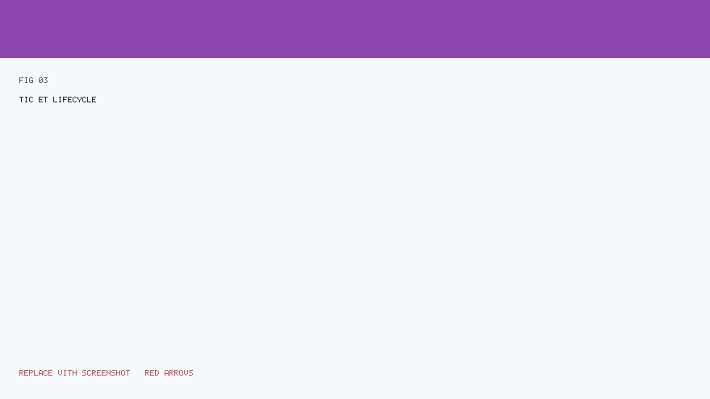
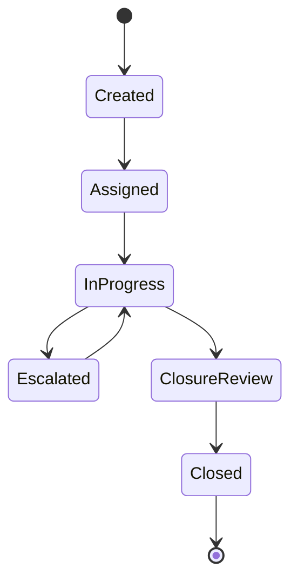
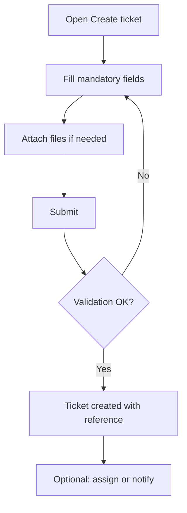

# SYSCO Web — User Manual (Part 2 of 5)

**Focus:** **Tickets**, **monitoring**, **creating tickets**, and **“Mon travail”** (my work).  
**Prerequisite:** You completed **Part 1** (login, shell, menu).

---

## Table of contents

1. [Tickets in plain language](#1-tickets-in-plain-language)  
2. [Ticket lifecycle (overview diagram)](#2-ticket-lifecycle-overview-diagram)  
3. [Module: Suivi des tickets (monitoring)](#3-module-suivi-des-tickets-monitoring)  
4. [Module: Gestion des tickets (management)](#4-module-gestion-des-tickets-management)  
5. [Creating a new ticket](#5-creating-a-new-ticket)  
6. [Comments, tasks, and history](#6-comments-tasks-and-history)  
7. [Escalation and closure (concept)](#7-escalation-and-closure-concept)  
8. [Mon travail — personal inbox](#8-mon-travail--personal-inbox)  
9. [Mon activité — activity timeline](#9-mon-activité--activity-timeline)  
10. [Good practices for ticket hygiene](#10-good-practices-for-ticket-hygiene)

---

## 1. Tickets in plain language

A **ticket** is a **tracked case** in SYSCO Web. Think of it as a **digital folder** that:

- Has a **unique reference** (number or code).  
- Has a **status** (open, in progress, waiting for closure review, closed, etc.).  
- Can be **assigned** to people or teams.  
- Stores **comments**, **attachments**, and sometimes **tasks** or **child tickets**.

**Why tickets matter:** They give **traceability** — anyone authorised can see **what happened** and **when**.

---

## 2. Ticket lifecycle (overview diagram)

The exact **status names** on your screen are configured for your institution, but the **idea** is always: **open → work in progress → review → closed**.

**Illustrated lifecycle (reference figure with arrows):**

*Reading the diagram:* Arrows show **allowed movements**. Not every user can trigger every arrow — your **role** and **assignment** determine which **buttons** you see.

---

## 3. Module: Suivi des tickets (monitoring)

**Purpose:** **Supervise** many tickets at once — filters, bulk awareness, operational visibility.

### 3.1 How to open the module

1. In the **left menu**, click **Suivi des tickets** (or the label your admin uses).  
2. Wait for the **list** to load.

### 3.2 Typical screen layout

| Area | Use |
|------|-----|
| **Filters** | Narrow by status, date, direction, priority. |
| **Table** | One row per ticket; key columns (reference, status, assignee, dates). |
| **Row action** | Open **detail** for one ticket. |

### 3.3 Step-by-step: find tickets due soon

1. Open **Suivi des tickets**.  
2. Locate the **date** or **deadline** filter (if present).  
3. Choose **today → end of week** (example).  
4. Click **Apply** / **Filtrer**.  
5. Sort by **due date** column if available.

### 3.4 Escalation from monitoring (if your role allows)

Some deployments allow **escalation** directly from monitoring views:

1. Select the **ticket** row.  
2. Click **Escalader** / **Escalate** (wording may vary).  
3. Choose **target** (direction, user, or external escalation — as implemented).  
4. Confirm.  
5. Check **notifications** — the recipient may be alerted.

---

## 4. Module: Gestion des tickets (management)

**Purpose:** **Deep work** on one ticket at a time — edit fields, manage assignments, add evidence.

### 4.1 Open a ticket from the list

1. Go to **Gestion des tickets** or **Suivi** (depending on your workflow).  
2. Click the **ticket reference** link or **Open** / **Voir** action.  
3. The **detail** page loads.

### 4.2 Detail page sections (typical)

| Section | Plain-language meaning |
|---------|------------------------|
| **Header** | Reference, status badge, SLA indicators. |
| **Main fields** | Category, priority, description, linked courier (if any). |
| **Assignments** | Who owns the ticket now. |
| **Comments** | Chronological discussion. |
| **Tasks** | Checklist items with due dates. |
| **History / genealogy** | Parent/child tickets, merge history. |

### 4.3 Modifier (edit) dialog

If you see **Modifier** / **Edit**:

1. Click **Modifier**.  
2. A **dialog** opens — change allowed fields only (others may be read-only).  
3. Click **Enregistrer** / **Save**.  
4. Read the **confirmation message**. If red text appears, fix the indicated field.

**Tip:** If the dialog closes without saving, your changes are **lost** — the system only persists on **Save**.

---

## 5. Creating a new ticket

**Module:** **Création de ticket** / **Create ticket** (menu label varies).

### 5.1 End-to-end flow

### 5.2 Step-by-step

1. Click **Création de ticket** in the menu.  
2. Enter **title / subject** and **description** clearly — future readers may not know your shorthand.  
3. Select **category**, **priority**, **direction** as required.  
4. **Attach** scans or PDFs if the process requires evidence.  
5. Click **Create** / **Créer**.  
6. **Copy** the new **reference** into your own tracker or email if needed.

### 5.3 Common mistakes

| Mistake | Result |
|---------|--------|
| Empty mandatory field | Form refuses submit; error near the field |
| Wrong category | Reporting skew; may require correction |
| Huge attachment | Upload error — ask IT for size limits |

---

## 6. Comments, tasks, and history

### 6.1 Comments

- Use comments for **decisions** and **handover** notes.  
- Avoid putting legally sensitive content in comments if policy says to use **secure attachments** only.

### 6.2 Tasks

- **Tasks** break work into steps with **owners** and **due dates**.  
- Completing tasks may be used informally as progress tracking (exact automation depends on configuration).

### 6.3 History

- **History** answers: *Who changed what?*  
- If something looks wrong, **history** is the first place supervisors check.

---

## 7. Escalation and closure (concept)

**Escalation** means: “This case needs **higher attention** or **another unit**.”

**Closure** means: “The **operational work** is done, pending final **verification** or **archival** rules.”

Your screen may show:

- **Escalader** — sends the case along a defined path.  
- **Demander clôture** / **Closure request** — starts a review period.  
- **Clôturer** — final close (often restricted).

*Always follow* your **local SOP** (standard operating procedure) — the software **enforces permissions**, not **legal authority**.

---

## 8. Mon travail — personal inbox

**Purpose:** See **what is assigned to you** without noise from the whole institution.

### Step-by-step

1. Open **Mon travail**.  
2. Review **sections** (if any): e.g. *assigned to me*, *awaiting my action*.  
3. Click a **ticket** to open detail.  
4. Perform the required action (comment, status change, attachment).  
5. Return to **Mon travail** to refresh the list.

---

## 9. Mon activité — activity timeline

**Purpose:** A **personal log** of actions you performed or that concern you (implementation-specific).

Use it when you need to **prove** you treated a dossier on a given day.

---

## 10. Good practices for ticket hygiene

1. **One ticket = one coherent case** — do not mix unrelated subjects.  
2. **Update status** honestly — dashboards depend on it.  
3. **Assign** explicitly when handing over — do not rely on verbal-only handover.  
4. **Close** only when work truly meets your **local closure checklist**.

---

## Next manual part

Continue with **Part 3 — Courrier, données, partage** (`04-User-Manual-Part-3-Courier-and-Data.md`).

---

*SYSCO Web User Manual Part 2 — Tickets & operations.*
