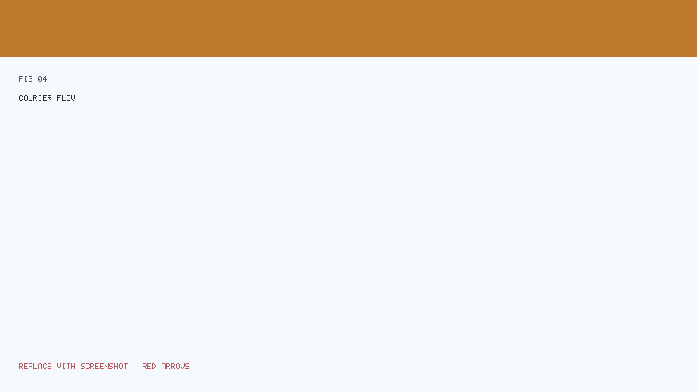
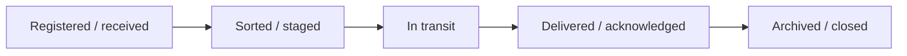
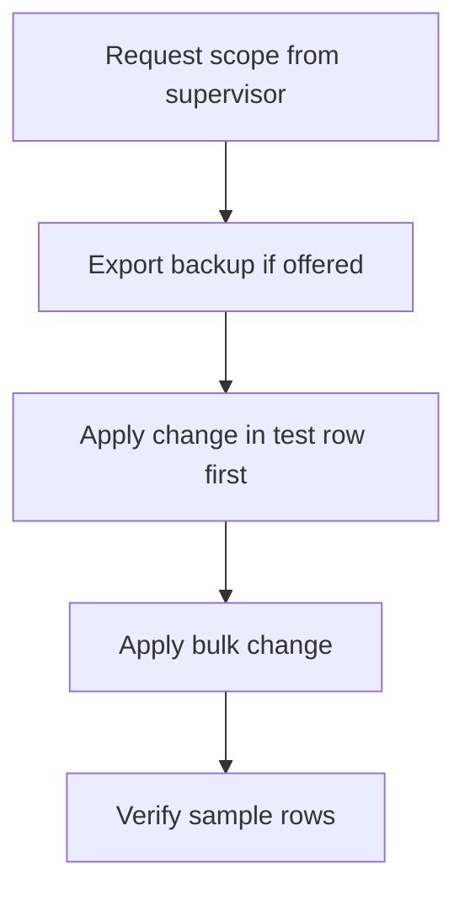

# SYSCO Web — User Manual (Part 3 of 5)

**Focus:** **Courrier** (courier / physical packets), **saisie des données** (data entry), **gestion des données** (data management), and **partage de données** (data share).

---

## Table of contents

1. [Courrier — what it is](#1-courrier--what-it-is)  
2. [Courier flow (illustrated)](#2-courier-flow-illustrated)  
3. [Portail courrier — daily steps](#3-portail-courrier--daily-steps)  
4. [Gestion courrier — supervision](#4-gestion-courrier--supervision)  
5. [Saisie des données](#5-saisie-des-données)  
6. [Gestion des données](#6-gestion-des-données)  
7. [Partage de données (secure share)](#7-partage-de-données-secure-share)  
8. [Files and uploads — practical rules](#8-files-and-uploads--practical-rules)

---

## 1. Courrier — what it is

**Courrier** in SYSCO Web tracks **physical movements** of **packets** or **sealed consignments** between units, desks, or external partners.

**Plain-language analogy:** Imagine a **registered parcel** in a postal system: it has a **barcode**, **origin**, **destination**, **scan events**, and **signatures**.

---

## 2. Courier flow (illustrated)

**Reference figure (arrows show handover points):**

*Note:* Your institution may use **different labels**; follow **on-screen** wording.

---

## 3. Portail courrier — daily steps

**Who uses it:** **Couriers**, **desk officers**, **receiving clerks** (role-dependent).

### 3.1 Register an incoming packet

1. Open **Portail courrier** from the menu.  
2. Click **Nouveau** / **Enregistrer** (wording varies).  
3. Fill **origin**, **destination**, **reference numbers** from the physical label.  
4. **Scan** or **photograph** the label if the UI allows attachment.  
5. **Save**.  
6. **Print** or **note** the system reference if your SOP requires sticking a sticker on the packet.

### 3.2 Hand over to another person

1. Locate the packet in **active** list (search by reference).  
2. Open **detail**.  
3. Choose **transfer** / **assign** / **handover** action.  
4. Select **recipient** (user or location).  
5. Confirm.  
6. Physically **give** the packet — the digital record is not enough.

### 3.3 Confirm delivery

1. Open the packet record.  
2. Use **delivered** / **received** action.  
3. Add **comment** if there is damage or discrepancy.  
4. Save.

### 3.4 If the packet is lost

1. **Do not** delete the record silently.  
2. Flag **incident** per local procedure (comment + supervisor).  
3. Your organisation may require a **parallel paper form** — follow that.

---

## 4. Gestion courrier — supervision

**Who uses it:** **Supervisors**, **heads of unit** — broader visibility than the portal.

### Typical tasks

| Task | Steps (high level) |
|------|---------------------|
| **Find stuck packets** | Filter by status *in transit* beyond N days |
| **Reassign** | Open detail → change assignee → notify |
| **Audit trail** | Export or print history for investigation |

---

## 5. Saisie des données

**Purpose:** Enter structured information that becomes part of operational datasets (often **table-like** screens).

### 5.1 Before you type

- Confirm you are in the **correct** **dataset** or **campaign** (if your UI shows one).  
- Verify **period** or **version** — wrong period corrupts statistics.

### 5.2 Step-by-step row entry

1. Open **Saisie des données**.  
2. Click **Add row** / **Nouvelle ligne** (if available).  
3. Fill cells — use **Tab** to move quickly.  
4. **Save** the row.  
5. Repeat.

### 5.3 Copy/paste from Excel

If the module supports **paste**:

1. Prepare a **clean** sheet: **no** merged cells in data area.  
2. **Headers** must match column order expected by the app (ask your admin for a **template**).  
3. Paste **small chunks** first to validate.  
4. Review **error messages** row by row.

### 5.4 Validation errors

| Message type | Meaning |
|--------------|---------|
| **Required field** | Empty cell where mandatory |
| **Invalid format** | Date not DD/MM/YYYY, number not numeric |
| **Duplicate** | Key already exists |

---

## 6. Gestion des données

**Purpose:** **Administrative** operations on datasets — imports, corrections, reconciliations (exact buttons depend on your build).

### 6.1 Safe workflow

### 6.2 Import workflow (typical)

1. Download **template** (CSV/XLSX) if provided.  
2. Fill **without** altering column names.  
3. **Upload** file.  
4. Read **preview** / **validation** screen.  
5. **Commit** import only if zero blocking errors.

### 6.3 If import partially fails

1. **Save** the error report (CSV/log) if offered.  
2. Fix **only** failing rows.  
3. Re-import **only** the corrected rows (if supported) or full file per admin guidance.

---

## 7. Partage de données (secure share)

**Purpose:** Share a file or dossier **outside** your usual folder structure with **access controls** — sometimes **OTP** (one-time password) or **time-limited** links.

### 7.1 Request a share (user)

1. Open **Partage de données**.  
2. Click **Nouveau partage** / similar.  
3. Choose **file** or **dataset** scope.  
4. Enter **recipient email** or **identifier** as required.  
5. Set **expiry** if the UI offers it — **shorter is safer**.  
6. Submit.  
7. **Communicate OTP** through an approved channel (not in the same email as the link, if policy says so).

### 7.2 Revoke access

If you shared by mistake:

1. Open **active shares** list.  
2. Select the row.  
3. **Revoke** / **Désactiver**.  
4. Inform your **security officer** if sensitive data left your control.

---

## 8. Files and uploads — practical rules

| Rule | Reason |
|------|--------|
| Prefer **PDF** for final documents | Preserves layout |
| Avoid **password-protected** archives unless IT approves | Automated scanning may block |
| Name files clearly `2026-05-02_Dossier123_facture.pdf` | Audit readability |
| Never upload **personal** photos unrelated to work | Data minimisation |

---

## Next manual part

Continue with **Part 4 — Planning, missions, équipe** (`05-User-Manual-Part-4-Planning-and-Missions.md`).

---

*SYSCO Web User Manual Part 3 — Courier & data.*
