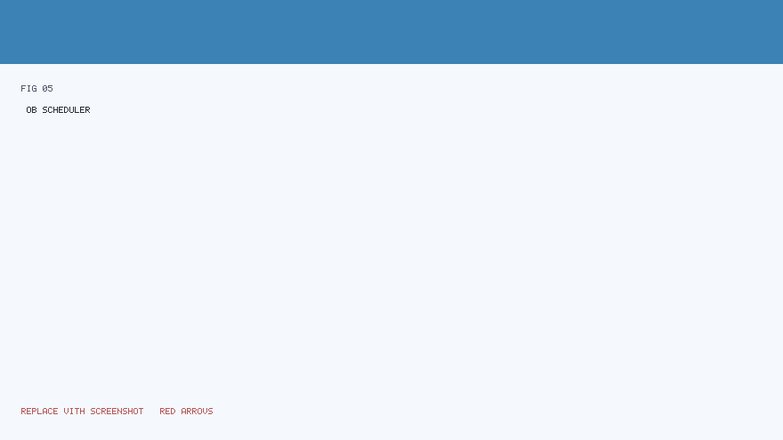
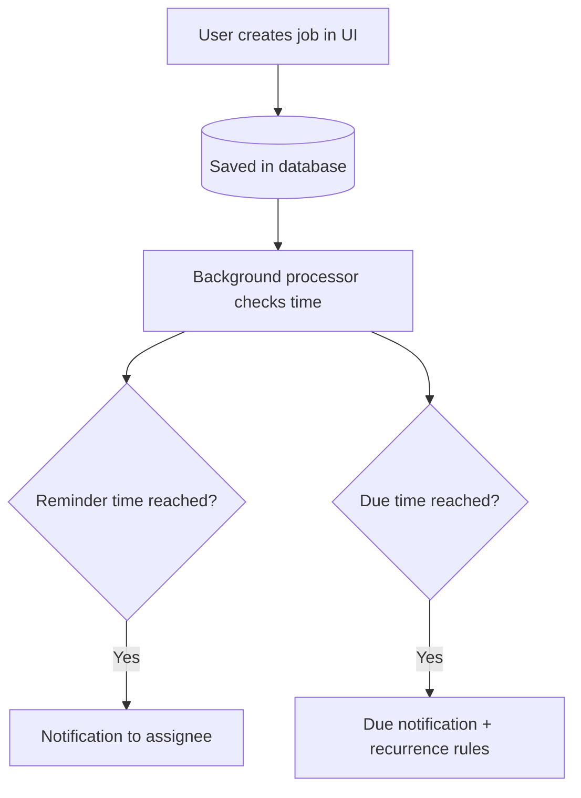

# SYSCO Web — User Manual (Part 4 of 5)

**Focus:** **Agenda / congés**, **missions**, **postes / shifts**, **planificateur de tâches** (job scheduler), **gestion du partage de fichiers** (file share management), and **reporting** touches.

---

## Table of contents

1. [Agenda et congés](#1-agenda-et-congés)  
2. [Missions](#2-missions)  
3. [Mon poste / équipes](#3-mon-poste--équipes)  
4. [Planificateur de tâches (scheduled jobs)](#4-planificateur-de-tâches-scheduled-jobs)  
5. [Job reminders and notifications](#5-job-reminders-and-notifications)  
6. [Gestion du partage de fichiers (administrative)](#6-gestion-du-partage-de-fichiers-administrative)  
7. [Operational reports (PDF)](#7-operational-reports-pdf)

---

## 1. Agenda et congés

**Purpose:** View **leave requests**, **team calendar** context, or **your own** absences — exact features depend on configuration.

### 1.1 View the calendar

1. Open **Agenda** / **Congés** from the menu.  
2. Use **month** / **week** controls if shown.  
3. Click a **day** to see details (if interactive).

### 1.2 Request leave (if enabled)

1. Click **Nouvelle demande** / **Request leave**.  
2. Choose **start** and **end** dates (use the date picker — typing wrong formats fails).  
3. Select **leave type** (annual, sick, mission-related, etc.).  
4. Add **comment** for your supervisor.  
5. Submit.  
6. Watch **notifications** for approval/denial.

### 1.3 Supervisor approval (if enabled)

1. Open **pending requests** list.  
2. Open one request.  
3. **Approve** or **Reject** with a **reason** (professional courtesy).  
4. Confirm.

---

## 2. Missions

**Purpose:** Plan **field missions** — participants, logistics, and sometimes **official documents** (generated files).

### 2.1 Create a mission

1. Open **Missions**.  
2. Click **Create** / **Nouvelle mission**.  
3. Fill **objective**, **location**, **dates**, **participants**.  
4. Attach **orders** or **maps** if required.  
5. Save.

### 2.2 Generate mission order document

If your build offers **document generation**:

1. Open mission **detail**.  
2. Click **Generate order** / **Générer l’ordre de mission**.  
3. Wait for **download** link.  
4. **Review** the PDF before signing — software does not replace **legal review**.

### 2.3 Close or cancel

1. Open mission.  
2. Use **Complete** / **Cancel** with reason.  
3. Archive attachments per **records policy**.

---

## 3. Mon poste / équipes

**Purpose:** **Shift** or **roster** awareness — who is on duty, attendance markers (implementation-specific).

### Daily use

1. Open **Mon poste** / **Mon équipe** (label varies).  
2. Confirm **your** shift for today.  
3. If you **swap** with a colleague, follow **local HR rules** — the software may only record the outcome after approval.

---

## 4. Planificateur de tâches (scheduled jobs)

**Purpose:** Create **time-based reminders** tied to operational work — distinct from ticket **SLA** clocks in concept, but similar in user value.

**Illustrated scheduler / reminder flow:**

### 4.1 Open the scheduler

1. Click **Planificateur de tâches** / **Job scheduler** in the menu.  
2. You see a **list** of jobs you may access (scoped by role/direction).

### 4.2 Create a job

1. Click **New job** / **Nouvelle tâche planifiée**.  
2. Enter **title** — be explicit: *“Relance direction X — dossier 123”* beats *“relance”*.  
3. Set **due date and time** using the picker.  
4. Set **reminder offset** if the form offers it (e.g. remind **1 day before**).  
5. Assign **owner** (yourself or colleague) if applicable.  
6. **Save**.

### 4.3 Edit or cancel

1. Locate the job in the list.  
2. Open **detail** or click **Edit** / **Modifier**.  
3. Adjust fields.  
4. Save — or use **Delete** / **Cancel job** if the work is obsolete.

### 4.4 Toggle active / inactive

Some UIs allow **pausing** a job without deleting history:

1. Open job.  
2. Switch **Active** off.  
3. Save.  
4. **Re-enable** later if the task returns.

### 4.5 PDF period report (if present)

If your screen offers **export** for a **period**:

1. Choose **start** and **end** dates covering the reporting window.  
2. Click **Generate PDF** / **Exporter**.  
3. Store the file in the **official** document repository — not only on your laptop.

---

## 5. Job reminders and notifications

**What you feel as a user:**

- A **badge** on the **bell** icon.  
- A row in **Notifications** saying a job is **due** or **reminder**.

**What you should do:**

1. Open **Notifications**.  
2. Click through to the **job** or **related ticket** if linked.  
3. **Mark as read** when handled (if available).  
4. **Update** the underlying ticket status if the job was about a dossier.

---

## 6. Gestion du partage de fichiers (administrative)

**Who uses it:** **Trusted administrators** — not every officer.

### Typical tasks

| Task | Steps |
|------|-------|
| **Review pending share requests** | Open module → filter *pending* → open row → approve/deny |
| **Audit active shares** | Export or list → identify stale shares → revoke |
| **Investigate incident** | Correlate user, timestamp, file name with **file share audit** module |

**Safety:** Treat this module like a **master key** — actions here affect **confidentiality**.

---

## 7. Operational reports (PDF)

If your deployment exposes **monthly** or **period** operational reports:

1. Open the **reporting** entry (may live under dashboard or a dedicated menu).  
2. Select **period**.  
3. Generate **PDF**.  
4. Verify **page count** and **totals** before circulating.

---

## Next manual part

Continue with **Part 5 — Chat, audits, administration, FAQ** (`06-User-Manual-Part-5-Reference.md`).

---

*SYSCO Web User Manual Part 4 — Planning & missions.*
