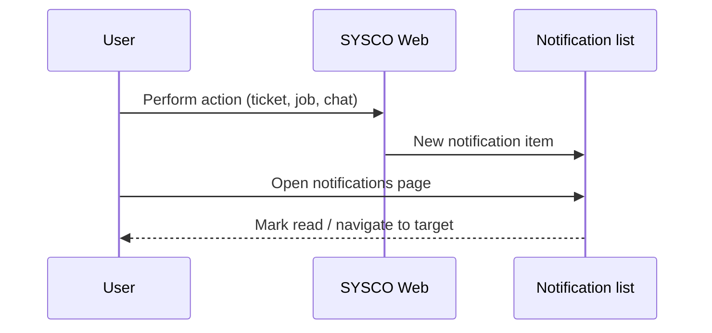

# SYSCO Web — User Manual (Part 5 of 5)

**Focus:** **Chat**, **notifications** (deep dive), **audits**, **user administration** (for admins), **accessibility**, **FAQ**, and **glossary for end users**.

---

## Table of contents

1. [Chat (messagerie)](#1-chat-messagerie)  
2. [Notifications — full workflow](#2-notifications--full-workflow)  
3. [Audits: connexions et partage de fichiers](#3-audits-connexions-et-partage-de-fichiers)  
4. [Administration des utilisateurs](#4-administration-des-utilisateurs)  
5. [Accessibility and ergonomics](#5-accessibility-and-ergonomics)  
6. [FAQ — frequent questions (non-IT)](#6-faq--frequent-questions-non-it)  
7. [Glossary — user-facing terms](#7-glossary--user-facing-terms)  
8. [Where to get help](#8-where-to-get-help)

---

## 1. Chat (messagerie)

**Purpose:** **Direct** or **group** messaging between colleagues **inside** SYSCO Web — useful for quick coordination **without** external email.

### 1.1 Open chat

1. Click **Chat** / **Messagerie** in the menu or header shortcut (if present).  
2. Wait for conversation list to load.

### 1.2 Start a conversation

1. Click **New** / **Nouvelle conversation**.  
2. Select **recipient(s)**.  
3. Type a **short** first message with **context** (*which dossier?*).  
4. Send.

### 1.3 Unread badges

- The **header** may show an **unread count**.  
- Opening the conversation usually **marks messages as seen** (depending on build).

### 1.4 Professional use guidelines

| Do | Don’t |
|----|-------|
| Use chat for **coordination** | Paste **classified** content if policy forbids |
| **Link** ticket references | Rely on chat as the **only** audit record |
| **Archive** decisions in the **ticket** comment | Argue **personally** in shared threads |

---

## 2. Notifications — full workflow

### 2.1 Types you might see

| Type | Plain meaning |
|------|----------------|
| **Ticket** | Assignment, escalation, closure request |
| **Chat** | New message |
| **Job** | Reminder or due task |
| **System** | Password change, policy broadcast (if used) |

### 2.2 Clearing noise

1. Open **Notifications**.  
2. Use **filters** (if any): unread only.  
3. Open each **high priority** item first.  
4. **Delete** or **archive** per UI (if available) only when sure.

---

## 3. Audits: connexions et partage de fichiers

**Who sees audits:** **Supervisors**, **security**, **IT auditors** — not all staff.

### 3.1 Audit des connexions (login audit)

**Purpose:** Prove **who** accessed the system **when** — often exported as **CSV** for spreadsheets.

**Typical steps:**

1. Open **Audit des connexions**.  
2. Set **date range** (narrow exports for performance).  
3. **Filter** by username if investigating one account.  
4. **Export** if allowed.  
5. Store export in **secure** drive only.

### 3.2 Audit du partage de fichiers

**Purpose:** Track **share creation**, **downloads**, **revocations**.

**Investigation pattern:**

1. Obtain **reference** of incident (user + approximate time).  
2. Open audit module.  
3. Search **time window**.  
4. Correlate **IP** / **user agent** if columns exist (ask IT meaning).  
5. **Do not** share raw audit logs with unrelated staff.

---

## 4. Administration des utilisateurs

**Audience:** **User administrators** only.

### 4.1 Create a user

1. Open **Gestion des utilisateurs**.  
2. Click **Create user** / **Nouvel utilisateur**.  
3. Fill **username**, **email**, **full name**, **matricule** if used.  
4. Assign **role** from the **controlled list** (director, inspector, …).  
5. Assign **direction** / **sous-direction** scope.  
6. Set **permissions** (module read/write) per **least privilege** principle.  
7. **Save**.  
8. Communicate **initial password** through **secure channel** per policy.

### 4.2 Reset a password

1. Locate user in list.  
2. **Reset password** / **temporary password** action.  
3. Inform user they must **change** on login.  
4. **Log** the reset in your service desk ticket.

### 4.3 Deactivate vs delete

| Action | When |
|--------|------|
| **Deactivate** | Employee on leave, investigation, role suspension |
| **Delete** | Rare — may break historical references; prefer deactivate |

### 4.4 Role modal / permissions UI

If your build uses a **modal** to pick permissions:

1. Open user **edit**.  
2. Click **Permissions** / **Rôles détaillés**.  
3. Toggle **READ** before **WRITE** where modules are split.  
4. Save — ask the user to **log out and in** if menu does not refresh.

---

## 5. Accessibility and ergonomics

- **Zoom:** Use browser zoom (Ctrl + mouse wheel) if text feels small — institutional UIs may default to dense tables.  
- **Keyboard:** Tab through forms; **Enter** may submit — be careful near destructive buttons.  
- **Colour:** Do not rely only on **colour** of status badges — read the **text label**.

---

## 6. FAQ — frequent questions (non-IT)

**Q: Why did my menu change overnight?**  
**A:** An administrator updated your **permissions** or **role**. Ask them for the change record.

**Q: I saved but my file is not there.**  
**A:** Check you clicked **Save** on the correct form; some pages have **multiple** sections with separate saves.

**Q: The system is slow.**  
**A:** Try **one** heavy export at a time; close unused **tabs**; if persistent, report to IT with **time** and **screen name**.

**Q: Can I use my phone?**  
**A:** Only if **IT** certifies the browser and **security** controls (VPN, MDM). Do not assume.

**Q: What if I see data that is not mine?**  
**A:** **Stop** using that screen; **report** immediately — possible misconfiguration or serious bug.

---

## 7. Glossary — user-facing terms

| French (typical UI) | English meaning |
|---------------------|-----------------|
| Tableau de bord | Dashboard |
| Billet / dossier | Ticket / case |
| Courrier | Courier / physical packet |
| Clôture | Closure |
| Escalade | Escalation |
| Notification | Alert / inbox item |
| Direction | Organisational unit (top level) |
| Sous-direction | Sub-unit |

---

## 8. Where to get help

1. **Local supervisor** — process questions.  
2. **User administrator** — access and roles.  
3. **IT service desk** — browser, VPN, slowness, errors.  
4. **Security** — suspected data leak or account compromise.

---

## Document set complete

You have now **five user manual parts**:

| Part | File |
|------|------|
| 1 | `02-User-Manual-Part-1-Getting-Started.md` |
| 2 | `03-User-Manual-Part-2-Tickets-and-Operations.md` |
| 3 | `04-User-Manual-Part-3-Courier-and-Data.md` |
| 4 | `05-User-Manual-Part-4-Planning-and-Missions.md` |
| 5 | `06-User-Manual-Part-5-Reference.md` |

**Technical companion:** `01-Technical-Documentation.md` (+ README in `00-README-Documentation-Package.md`).

---

*SYSCO Web User Manual Part 5 — Reference & administration.*
