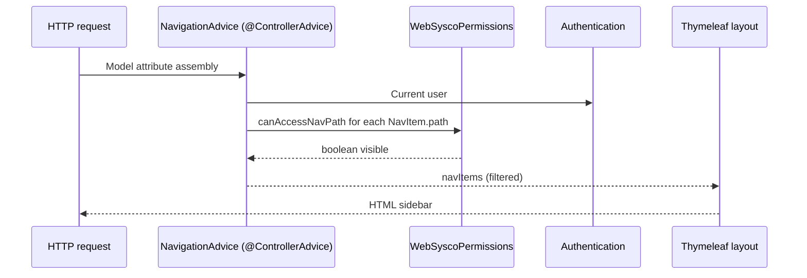

# SYSCO Web — Technical Reference: Navigation, Permissions, and Integration

**Companion to:** `01-Technical-Documentation.md`  
**Source of truth in code:** `NavigationRegistry.java`, `WebSyscoPermissions.java`

This document gives **exact** path → permission rules as implemented in the web shell, so integrators and auditors can reconcile **what appears in the menu** with **database permission rows** and **Spring Security roles**.

---

## 1. Main navigation paths (canonical list)

The sidebar is built from `NavigationRegistry.mainNav()` in **order**:

| # | Servlet path | i18n key (`messages_*.properties`) |
|---|--------------|--------------------------------------|
| 1 | `/app` | `nav.dashboard` |
| 2 | `/app/data-entry` | `nav.dataEntry` |
| 3 | `/app/courier` | `nav.courier` |
| 4 | `/app/courier-management` | `nav.courierManagement` |
| 5 | `/app/data-management` | `nav.dataManagement` |
| 6 | `/app/data-share` | `nav.dataShare` |
| 7 | `/app/my-activity` | `nav.myActivity` |
| 8 | `/app/my-work` | `nav.myWork` |
| 9 | `/app/ticket-monitoring` | `nav.ticketMonitoring` |
| 10 | `/app/ticket-management` | `nav.ticketManagement` |
| 11 | `/app/file-share-management` | `nav.fileShareManagement` |
| 12 | `/app/user-management` | `nav.userManagement` |
| 13 | `/app/agenda` | `nav.agenda` |
| 14 | `/app/login-audit` | `nav.loginAudit` |
| 15 | `/app/file-share-audit` | `nav.fileShareAudit` |
| 16 | `/app/create-ticket` | `nav.createTicket` |
| 17 | `/app/job-scheduler` | `nav.jobScheduler` |
| 18 | `/app/missions` | `nav.missions` |
| 19 | `/app/my-shift` | `nav.myShift` |

**Not in the registry but allowed by permission gate:**

- `/app/chat` — always visible for authenticated users (same for `/app/notifications` in `canAccessNavPath`).
- `/app/leave-management` — gate treats like agenda (`LEAVE_MANAGEMENT` or `USER_MANAGEMENT` read).

**Plain-language note for sponsors:** The **order** above is the **default** order users see in the left menu (subject to filtering — items they cannot access are hidden entirely).

---

## 2. Permission gate algorithm (summary)

`WebSyscoPermissions.canAccessNavPath(Authentication auth, String servletPath)`:

1. If **not authenticated** → **false** for all app paths.  
2. Collect **non-ROLE_** authorities as “permission strings”.  
3. Resolve **role** from first `ROLE_*` authority.  
4. If role is **`ADMIN`** or **`SUPER_ADMIN`** → **true** for every path handled in the `switch` (full menu).  
5. Otherwise evaluate the **`switch (servletPath)`** cases below.

---

## 3. Path-by-path rules (non-admin users)

### 3.1 Dashboard `/app`

Access if **any** of:

- Permission set contains **`DASHBOARD`**, or  
- `canRead(perms, dashboardKeyForRole(role))` where keys are like `DIRECTEUR_DASHBOARD`, `INSPECTEUR_DASHBOARD`, …, or  
- **`implicitDashboardNavByRole(role)`** returns true for normalised roles:  
  `ADMIN`, `SUPER_ADMIN`, `DIRECTEUR`, `SOUS-DIRECTEUR`, `INSPECTEUR`, `CONTROLEUR`, `VERIFICATEUR`, `VERIFICATEUR-ASSISTANT`, `SECRETAIRE`, `COURIER`, `COURRIER`, `USER`, `AGENT`.

**Rationale (from code comments):** Many deployments store fine-grained `*_READ` authorities without explicit `*_DASHBOARD` rows; without the implicit rule the **Dashboard** link would disappear after redirect even though the user is allowed to land on `/app`.

### 3.2 Data entry `/app/data-entry`

- `canRead(perms, "DATA_ENTRY")` — accepts `DATA_ENTRY`, `DATA_ENTRY_READ`, or `DATA_ENTRY_WRITE`.

### 3.3 Courier portal `/app/courier`

Visible if **either**:

- `canRead(perms, "PHYSICAL_COURIER")`, **or**  
- Role (normalised) is one of:  
  `COURIER`, `SECRETAIRE`, `DIRECTEUR`, `SOUS-DIRECTEUR`, `INSPECTEUR`, `CONTROLEUR`, `VERIFICATEUR`, `VERIFICATEUR-ASSISTANT`.

### 3.4 Courier management `/app/courier-management`

- Role (normalised) ∈ `ADMIN`, `DIRECTEUR`, `SECRETAIRE`, `SOUS-DIRECTEUR`, `INSPECTEUR`.  
- **Note:** This path does **not** check `PHYSICAL_COURIER` read in the switch — it is **role-driven** for visibility.

### 3.5 Data management `/app/data-management`

- `canRead(perms, "DATA_MANAGEMENT")`.

### 3.6 Data share `/app/data-share`

- `canRead(perms, "DATASHARE")` — base string is **`DATASHARE`** (no underscore).

### 3.7 My activity `/app/my-activity`

- `canRead(perms, "MY_ACTIVITY")`.

### 3.8 My work `/app/my-work`

- `canRead(perms, "MY_WORK")` **or** `canRead(perms, "MY_ACTIVITY")`.

### 3.9 Ticket monitoring `/app/ticket-monitoring`

- `canRead(perms, "TICKET_MONITORING")`.

### 3.10 Ticket management `/app/ticket-management`

- `canRead(perms, "TICKET_MANAGEMENT")`.

### 3.11 File share management `/app/file-share-management`

- Only **`SUPER_ADMIN`** or **`ADMIN`** role (case-insensitive).

### 3.12 User management `/app/user-management`

- `canRead(perms, "USER_MANAGEMENT")`.

### 3.13 Agenda `/app/agenda` and leave `/app/leave-management`

- `canRead(perms, "LEAVE_MANAGEMENT")` **or** `canRead(perms, "USER_MANAGEMENT")`.

### 3.14 Login audit `/app/login-audit`

- `canRead(perms, "LOGIN_AUDIT")`.

### 3.15 File share audit `/app/file-share-audit`

- `canRead(perms, "FILE_SHARE_AUDIT")`.

### 3.16 Create ticket `/app/create-ticket`

- `canRead(perms, "CREATE_TICKET")`.

### 3.17 Job scheduler `/app/job-scheduler`

- `canRead(perms, "JOB_SCHEDULER")`.

### 3.18 Missions `/app/missions`

- `canRead(perms, "MISSIONS")`.

### 3.19 My shift `/app/my-shift`

Visible if **either**:

- `canRead(perms, "MY_SHIFT")`, **or**  
- Role ∈ `ADMIN`, `DIRECTEUR`, `SOUS-DIRECTEUR`.

### 3.20 Chat and notifications

- `/app/chat` and `/app/notifications` → **true** for any authenticated user passing this gate (sidebar may still expose links via separate fragments — verify `sidebar.html` and header fragments).

### 3.21 Default case

- Any **unknown** path under the switch → **false** (deny).

---

## 4. Role normalisation (scope)

`normalizeForScope` strips diacritics, uppercases, maps variants:

- `COURRIER` → `COURIER`  
- `VERIFICATEUR` + `ASSISTANT` → `VERIFICATEUR-ASSISTANT`  
- `SOUS` + `DIRECTEUR` → `SOUS-DIRECTEUR`  
- `DIRECTRICE` → `DIRECTEUR`  
- NBSP and soft hyphen removed  

This mirrors desktop **`RoleKeyUtil`** behaviour per class Javadoc.

---

## 5. Permission string format in Spring Security

- **Roles:** `ROLE_DIRECTEUR`, `ROLE_INSPECTEUR`, …  
- **Fine-grained permissions:** stored as **GrantedAuthority** strings **without** `ROLE_` prefix, e.g. `TICKET_MANAGEMENT_READ`.  
- **`canRead`** accepts: exact base (`DATA_ENTRY`), or `BASE_READ`, or `BASE_WRITE`.

Integrators provisioning users must ensure **both**:

1. A **`ROLE_*`** authority exists (for normalisation paths that depend on role).  
2. Appropriate **`MODULE_READ` / `MODULE_WRITE`** rows for module gates that are permission-driven.

---

## 6. Sequence: navigation advice → template

---

## 7. Integration points (external systems)

This `sysco-web` module is primarily **self-contained**:

| Integration | Mechanism | Notes |
|-------------|-----------|-------|
| **Database** | JDBC / JPA | Oracle or H2 via `spring.datasource.*` |
| **Mail** | Optional Spring mail | Password reset / notifications if configured |
| **LDAP / SSO** | Not documented in this package | Would be additional Spring Security config |
| **Desktop SYSCO** | Parity goal | Permission names mirror JavaFX client concepts |

For **each new integration**, update:

- Security filter chain  
- Property files (secrets via env / vault)  
- This documentation’s **deployment** section  

---

## 8. Mapping permissions to audit questions

| Audit question | Where to verify |
|----------------|-----------------|
| Who can manage users? | `USER_MANAGEMENT_*` + `UserManagementController` method security |
| Who can see login history? | `LOGIN_AUDIT_*` + `LoginAuditController` |
| Who can approve file shares? | `FileShareManagementAccessService` + `ADMIN`/`SUPER_ADMIN` for nav |
| Can couriers see management? | **No**, unless role is in courier-management list |

---

## 9. Change impact analysis (when editing `WebSyscoPermissions`)

1. **Adding a path:** add `NavItem`, add `switch` case, add integration test or manual test matrix row.  
2. **Tightening a rule:** expect **helpdesk tickets** — users lose menu entries.  
3. **Loosening a rule:** security review — may expose PII or operational data.

---

## 10. Test matrix template (copy for QA)

| Path | Role | Permissions | Expected visible (Y/N) |
|------|------|-------------|-------------------------|
| `/app` | VERIFICATEUR | none | Y (implicit dashboard) |
| `/app/file-share-management` | DIRECTEUR | all operational | N (admin only) |
| `/app/courier-management` | SECRETAIRE | — | Y |
| `/app/courier-management` | COURIER | PHYSICAL_COURIER_READ | N |

Extend with your organisation’s full role catalogue.

---

*End of technical reference — navigation & permissions.*
