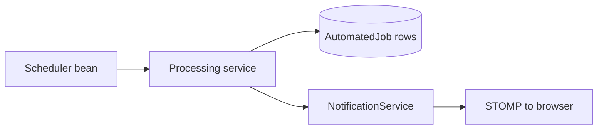

# SYSCO Web — Controller, Service, and Template Inventory

**Audience:** Developers, release managers, auditors mapping **code artefacts** to **business modules**.  
**Scope:** `sysco-web` Maven module as present in repository.

---

## 1. Web controllers (`com.sysco.web.web`)

| Java class | Typical base path | Notes |
|------------|-------------------|--------|
| `RootController` | `/` | Entry redirects |
| `LoginController` | `/login`, password flows | Form login |
| `AppController` | `/app` | Dashboard |
| `DataEntryController` | `/app/data-entry` | Data entry UI |
| `CourierPortalController` | `/app/courier` | Courier portal |
| `CourierManagementController` | `/app/courier-management` | Courier management |
| `DataManagementController` | `/app/data-management` | Data management |
| `DataShareController` | `/app/data-share` | Data share |
| `MyActivityController` | `/app/my-activity` | Activity |
| `MyWorkController` | `/app/my-work` | Inbox |
| `TicketMonitoringController` | `/app/ticket-monitoring` | Monitoring |
| `TicketManagementController` | `/app/ticket-management` | Ticket detail ops |
| `FileShareManagementController` | `/app/file-share-management` | Admin file share |
| `UserManagementController` | `/app/user-management` | Users |
| `AgendaController` | `/app/agenda`, `/app/leave-management` | Leave / agenda |
| `LoginAuditController` | `/app/login-audit` | Login audit |
| `FileShareAuditController` | `/app/file-share-audit` | Share audit |
| `CreateTicketController` | `/app/create-ticket` | Create ticket |
| `JobSchedulerController` | `/app/job-scheduler` | Planner |
| `MissionsController` | `/app/missions` | Missions |
| `MyShiftController` | `/app/my-shift` | Shifts |
| `NotificationsController` | `/app/notifications` | Notification pages |
| `ChatController` | `/app/chat` | Chat UI |
| `HelpController` | `/app/help/...` | Tutorial completion endpoint |

*Verify exact `@RequestMapping` values on each class before external integration.*

---

## 2. Cross-cutting web components

| Component | Responsibility |
|-----------|------------------|
| `NavigationAdvice` | Injects filtered `navItems` for sidebar |
| `NavigationRegistry` | Canonical ordered menu |
| `WebSyscoPermissions` | Path visibility rules |
| Thymeleaf layout | `templates/layout/base.html` + fragments |

---

## 3. Template locations (convention)

Primary feature templates live under:

- `src/main/resources/templates/app/` — feature pages  
- `src/main/resources/templates/layout/` — chrome  
- `src/main/resources/templates/fragments/` — reusable pieces  

**Maintenance tip:** When renaming a controller route, update **three** places: Java mapping, **Thymeleaf** `th:href`, and **`WebSyscoPermissions`**.

---

## 4. Security filters and handlers (typical)

| Class | Role |
|-------|------|
| `SecurityConfig` (or equivalent) | `SecurityFilterChain` beans |
| `SyscoAuthenticationSuccessHandler` | Post-login routing |
| `SyscoAuthenticationFailureHandler` | Failed login behaviour |
| `FileShareManagementAccessFilter` | Restricts file-share admin area |

*Search `com.sysco.web.security` for the authoritative list in your branch.*

---

## 5. Scheduled processing

| Component | Behaviour |
|-----------|-----------|
| `AutomatedJobPlannerProcessor` | Periodic poll (`@Scheduled` / configurable) |
| `AutomatedJobProcessingService` | Reminder/due notification rules |
| Application properties | `sysco.scheduler.jobs-poll-ms` |



---

## 6. Real-time stack

| Layer | Technology |
|-------|------------|
| Endpoint | Spring WebSocket + STOMP |
| Client | `sockjs-client`, `stompjs` (see static resources) |
| User destination | `/user/{username}/queue/...` pattern (verify in config) |

**Operational note:** WebSockets may require **sticky sessions** or **broker affinity** if you scale horizontally — not automatic in all deployments.

---

## 7. Database evolution

| Path | Purpose |
|------|---------|
| `src/main/resources/db/migration/V*.sql` | Flyway versioned DDL/DML |

**Rule:** Never edit an **already released** migration; add a new `V{n+1}` script.

---

## 8. Configuration keys (non-exhaustive)

Consult `application.yml` for the full set. Common categories:

- `spring.datasource.*`  
- `spring.jpa.*`  
- `sysco.uploads.directory`  
- `sysco.scheduler.*`  
- Mail settings if enabled  

---

## 9. Build & run (developer)

```text
mvn -pl sysco-web spring-boot:run
```

*Exact module coordinates depend on parent POM structure.*

---

## 10. Release checklist (technical)

1. All Flyway scripts apply cleanly on **empty** and **production-copy** DB.  
2. Smoke: login, dashboard, one ticket mutation, one upload, one notification.  
3. Permission regression matrix (see `07-Technical-Reference` §10).  
4. Verify **French** bundles for new keys (`messages_fr.properties`).

---

## 11. Mapping controllers → user manual sections

| Controller | User manual anchor |
|------------|-------------------|
| `AppController` | Part 1 — dashboard |
| `TicketManagementController` | Part 2 — management |
| `CourierPortalController` | Part 3 — courier |
| `JobSchedulerController` | Part 4 — scheduler |
| `UserManagementController` | Part 5 — admin |

---

## 12. Future-proofing

- Prefer **feature flags** in configuration over compile-time branching for institutional variants.  
- Document **environment differences** (Oracle vs H2) in runbooks, not only in developer README.

---

*End of technical inventory.*
