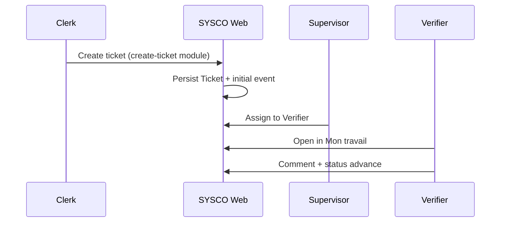
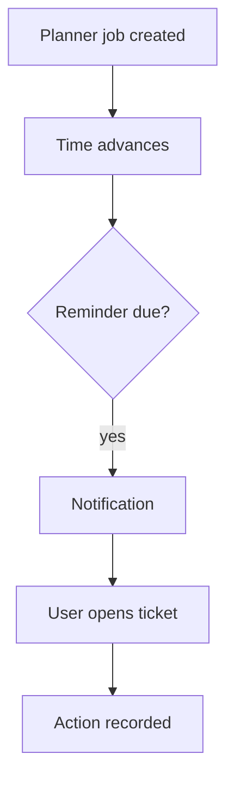
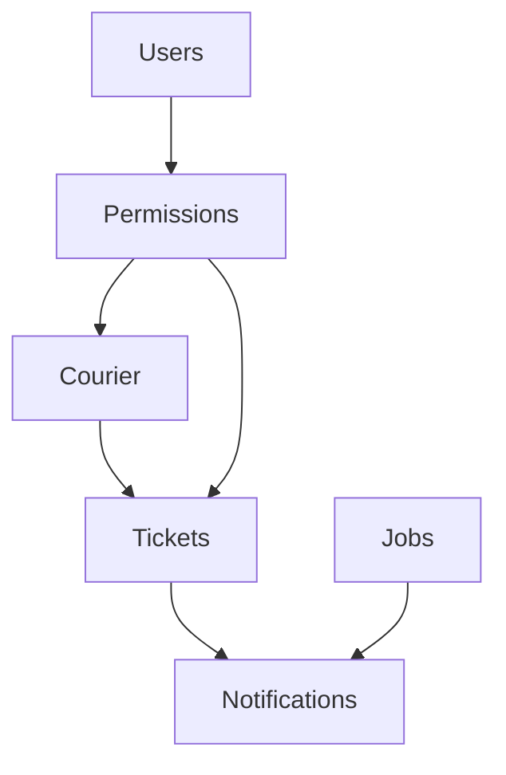

# SYSCO Web — Business Workflows & Narrative Specification (technical + business)

**Audience:** Business analysts, product owners, enterprise architects, and developers aligning **stories** with **implementation**.  
**Method:** Narrative + diagram + acceptance hints. This is **not** a binding legal contract; it explains how the web app **supports** institutional processes.

---

## 1. Introduction: parity with desktop SYSCO

The JavaFX **desktop** client historically embodied many customs workflows. **SYSCO Web** reproduces **navigation and permission** concepts (`WebSyscoPermissions` mirrors desktop `MainController#applyPermissions()` per class documentation). When business stakeholders say “it worked in JavaFX”, engineers should:

1. Identify the **module** and **permission keys**.  
2. Compare **service** behaviour, not only **UI layout**.  
3. Record gaps as **explicit backlog** items.

---

## 2. Workflow W1 — Intake → assignment → first action

**Story:** A new operational case arrives (paper, email, or partner system handoff). A clerk **creates a ticket**, a supervisor **assigns** it, and a verifier **acts**.

**Acceptance hints:**

- Ticket reference visible after creation.  
- Assignee sees item without full institutional list noise.  
- History shows **who** assigned.

---

## 3. Workflow W2 — Monitoring → escalation → director decision

**Story:** Monitoring staff detect SLA risk; they **escalate**; director **decides**.

**Narrative detail:** Monitoring is intentionally **wide-angle**; management is **depth-first**. Splitting them reduces accidental mass edits by frontline users.

**Risk:** Escalation storms — many simultaneous escalations. Mitigation: **comment quality** rules in training (scenario library §D).

---

## 4. Workflow W3 — Courier chain of custody

**Story:** Packet enters building; each hop **acknowledges** custody until archival.

**Non-functional requirement:** Timestamp skew between clients must be minimised — use **NTP** on servers and workstations.

**Audit question:** Can we reconstruct **who held the packet at 14:07**? Answer should be **yes** if scans are disciplined.

---

## 5. Workflow W4 — Data share with OTP

**Story:** Officer shares sensitive extract with external auditor for 48 hours using **one-time password** channel.

**Failure modes:**

- OTP sent in same email as link → **policy violation**.  
- Share not revoked after review → **unnecessary exposure**.

**Technical touchpoints:** `DataShareController`, `DataShareService`, email configuration.

---

## 6. Workflow W5 — Scheduled job drives ticket follow-up

**Story:** Officer sets **reminder** one day before treaty deadline; notification fires; officer advances ticket.

**Coupling:** Jobs may reference **ticket id** — document this linkage in your institution’s SOP.

---

## 7. Workflow W6 — Mission order generation

**Story:** Mission lead fills logistics; system generates **DOCX/PDF**; legal signature on paper.

**Important:** Generated documents are **templates** — wording must be legally vetted when fields change.

---

## 8. Workflow W7 — User lifecycle

**Story:** HR hires → IT provisions → user works → HR terminates → IT deactivates.

**Parallel story:** Permission **reviews** quarterly — least privilege.

---

## 9. Workflow W8 — Incident with login audit

**Story:** Suspected account misuse; security exports **login audit** CSV and correlates with **physical access** logs offline.

**Data protection:** CSV contains **PII** — encrypt at rest in transit.

---

## 10. Non-functional requirements catalogue (starter)

| NFR ID | Category | Statement |
|--------|----------|-----------|
| NFR-01 | Availability | Business hours availability target set by institution |
| NFR-02 | Performance | Dashboard loads < X seconds on reference hardware |
| NFR-03 | Security | HTTPS everywhere in production |
| NFR-04 | Auditability | Login events retained ≥ policy period |
| NFR-05 | Maintainability | Flyway-only schema changes |

Fill **X** with measured values from your environment.

---

## 11. Data classification guide (engineering)

| Class | Example fields | Handling |
|-------|----------------|----------|
| Public | Office address | Low control |
| Internal | Aggregated counts | Access control |
| Confidential | Ticket narratives | Need-to-know |
| Restricted | National security excerpts | Highest controls |

Map classes to **backup**, **masking**, and **export** rules.

---

## 12. State machines vs human judgement

The ticket **status** field is a **model**, not the **law**. Officers may need to **pause** ethically while waiting for external court orders — capture that in **comments** even if status unchanged.

---

## 13. Inter-module dependencies (conceptual)

---

## 14. Versioning & release notes discipline

Each production deploy should record:

- Flyway **head** version  
- Git **tag**  
- **Known issues**  
- **Rollback** decision tree  

---

## 15. Glossary bridge (business ↔ engineering)

| Business phrase | Engineering anchor |
|-----------------|---------------------|
| “My queue” | `MyWorkService` + permissions |
| “Who can directeur dashboards?” | `hasDashboardAccess` rules |
| “Why no courier mgmt for verifier?” | `isCourierManagementVisible` role gate |

---

## 16. Long narrative: a week in the life of the system (condensed)

**Monday:** Peak intake; create-ticket module busy; monitoring sees backlog rise.  
**Tuesday:** Escalations peak; directors reassign.  
**Wednesday:** Courier volume high; portal users register packets early.  
**Thursday:** Data entry campaign deadline; validation errors cleaned.  
**Friday:** Jobs fire reminders; notifications badge active; users close tasks before weekend.  
**Weekend:** Batch reports maybe generated; IT applies patches on maintenance window.

This story helps **non-IT sponsors** understand **why** performance and **notification** tuning matter.

---

## 17. Open questions template (workshop)

| ID | Question | Owner | Due |
|----|----------|-------|-----|
| OQ-01 | Are merges logged immutably? | Engineering | |
| OQ-02 | Retention for chat messages? | Legal | |
| OQ-03 | Cross-border data transfer for missions? | Legal | |

---

## 18. Traceability matrix stub

| Requirement | Test case | Automated? |
|-------------|-----------|------------|
| Courier handover | C3 in scenario library | Manual |
| Login lockout | Security integration test | Partial |

Expand during QA planning.

---

## 19. Accessibility statement (product)

Target **WCAG** level set by institution. Engineering checklist:

- Form labels tied to inputs  
- Keyboard traps avoided in modals  
- Status messages not colour-only  

---

## 20. Handover to operations

Before declaring “business ready”:

1. Training materials printed **or** PDF exported.  
2. Helpdesk **shortlist** of top 10 errors.  
3. On-call **runbook** with DB credentials location (secret store).

---

*End of business workflow narrative specification.*
