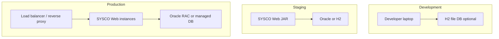

# SYSCO Web — Runbook: Configuration, Environments, and Release

**Audience:** Operations, DevOps, and senior developers. Complements `01` and `10`.

---

## 1. Environment topology (reference)

**Plain language:** **Dev** is for experiments; **staging** mirrors production **shape**; **production** serves real users.

---

## 2. Configuration sources (precedence)

1. **Command-line arguments** to Spring Boot  
2. **Environment variables** (often `SPRING_DATASOURCE_URL` style)  
3. **`application-{profile}.yml`**  
4. **Default `application.yml`**

Document your **secret store** (Vault, AWS SM, Azure Key Vault) separately — do not paste secrets into this repo.

---

## 3. Key profiles

| Profile | Typical use |
|---------|-------------|
| `default` | Developer workstation |
| `oracle` | Production-like JDBC |

Add institution-specific profiles (`prod-fr`, `prod-drc`, …) only when deltas are real.

---

## 4. Database checklist

| Check | Detail |
|-------|--------|
| Charset | UTF-8 compatible |
| Time zone | DB and JVM aligned to UTC or institution zone — pick one |
| Backups | RPO/RTO defined |
| Migrations | Flyway baseline verified on empty schema |

---

## 5. File uploads directory

Property pattern: `sysco.uploads.directory`.

| Risk | Mitigation |
|------|------------|
| Disk full | Monitoring + rotation policy |
| Permissions | App user read/write only |
| Path traversal bugs | Validate filenames in services (audit code) |

---

## 6. Scheduler checklist

Properties like `sysco.scheduler.jobs-poll-ms` control planner polling.

| Risk | Mitigation |
|------|------------|
| Too aggressive | DB load; tune interval |
| Too lazy | Missed reminders near boundary — test edge times |

---

## 7. WebSocket / STOMP in production

| Topic | Guidance |
|-------|----------|
| Sticky sessions | May be required behind load balancer |
| Heartbeats | Tune for mobile flaky networks |
| Firewall | Allow upgrade path for WebSockets |

---

## 8. Logging

| Log type | Use |
|----------|-----|
| Access | Reverse proxy logs |
| Application | Spring Boot logback |
| Audit tables | Login/share/ticket events |

**PII scrubbing:** Ensure access logs do not store passwords (Spring Security defaults help).

---

## 9. Health checks

Implement **readiness** vs **liveness**:

- **Liveness:** process up  
- **Readiness:** DB reachable, migrations complete

Spring Boot **Actuator** can expose `/actuator/health` if enabled — **secure** it.

---

## 10. Release procedure (suggested)

1. **Freeze** content translations (`messages_fr.properties`).  
2. **Run** automated tests (`mvn test`).  
3. **Apply** Flyway on staging clone.  
4. **Deploy** JAR to staging.  
5. **Smoke** script: login, ticket, upload, notification.  
6. **Change window** in production; **deploy**; **repeat smoke**.  
7. **Monitor** errors 2h intensely, 24h loosely.

---

## 11. Rollback procedure

1. **Stop** new instances.  
2. **Redeploy** previous **known-good** JAR.  
3. **Database:** if migration **irreversible**, restore DB snapshot **or** forward-fix with new migration — **never** delete Flyway history rows casually.  
4. **Communicate** downtime to helpdesk.

---

## 12. Capacity planning starter

| Signal | Action |
|--------|--------|
| CPU high + DB wait | Optimise queries, add index via migration |
| Memory high | Heap dump analysis |
| Thread pool saturation | Tune Tomcat / WebSocket executor |

---

## 13. Security hardening checklist

- [ ] TLS 1.2+ only  
- [ ] HSTS at proxy  
- [ ] Secure cookies  
- [ ] Admin endpoints not public  
- [ ] Rate limit login (optional WAF)  

---

## 14. Observability (optional stack)

| Tool | Maps to |
|------|---------|
| Prometheus | JVM metrics |
| Grafana | Dashboards |
| ELK / OpenSearch | Central logs |

This project may not ship these; institution adds.

---

## 15. Incident severity table

| Sev | Example | Response |
|-----|---------|----------|
| S1 | Total outage | All hands |
| S2 | Degraded tickets | War room |
| S3 | Single module | Team queue |
| S4 | Cosmetic | Backlog |

---

## 16. Data subject request handling (ops)

1. Legal opens ticket.  
2. DBA + app owner extract **minimal** columns.  
3. Deliver via **encrypted** channel.  
4. Log **who** extracted **what**.

---

## 17. Patch management

- OS patches monthly  
- JVM security quarterly  
- Dependency CVE scanning in CI  

---

## 18. Contact roster template

| Role | Name | Phone |
|------|------|-------|
| App owner | | |
| DBA | | |
| Security | | |
| Network | | |

Fill institution-specific.

---

## 19. Post-incident review template

- Timeline  
- Root cause  
- What went well  
- Action items with owners  

---

## 20. Handover between vendors

Export:

- This documentation package PDF  
- **ERD** (if maintained)  
- **Infra diagram**  
- **Secret inventory location**  

---

*End of operations runbook.*
