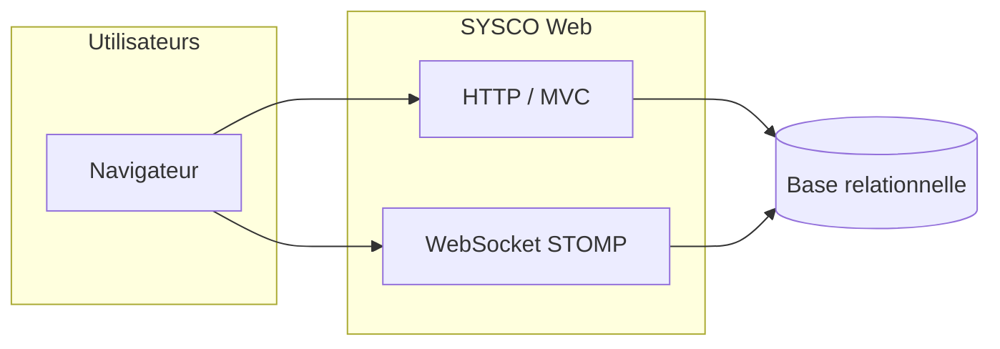
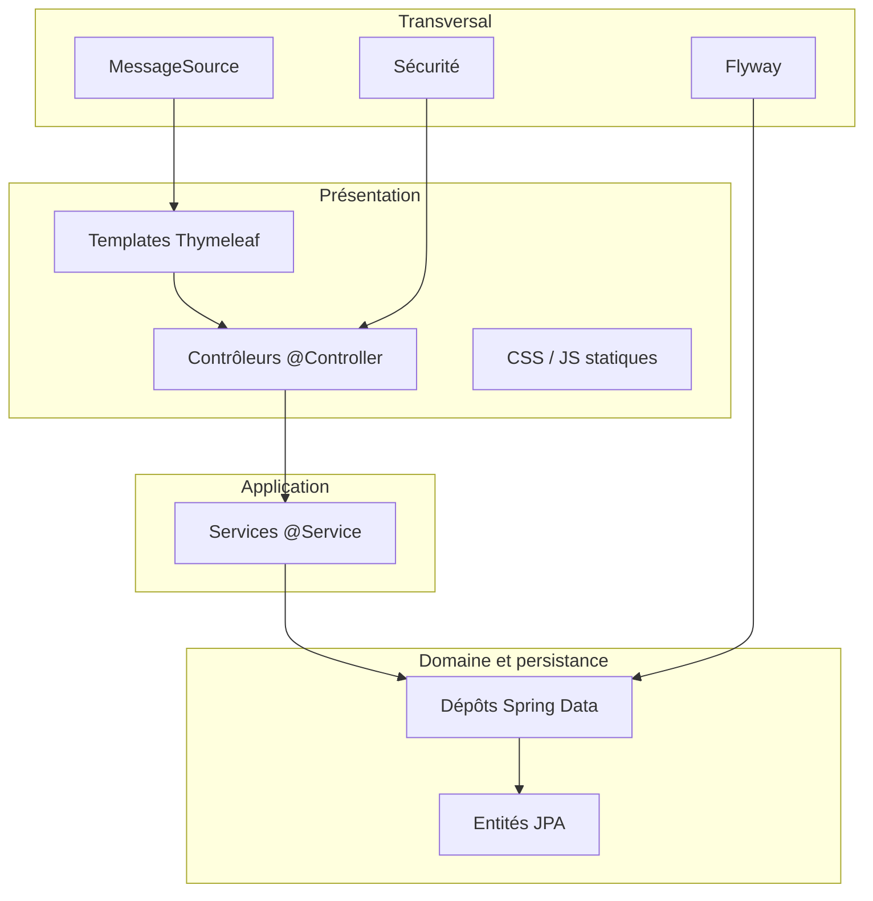
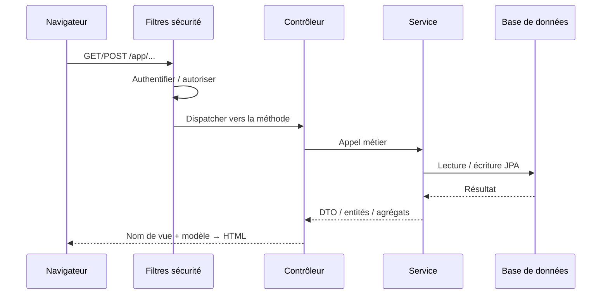

# Chapitre 1 — Introduction et architecture générale

**SYSCO Web — Documentation technique (français)**  
**Référence code :** module `com.sysco:sysco-web`, Spring Boot 3.2.5, Java 17.

---

## 1.1 Objet du document

Ce chapitre présente la **vision produit** de SYSCO Web, le **contexte d’utilisation**, un **glossaire** partagé par les métiers et les équipes IT, puis une **architecture logique** et la **pile technologique**. Il s’adresse aux **responsables métier**, **architectes**, **intégrateurs**, **développeurs** et **auditeurs** qui doivent comprendre *ce que fait le système* et *comment il est structuré* sans nécessairement parcourir tout le code.

---

## 1.2 Résumé exécutif (langage métier)

SYSCO Web est une **application web** utilisée dans un contexte **institutionnel** (douanes, administrations, entités opérationnelles apparentées). Elle permet de :

- gérer des **dossiers opérationnels** modélisés comme des **tickets** (création, affectation, statuts, escalade, clôture) ;
- suivre le **courrier physique** (portail courrier, gestion courrier) ;
- saisir et administrer des **données structurées** (saisie, gestion des données) ;
- effectuer des **partages de fichiers** contrôlés et en auditer l’usage ;
- planifier des **tâches et échéances** (planificateur) ;
- gérer des **missions de terrain**, l’**agenda / congés**, la **garde / présence** ;
- disposer de **notifications en temps quasi réel** et d’une **messagerie interne** (chat) ;
- administrer les **comptes utilisateurs** et consulter des **journaux d’audit** (connexions, partages) selon les droits.

L’application vise une **parité fonctionnelle** avec un client **JavaFX** historique : les règles de **navigation** et de **visibilité des modules** s’inspirent explicitement du comportement du client bureau (`WebSyscoPermissions`, commentaires de code).

---

## 1.3 Périmètre technique

Dans le dépôt actuel, SYSCO Web est un **monolithe modulaire** côté serveur :

- rendu **HTML côté serveur** via **Thymeleaf** ;
- API **REST** limitée (l’essentiel du parcours utilisateur passe par des formulaires et des vues) ;
- **WebSocket** / **STOMP** pour pousser des événements vers le navigateur ;
- persistance **relationnelle** via **JPA** et **Spring Data** ;
- évolution du schéma par **Flyway**.

Les intégrations avec des systèmes externes (LDAP, bus métier, etc.) ne sont pas codées de façon universelle dans ce document : elles relèvent de la **configuration** et de **extensions** propres à chaque déploiement.

---

## 1.4 Glossaire

| Terme | Sens métier | Sens technique |
|--------|-------------|----------------|
| **Module** | Grande fonctionnalité accessible depuis le menu (Courrier, Tickets, …) | Entrée dans `NavigationRegistry`, soumise à `WebSyscoPermissions` |
| **Ticket** | Dossier / affaire suivie | Entité persistante avec statut, affectations, pièces jointes, historique |
| **Rôle** | Fonction organisationnelle (directeur, inspecteur, …) | Autorité `ROLE_*` Spring Security + normalisation pour les règles de menu |
| **Permission** | Droit fin sur un domaine | Chaîne d’autorité non préfixée par `ROLE_`, ex. `TICKET_MANAGEMENT_READ` |
| **Escalade** | Remonter ou réorienter un dossier | Opérations métier + notifications |
| **Session** | Période de travail connecté | Session HTTP sécurisée par Spring Security |
| **CSRF** | Protection contre les actions forgées depuis un autre site | Jeton synchroniseur sur formulaires et requêtes AJAX |
| **Migration Flyway** | Script SQL versionné appliqué dans l’ordre | Fichier `V{n}__description.sql` sous `db/migration` |
| **STOMP** | Protocole de messages sur WebSocket | Couche utilisée avec Spring Messaging pour les notifications |

---

## 1.5 Contexte système

Les utilisateurs accèdent à SYSCO Web via un **navigateur**. Le serveur d’application traite les requêtes **HTTP** et maintient des canaux **WebSocket** pour le temps réel. La base de données relationnelle concentre l’état durable (utilisateurs, tickets, courrier, etc.).

**Légende :** le navigateur interagit à la fois avec la couche **Web classique** et avec la couche **temps réel** ; les deux s’appuient sur la même base de données via la couche service / JPA.

---

## 1.6 Architecture en couches

L’application suit le modèle classique **Spring** : présentation, application (services), domaine / persistance, transversal.

**Présentation :** les contrôleurs reçoivent la requête HTTP, invoquent les services, choisissent la vue Thymeleaf et préparent le modèle (données affichées).  
**Application :** les services concentrent les **règles métier** et les **transactions**.  
**Persistance :** les entités mappent les tables ; les dépôts encapsulent les requêtes.  
**Transversal :** sécurité (filtres, authentification), migrations, internationalisation.

---

## 1.7 Cycle de vie d’une requête HTTP (simplifié)

Ce schéma ne couvre pas les appels **WebSocket** ni les réponses **@ResponseBody** ponctuelles, mais représente le flux principal des écrans métier.

---

## 1.8 Pile technologique (référence `pom.xml`)

| Couche | Technologie | Rôle |
|--------|-------------|------|
| Langage | Java 17 | Plateforme LTS |
| Framework | Spring Boot 3.2.x | Web, sécurité, JPA, WebSocket, validation |
| Vues | Thymeleaf 3 + extras Spring Security 6 | Génération HTML, intégration des expressions de sécurité |
| Persistance | Spring Data JPA, Hibernate | ORM, dépôts |
| Migrations | Flyway | Versionnement du schéma SQL |
| Base (dev) | H2 (fichier ou mémoire selon config) | Développement local |
| Base (prod typique) | Oracle JDBC (`ojdbc11`, profil optionnel) | Environnements institutionnels |
| Front tiers | Flatpickr, Driver.js (CDN), SockJS, STOMP | Dates, visite guidée, temps réel |
| Build | Maven | Packaging JAR exécutable |

---

## 1.9 Organisation des packages Java (vue conceptuelle)

Sans lister exhaustivement chaque classe, on retrouve typiquement :

| Paquet (`com.sysco.web…`) | Rôle |
|---------------------------|------|
| `web` | Contrôleurs MVC, point d’entrée HTTP des écrans |
| `service` | Logique métier, orchestration, transactions |
| `domain` | Entités JPA, modèle métier |
| `repo` | Interfaces Spring Data |
| `security` | Handlers, filtres, utilitaires de permissions web |
| `config` | Beans Spring (locale, MVC, WebSocket, …) |
| `navigation` | Registre du menu principal (`NavigationRegistry`) |

Cette structure facilite la **localisation** des changements : une évolution d’écran commence souvent par le contrôleur et le template, puis le service si la règle métier change.

---

## 1.10 Principes de conception observables

1. **Séparation des responsabilités** : peu de logique métier lourde dans les contrôleurs ; les services portent les invariants.  
2. **Sécurité centralisée** : chaîne de filtres Spring Security + règles fines pour le menu (`WebSyscoPermissions`).  
3. **Schéma évolutif** : toute modification de base passe par **Flyway** (éviter les scripts ad hoc en production).  
4. **Thème institutionnel** : feuilles de style partagées (`sysco-theme.css`) pour homogénéiser l’UI avec l’identité visuelle du programme.  
5. **Temps réel complémentaire** : le cœur métier reste transactionnel sur HTTP ; les notifications enrichissent l’expérience sans remplacer les enregistrements en base.

---

## 1.11 Alignement avec le client JavaFX

Le code de `WebSyscoPermissions` indique une volonté de **reproduire** la logique du client bureau (`MainController#applyPermissions`, `ModuleAccess`, etc.). Pour les équipes de migration :

- comparer les **clés de permission** entre les deux clients ;  
- vérifier les **rôles** et leur normalisation (`normalizeForScope`) ;  
- documenter tout **écart** fonctionnel dans votre outil de suivi (Jira, etc.).

---

## 1.12 Publics cibles et lectures recommandées

| Public | Chapitres prioritaires |
|--------|-------------------------|
| Sponsor / chef de projet | 1, 2 (sections résumé), 6 |
| Architecte SI | 1, 2, 3, 4, 5, 6 |
| Développeur | 3, 4, 5, 7 |
| Exploitation / DevOps | 4, 6, 7 |
| Audit / RSSI | 2, 6, 7 |

---

## 1.13 Limites de ce document

Ce document **ne constitue pas** une homologation de sécurité ni une notice légale. Les flux personnels, la durée de conservation des données et les bases légales du traitement relèvent de la **politique** de l’organisme utilisateur. Les captures d’écran et les libellés exacts peuvent varier selon la **configuration** et la **langue** active (`messages_fr.properties`).

---

*Fin du chapitre 1.*
