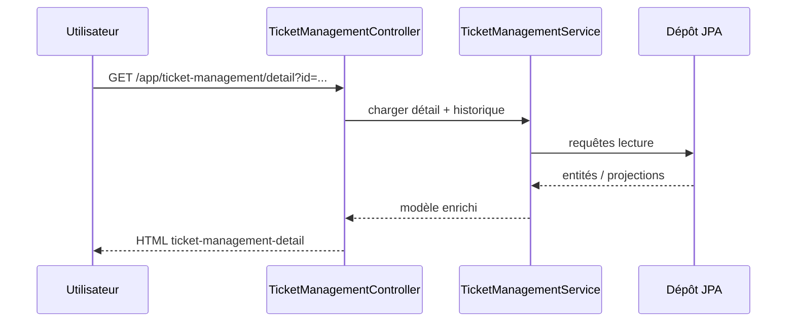

# Chapitre 3 — Couche Web : modules, contrôleurs et flux

Ce chapitre décrit **comment l’interface Web est structurée** : organisation des **contrôleurs**, correspondance avec les **templates Thymeleaf**, rôle du **layout** et du **menu**, et **flux fonctionnels** représentatifs (tickets, courrier, planificateur).

---

## 3.1 Rôle de la couche Web dans SYSCO Web

La couche Web assure :

1. **Traduction** des requêtes HTTP en appels de services métier.  
2. **Choix de la vue** (template) et **remplissage du modèle** (attributs exposés au template).  
3. **Gestion des erreurs** de validation et des messages utilisateur (clés i18n).  
4. **Intégration** avec la sécurité (session, CSRF, visibilité conditionnelle).

SYSCO Web privilégie le modèle **« server-side rendering »** : le HTML est principalement produit sur le serveur. Cela simplifie le référencement interne des écrans et limite la surface d’attaque d’une **SPA** pure, au prix d’une navigation « classique » par rechargement de page ou fragments.

---

## 3.2 Layout principal (`base.html`)

Le gabarit `layout/base.html` définit :

- l’en-tête avec méta **CSRF** pour les scripts AJAX ;  
- les feuilles de style globales (`sysco-theme.css`) et les dépendances tierces (Flatpickr, Driver.js pour utilisateurs authentifiés) ;  
- la structure **sidebar + colonne principale** (menu latéral, en-tête de page, zone de contenu) ;  
- les scripts globaux (datepicker, upload, temps réel, visite guidée) ;  
- un formulaire de **déconnexion** masqué référencé par le bouton du menu.

Les pages métier **injectent** leur contenu dans la zone principale via le mécanisme de **fragment** Thymeleaf (`th:replace`, `layout (title, section)`).

---

## 3.3 Fragments réutilisables

### 3.3.1 `fragments/header.html`

Contient la marque applicative, les icônes **aide (visite guidée)**, **notifications**, **chat**, et l’identifiant de l’utilisateur connecté. Les badges de notification s’appuient sur des attributs de modèle fournis par `NavigationAdvice` (`headerUnreadNotifications`, `headerUnreadChat`).

### 3.3.2 `fragments/sidebar.html`

Affiche la liste `navItems` avec un lien par module autorisé. Chaque entrée reçoit un identifiant `tour-nav-{index}` pour la **visite guidée** Driver.js. Le bouton de déconnexion soumet le formulaire global via l’attribut `form`.

---

## 3.4 Inventaire des contrôleurs principaux (`com.sysco.web.web`)

Le tableau suivant mappe les **contrôleurs** aux **préfixes d’URL** typiques. Les annotations exactes `@RequestMapping` doivent être vérifiées dans le code pour chaque release.

| Classe | Préfixe / chemin typique | Fonction métier |
|--------|---------------------------|-----------------|
| `AppController` | `/app` | Tableau de bord |
| `DataEntryController` | `/app/data-entry` | Saisie des données |
| `CourierPortalController` | `/app/courier` | Portail courrier |
| `CourierManagementController` | `/app/courier-management` | Gestion courrier |
| `DataManagementController` | `/app/data-management` | Gestion des données |
| `DataShareController` | `/app/data-share` | Partage des données |
| `MyActivityController` | `/app/my-activity` | Mon activité |
| `MyWorkController` | `/app/my-work` | Mon travail |
| `TicketMonitoringController` | `/app/ticket-monitoring` | Suivi des tickets |
| `TicketManagementController` | `/app/ticket-management` | Gestion des tickets |
| `FileShareManagementController` | `/app/file-share-management` | Admin partage fichiers |
| `UserManagementController` | `/app/user-management` | Utilisateurs |
| `AgendaController` | `/app/agenda`, `/app/leave-management` | Agenda / congés |
| `LoginAuditController` | `/app/login-audit` | Journal connexions |
| `FileShareAuditController` | `/app/file-share-audit` | Audit partages |
| `CreateTicketController` | `/app/create-ticket` | Création ticket |
| `JobSchedulerController` | `/app/job-scheduler` | Planificateur |
| `MissionsController` | `/app/missions` | Missions |
| `MyShiftController` | `/app/my-shift` | Ma garde |
| `NotificationsController` | `/app/notifications` | Notifications |
| `ChatController` | `/app/chat` | Chat |
| `HelpController` | `/app/help/...` | Fin de tutoriel (POST) |
| `LoginController` | `/login`, changement mot de passe | Authentification |
| `RootController` | `/` | Redirections racine |

---

## 3.5 Templates métier (`templates/app/`)

Chaque module possède en général un ou plusieurs fichiers HTML :

- listes (`ticket-management.html`, `missions.html`, …) ;  
- détails (`ticket-management-detail.html`, `mission-detail.html`, `task-detail.html`) ;  
- formulaires spécifiques (`create-ticket.html`, `job-scheduler.html`) ;  
- vues d’audit (`login-audit.html`, `file-share-audit.html`).

Le nom du fichier n’est pas toujours identique au segment d’URL : la correspondance est fixée par la **chaîne de retour** du contrôleur (`return "app/xyz"`).

---

## 3.6 Flux représentatif : consultation d’un ticket

Les transitions d’état (changement de statut, clôture) se font via **POST** avec jeton CSRF ; le service applique les **règles métier** et persiste les événements.

---

## 3.7 Flux représentatif : courrier physique

1. **Enregistrement** d’un objet (scan / saisie de référence).  
2. **Affectation** ou **transfert** vers un autre agent ou bureau.  
3. **Mise à jour de statut** à chaque étape physique.  
4. **Clôture** lorsque l’objet est archivé ou la chaîne terminée.

Le portail courrier et la gestion courrier partagent le **même modèle de données** ; la différence est **l’écran** et les **permissions** (voir chapitre 2).

---

## 3.8 Flux représentatif : planificateur de tâches

1. L’utilisateur crée une **tâche planifiée** avec échéance et éventuellement rappel.  
2. Les lignes sont persistées en base (`AutomatedJob` ou entité équivalente selon version).  
3. Un **processeur planifié** (`@Scheduled` côté Spring) interroge périodiquement les lignes actives.  
4. Lorsque la date de rappel ou d’échéance est atteinte, le système **notifie** l’utilisateur (notification persistée + message temps réel si connecté).

Ce mécanisme est **complémentaire** aux SLA des tickets : il sert souvent à des **engagements personnels** ou à des **rappels** non modélisés comme champs du ticket.

---

## 3.9 Gestion des fichiers uploadés

Les pièces jointes passent typiquement par :

- un répertoire configurable (`sysco.uploads.directory` dans `application.yml`) ;  
- des validations côté **service** (taille, type) ;  
- un renommage ou une clé de stockage pour éviter les collisions.

L’**exploitation** doit sauvegarder **à la fois** la base et le répertoire de fichiers pour un **plan de reprise cohérent**.

---

## 3.10 Bonnes pratiques pour les évolutions Web

1. Lors de l’ajout d’un module :  
   - ajouter l’entrée dans `NavigationRegistry` ;  
   - compléter `WebSyscoPermissions` ;  
   - créer le contrôleur + templates + service ;  
   - ajouter les clés `messages_fr.properties` ;  
   - documenter les permissions en base (`USER_MANAGEMENT`).  

2. Éviter la logique métier lourde dans les templates Thymeleaf — préférer des **DTO** préparés côté service.  

3. Pour les actions destructives : toujours **POST** + confirmation + vérification serveur.

---

## 3.11 Accessibilité et ergonomie (rappel)

- Prévoir des **labels** explicites sur les champs de formulaire.  
- Ne pas fonder l’information **uniquement** sur la couleur (statuts).  
- Tester le parcours au **clavier** pour les écrans à fort enjeu.

---

## 3.12 Point de contrôle intégration

Avant une mise en production :

- [ ] Tous les nouveaux chemins sont couverts par `WebSyscoPermissions` ou explicitement publics.  
- [ ] Aucun écran sensible n’est accessible en **GET** avec effet de bord.  
- [ ] Les templates sensibles utilisent `sec:authorize` en complément des contrôles serveur.  

---

*Fin du chapitre 3.*
