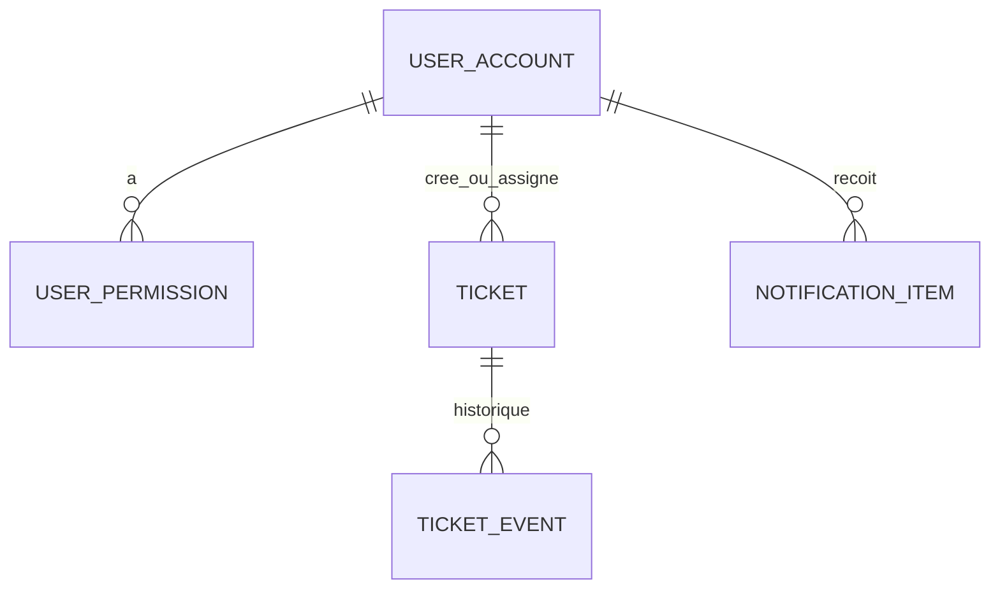

# Chapitre 4 — Persistance des données, JPA et Flyway

Ce chapitre décrit **comment les données sont stockées et versionnées** : modèle relationnel vu depuis l’application, utilisation de **JPA/Hibernate**, rôle de **Spring Data**, et **discipline Flyway** pour les migrations.

---

## 4.1 Rôle de la persistance dans SYSCO Web

La persistance assure :

- la **durabilité** des dossiers (tickets, courrier, utilisateurs, permissions, notifications, …) ;  
- l’**intégrité référentielle** au niveau base (clés étrangères, contraintes) ;  
- la **cohérence transactionnelle** lors d’opérations multi-tables (annotation `@Transactional` côté services).

Sans une base cohérente, les écrans Web et les notifications ne peuvent pas refléter un état fiable pour le métier et les audits.

---

## 4.2 Spring Data JPA et Hibernate

### 4.2.1 Entités

Les **entités** (`@Entity`) du paquet `domain` mappent les tables SQL. Les relations (`@ManyToOne`, `@OneToMany`, etc.) modélisent les liens métier (ticket ↔ utilisateur, ticket ↔ événements, …).

### 4.2.2 Dépôts

Les **interfaces** `*Repository` étendent `JpaRepository` ou équivalent. Elles fournissent :

- le **CRUD** de base ;  
- des **méthodes dérivées** du nom (`findBy…`) ;  
- des requêtes **@Query** pour les cas complexes.

### 4.2.3 Transactions

Les services métier marqués `@Transactional` délimitent une unité de travail : en cas d’exception non gérée, **rollback** automatique. Certaines opérations (traitement de jobs planifiés) peuvent utiliser `REQUIRES_NEW` pour **isoler** une transaction courte — à vérifier dans les services concernés.

### 4.2.4 Lazy loading et N+1

Les listes volumineuses (tickets, notifications) exposent un risque de requêtes **N+1** si des associations **LAZY** sont résolues dans une boucle Thymeleaf. Les bonnes pratiques :

- utiliser des **DTO** ou des **projections** ;  
- utiliser **JOIN FETCH** dans des requêtes dédiées ;  
- ou paginer côté serveur (`Pageable`).

---

## 4.3 Flyway : principe et emplacement

### 4.3.1 Fichiers de migration

Les scripts SQL sont placés sous :

`src/main/resources/db/migration/`

Nommage conventionnel : `V{version}__description.sql`  
Exemples : `V1__sysco_baseline.sql`, `V22__mission_order_dgda.sql`, …

### 4.3.2 Ordre d’exécution

Au démarrage, Flyway :

1. vérifie la table d’historique (`flyway_schema_history`) ;  
2. applique les migrations **non encore exécutées** dans l’ordre des versions ;  
3. **échoue** si un script est invalide ou si l’état de la base ne correspond pas à l’historique.

### 4.3.3 Règle d’or

**Ne jamais modifier** un script `Vn__…` **déjà livré** en production. En cas d’erreur, ajouter un nouveau script `V{n+1}__fix_….sql` qui corrige le schéma ou les données.

---

## 4.4 Environnements : H2 et Oracle

### 4.4.1 Développement

Le profil par défaut utilise souvent **H2** (fichier ou mémoire) pour simplifier le démarrage local. Les identifiants et URL JDBC sont dans `application.yml`.

### 4.4.2 Production

Un profil **`oracle`** (ou équivalent) peut activer le pilote **Oracle** (`ojdbc11`) et adapter la validation DDL (`ddl-auto`, dialect Hibernate). La configuration exacte dépend du **DataSource** fourni par l’exploitation (pool, secrets).

### 4.4.3 Différences de dialecte

Les types SQL (dates, booléens, texte long) peuvent différer entre H2 et Oracle. Tester les migrations sur une **base Oracle de préproduction** avant la mise en production.

---

## 4.5 Données sensibles et chiffrement

- Les **mots de passe** utilisateur doivent être stockés **hachés** (bcrypt ou algorithme configuré via Spring Security).  
- Les **données personnelles** (emails, matricules, contenus de tickets) nécessitent une **politique de rétention** et des contrôles d’accès (chapitre 2).  
- Le **chiffrement au repos** de la base et des sauvegardes relève de l’**infrastructure** (TDE, volumes chiffrés).

---

## 4.6 Sauvegarde et restauration

### 4.6.1 Cohérence

Une sauvegarde **uniquement** de la base sans le **répertoire de fichiers uploadés** laisse des **liens cassés** dans l’application. Planifier :

- sauvegarde **DB** (snapshot cohérent) ;  
- sauvegarde **fichiers** alignée dans le temps ;  
- procédure de **restauration** testée au moins une fois par an.

### 4.6.2 Anonymisation

Pour les environnements de **test**, prévoir des scripts d’**anonymisation** (noms, identifiants) — hors périmètre Flyway standard, souvent des tâches de maintenance.

---

## 4.7 Performance et index

Les lenteurs sur les grands volumes se traitent par :

- **index** sur les colonnes filtrées (statut, date, direction, assigné) ;  
- **archivage** ou partitionnement (stratégie métier) ;  
- **limitation** des jointures inutiles dans les écrans de liste.

Toute création d’index en production doit passer par une **migration Flyway** documentée.

---

## 4.8 Schéma conceptuel simplifié

Ce diagramme est **volontairement simplifié** : le schéma réel comporte davantage de tables (chat, missions, jobs planifiés, partages, …). Se référer aux migrations `V*.sql` pour la vérité terrain.

---

## 4.9 Check-list développeur base de données

- [ ] Toute nouvelle colonne a une migration Flyway.  
- [ ] Les valeurs par défaut et les contraintes `NOT NULL` sont cohérentes avec le code JPA.  
- [ ] Les scripts sont **idempotents** ou sûrs en réexécution contrôlée (Flyway ne réexécute pas un `Vn` appliqué).  
- [ ] Les jeux de données de test sont documentés (seed optionnel `SyscoDataInitializer` ou scripts séparés).

---

*Fin du chapitre 4.*
