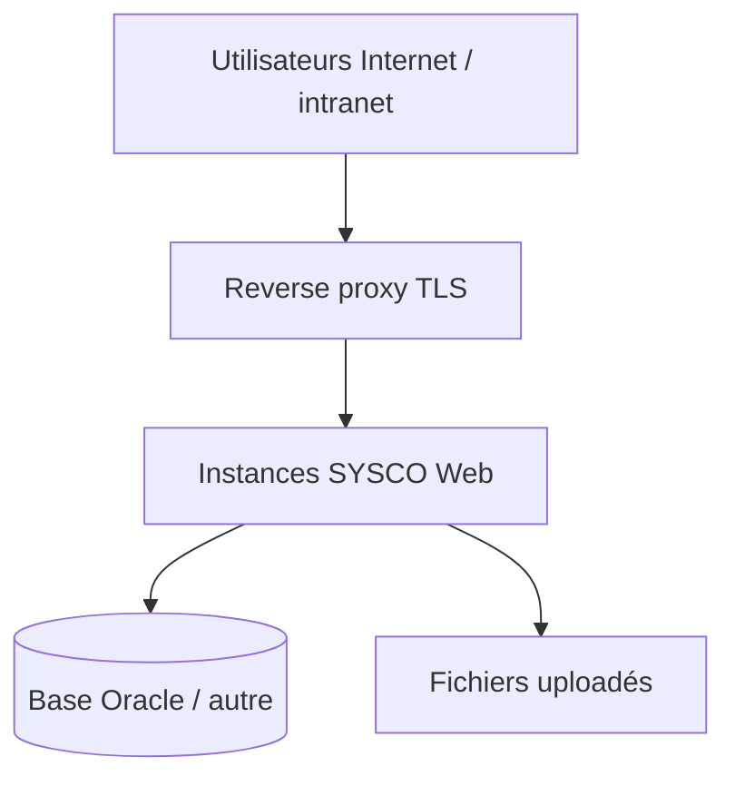

# Chapitre 6 — Déploiement, configuration et runbook d’exploitation

Ce chapitre regroupe les **paramètres d’exécution**, les **profils Spring**, les **bonnes pratiques de mise en production** et un **runbook** pour l’équipe d’exploitation.

---

## 6.1 Artefact livrable

Le build Maven produit un **JAR exécutable** Spring Boot (`spring-boot-maven-plugin`). Le déploiement consiste à :

1. choisir une **version** (tag Git) ;  
2. construire l’artefact en CI (`mvn clean package`) ;  
3. déployer le JAR sur un **runtime Java 17** ;  
4. fournir les **variables d’environnement** ou fichiers de configuration pour JDBC, secrets, répertoires.

---

## 6.2 Configuration : ordre de priorité Spring Boot

Spring Boot charge la configuration dans un ordre bien défini (du plus spécifique au plus général). En pratique pour SYSCO Web :

1. **Arguments** en ligne de commande (`--spring.datasource.url=...`).  
2. **Variables d’environnement** (souvent mappées en `SPRING_DATASOURCE_*`).  
3. Fichiers `application-{profile}.yml` ou `.properties`.  
4. `application.yml` embarqué dans le JAR.

Les **secrets** (mots de passe DBA, clés) ne doivent **pas** être commités dans le dépôt : utiliser un **coffre** (Vault, Azure Key Vault, AWS Secrets Manager) ou des variables injectées par la plateforme.

---

## 6.3 Paramètres typiques (`application.yml`)

### 6.3.1 Source de données

- `spring.datasource.url` — JDBC URL (H2 fichier, Oracle SID/service, etc.).  
- `spring.datasource.username` / `password` — identifiants applicatifs **à privilèges limités**.  
- `spring.jpa.hibernate.ddl-auto` — en production, souvent `validate` ou `none` lorsque Flyway gère le schéma.

### 6.3.2 Flyway

Flyway est activé par défaut avec les starters Spring Boot appropriés. Vérifier :

- `spring.flyway.locations` si les migrations sont déplacées ;  
- les **droits** du compte DB (CREATE/ALTER sur environnement de build ; parfois restreints en prod selon politique).

### 6.3.3 Fichiers uploadés

- `sysco.uploads.directory` — chemin **absolu** sur le serveur ou volume monté.  
  Le compte d’exécution du processus Java doit avoir **lecture/écriture** sur ce répertoire.  
  Prévoir la **surveillance disque** (alerte avant saturation).

### 6.3.4 Planificateur métier

- `sysco.scheduler.jobs-poll-ms` — intervalle de **scrutation** des tâches planifiées (rappels / échéances).  
  Un intervalle trop court augmente la charge DB ; trop long retarde les notifications.

---

## 6.4 Profils d’environnement

| Profil | Usage |
|--------|--------|
| `default` | Développement local, H2 |
| `oracle` (exemple) | JDBC Oracle, paramètres prod-like |
| Profils institutionnels | `preprod`, `prod-fr`, … selon vos conventions |

Documenter **chaque profil** dans le wiki interne : URL DB, taille du pool, feature flags.

---

## 6.5 Topologie réseau recommandée

Le **reverse proxy** (NGINX, Apache, F5, …) termine TLS, applique les **en-têtes de sécurité**, et peut limiter le débit sur `/login`.

---

## 6.6 Mise en production : procédure type

1. **Gel** des traductions et validation fonctionnelle sur **préproduction**.  
2. **Sauvegarde** base + fichiers avant bascule.  
3. **Migration Flyway** appliquée sur la cible (ou au premier démarrage du JAR si politique automatique).  
4. **Déploiement** du JAR (blue/green ou rolling selon maturité).  
5. **Smoke test** : connexion, ouverture d’un ticket, upload, notification.  
6. **Surveillance** renforcée pendant la fenêtre (logs, métriques, alertes).

---

## 6.7 Retour arrière (rollback)

- **Application** : redéployer le JAR **N-1** identifié.  
- **Base** : si une migration **irréversible** a été appliquée, le retour nécessite **restauration** depuis sauvegarde ou **script correctif** `V{n+1}`.  
  **Ne pas** supprimer manuellement des lignes dans `flyway_schema_history` sans procédure DBA.

---

## 6.8 Journalisation

- **Niveau root** : `INFO` en prod ; `DEBUG` ponctuel sur un package pour diagnostic.  
- **Logs WebSocket** : peuvent être verbeux — ajuster en cas de volume.  
- **PII** : veiller à ce qu’aucun logger applicatif n’écrive mots de passe ou jetons.

---

## 6.9 Santé et supervision

Spring Boot **Actuator** peut exposer `/actuator/health` si activé — à **protéger** (réseau interne, authentification). Indicateurs utiles : état DB, espace disque uploads.

---

## 6.10 Runbook incident — indisponibilité totale

| Étape | Action |
|-------|--------|
| 1 | Vérifier sondes LB et certificats TLS |
| 2 | Vérifier processus JVM (OOM, crash) |
| 3 | Vérifier connectivité JDBC |
| 4 | Consulter logs applicatifs derniers déploiements |
| 5 | Décider rollback app vs restauration DB |
| 6 | Communiquer fenêtre et workaround (ex. mode dégradé papier) |

---

## 6.11 Runbook incident — lenteurs

1. Identifier **requêtes SQL** lentes (traces Hibernate temporaires, APM).  
2. Vérifier **pool** de connexions saturé.  
3. Vérifier **anti-virus** ou scan disque sur le volume uploads.  
4. Examiner **jobs** planifiés qui surconsomment CPU/DB.

---

## 6.12 Maintenance préventive

- Mises à jour **OS** et **JVM** (correctifs sécurité).  
- Rotation des **logs** (logrotate).  
- Revue des **comptes** DB et applicatifs (quarterly).  
- Test de **restauration** annuel.

---

*Fin du chapitre 6.*
