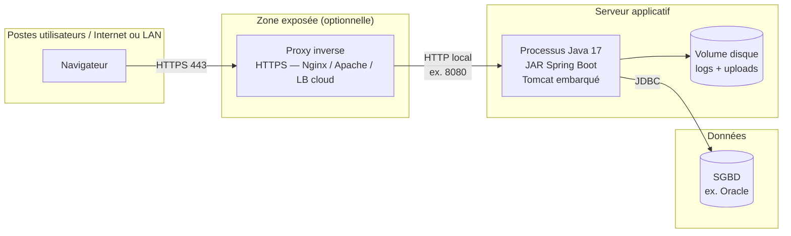
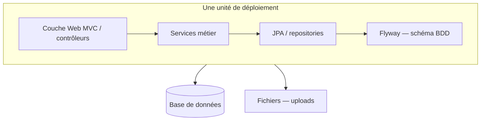
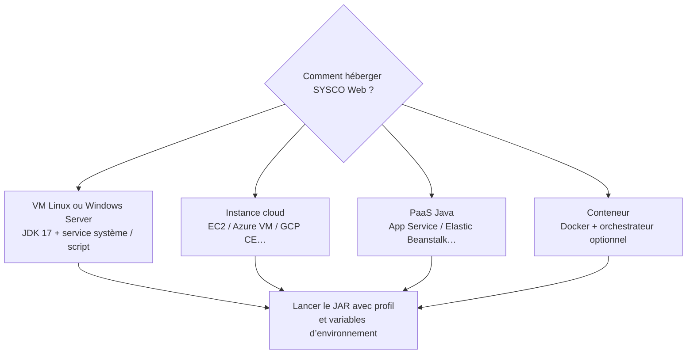
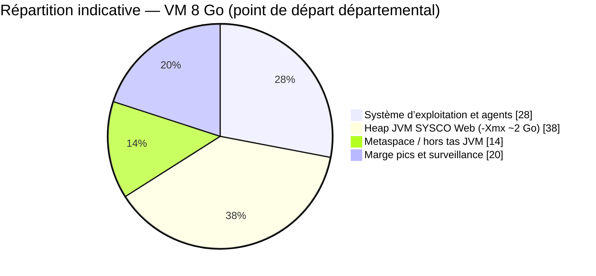
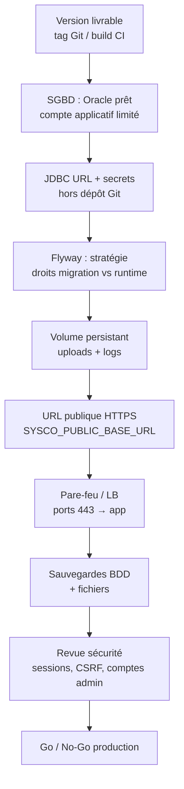
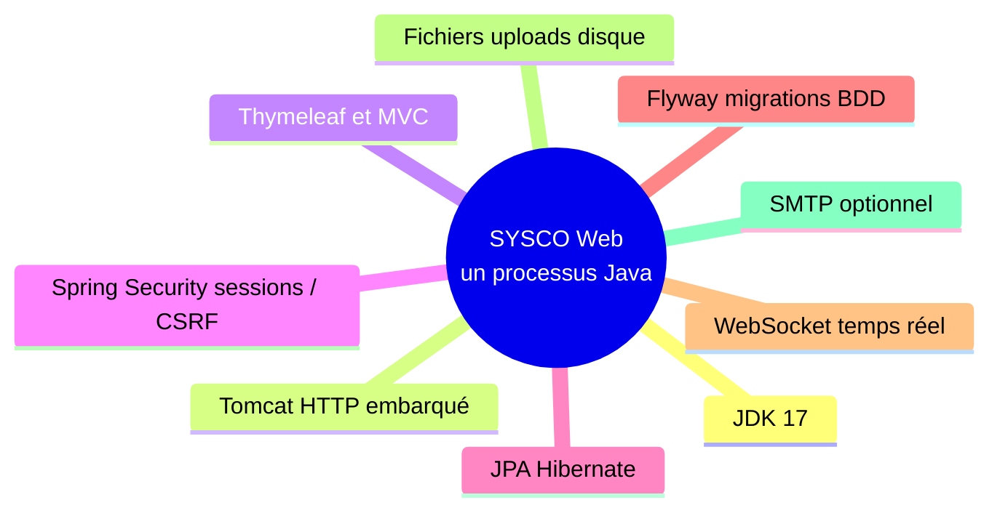

# Guide pré-déploiement serveur — SYSCO Web

**Public visé :** responsables infrastructure, exploitants, chefs de projet technique  
**Module :** `sysco-web` (Spring Boot 3.2.x, Java 17)  
**Complément :** voir aussi [06-Deploiement-Configuration-et-Runbook.md](06-Deploiement-Configuration-et-Runbook.md) pour le runbook détaillé et l’ordre de chargement de la configuration.

Ce document résume **ce qu’il faut savoir avant de déployer** l’application sur un serveur : architecture logique, types d’hébergement, capacité indicative et une **checklist de préparation**. Les figures utilisent la syntaxe **Mermaid** (affichage dans GitHub, GitLab, VS Code / Cursor avec extension, ou export PNG pour Word/PDF).

---

## 1. Objet et périmètre

SYSCO Web est une **application monolithique** Spring Boot : un **JAR exécutable** embarque **Tomcat** et expose l’interface Web (Thymeleaf), les API nécessaires au navigateur, la persistance **JPA**, les migrations **Flyway**, les **WebSockets** pour le temps réel, et des pièces jointes stockées sur **disque**.

Ce guide ne remplace pas une **étude de charge** ni un **audit sécurité** ; il fixe les bases pour un premier déploiement réussi.

---

## 2. Architecture logique recommandée en production

Le schéma suivant représente une **cible courante** : les utilisateurs atteignent l’application via **HTTPS** ; le serveur d’applications dialogue avec une **base de données** (souvent Oracle en production) et conserve les **fichiers uploadés** sur un volume persistant.

**À retenir avant le déploiement**

- Décider si **TLS** se termine sur le **proxy** (recommandé) ou sur l’application (plus rare pour cette pile).
- Prévoir un **nom DNS public** et le faire pointer vers le proxy ou l’IP du serveur.
- Aligner la variable **`SYSCO_PUBLIC_BASE_URL`** (ou équivalent) sur l’URL HTTPS réelle pour que les **liens dans les e-mails** et notifications restent corrects.

---

## 3. Nature de l’application : pas de microservices

SYSCO Web est **un seul service déployable**. Il n’y a pas de découplage en plusieurs microservices autonomes avec découverte de services ou passerelle API dédiée dans ce dépôt.

**Conséquence pour le serveur :** une **machine virtuelle ou un conteneur** suffit pour héberger le processus Java principal ; la **charge base de données** doit être dimensionnée **à part**.

---

## 4. Types de serveurs ou environnements possibles

**À savoir avant de choisir**

| Option | Avantage typique | Point de vigilance |
|--------|------------------|---------------------|
| VM dédiée | Contrôle total, scripts simples | Patch OS, sauvegardes disque uploads |
| Cloud VM | Élasticité, snapshots | Groupe de sécurité / NSG, coût |
| PaaS | Déploiement simplifié | Limites timeout, stockage persistant pour uploads |
| Docker | Reproductibilité | Volume monté pour `SYSCO_UPLOAD_DIR`, secrets injectés |

---

## 5. Spécifications techniques minimales (référence projet)

Les valeurs ci-dessous correspondent au **code source** (`pom.xml`, `application.yml`) et aux usages habituels.

| Élément | Spécification |
|---------|----------------|
| **Langage / runtime** | Java **17** (LTS) |
| **Framework** | Spring Boot **3.2.x** |
| **Serveur HTTP** | **Tomcat embarqué** dans le JAR (pas besoin d’installer Tomcat séparément) |
| **Base de données** | **H2 fichier** (développement / formation) ou **Oracle** via JDBC (profil `oracle` documenté) |
| **Migrations** | **Flyway** au démarrage si activé |
| **Fichiers** | Répertoire configurable (`sysco.uploads.directory`) — à prévoir **persistant** et **sauvegardé** |
| **Courriel** | SMTP optionnel via variables d’environnement ; peut rester vide |

---

## 6. Dimensionnement capacitaire (ordre de grandeur)

Il n’existe **pas de dimensionnement unique** dans le dépôt : tout dépend du nombre d’utilisateurs simultanés, du volume de pièces jointes et des performances Oracle.

### 6.1 Tableau indicatif

| Profil d’usage | vCPU | Mémoire totale machine | Heap JVM indicative (`-Xmx`) |
|----------------|------|-------------------------|------------------------------|
| Pilote / petite équipe | 2 | 4 Go | 512 Mo — 1 Go |
| Départemental | 2 — 4 | 4 — 8 Go | 1 — 2 Go |
| Charge soutenue | 4+ | 8 Go+ | Ajuster après mesure (APM, logs GC) |

**Règle pratique :** augmenter la mémoire heap **seulement** si les métrologies JVM le justifient ; souvent le goulot est la **base de données** ou le **stockage disque I/O**.

### 6.2 Répartition illustrative de la RAM (VM 8 Go — exemple)

---

## 7. Chaîne de dépendances avant la mise en production

Le diagramme suivant ordonne les **décisions et prérequis** à clarifier **avant** d’ouvrir le serveur aux utilisateurs.

---

## 8. Ce qu’il faut savoir avant le jour J (checklist narrative)

1. **Artefact**  
   - Obtenir un **JAR** issu de `mvn clean package -DskipTests` (ou avec tests selon votre politique), depuis une **branche ou tag validé**.

2. **Base de données**  
   - En production, éviter le **H2 fichier** sauf cas très contrôlé ; viser **Oracle** (ou autre SGBD supporté par votre configuration).  
   - Définir qui exécute **Flyway** (compte technique) et qui exécute l’**applicatif** (moindre privilège).

3. **Secrets**  
   - Mots de passe JDBC, clés API assistant : injectés par **variables d’environnement** ou coffre — **jamais** dans Git.

4. **Stockage**  
   - Le répertoire **uploads** doit survivre aux redémarrages et être inclus dans la **politique de sauvegarde**.

5. **Réseau et exposition**  
   - Le fichier `application.yml` peut lier l’écoute sur `0.0.0.0` ; en production, combinez **pare-feu**, **proxy HTTPS** et **liste blanche** si nécessaire.

6. **Courriel**  
   - Si SMTP est vide, les envois peuvent être **désactivés** ou dégradés : valider le comportement métier attendu en prod.

7. **Temps réel**  
   - Les **WebSockets** / SockJS doivent fonctionner derrière le proxy (**upgrade HTTP**, timeouts cohérents).

8. **Observabilité**  
   - Prévoir rotation des **logs**, surveillance **CPU / RAM / disque**, et alertes sur erreurs applicatives.

9. **Plan de retour arrière**  
   - Version précédente du JAR, **snapshot BDD** avant migration majeure Flyway, procédure de **rollback** documentée.

---

## 9. Récapitulatif « pile » au démarrage

Toutes les briques suivantes tournent dans **un seul processus JVM** (monolithe déployable).

---

## 10. Références internes

- Détail configuration et secrets : [06-Deploiement-Configuration-et-Runbook.md](06-Deploiement-Configuration-et-Runbook.md)  
- Sécurité applicative : [02-Securite-Authentification-Autorisation.md](02-Securite-Authentification-Autorisation.md)  
- Performances JVM et diagnostic : [14-Performances-JVM-Base-de-donnees-et-Resolution-de-problemes.md](14-Performances-JVM-Base-de-donnees-et-Resolution-de-problemes.md)

---

## 11. Export des diagrammes pour Word ou PDF

Les blocs Mermaid peuvent être rendus en images via :

- l’**IDE** (aperçu Markdown avec extension Mermaid) ;
- [Mermaid Live Editor](https://mermaid.live) (copier-coller le code entre les balises \`\`\`mermaid ) ;
- Pandoc avec filtre Mermaid (voir note dans [00-LISEZMOI-Documentation-Technique.md](00-LISEZMOI-Documentation-Technique.md)).

---

*Document généré pour accompagner la préparation au déploiement serveur de SYSCO Web — à adapter selon votre contrat d’hébergement et votre politique de sécurité.*
